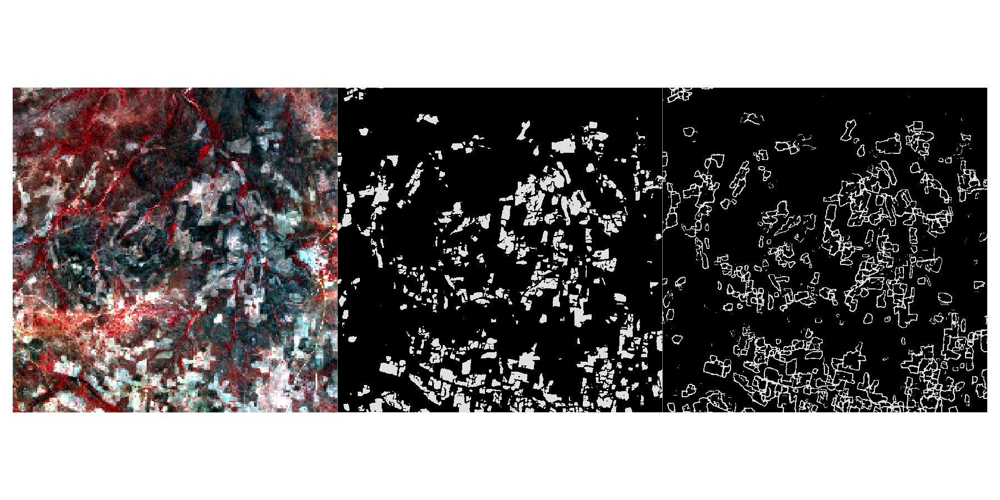

# New Methods in Earth Observation

This course provides an overview of recent advances in Earth Observation
(EO) technology that are helping to overcome some of traditional
limitations of EO, and are leading to breakthrough in our ability to
understand our planet. In this course, students will work with datasets
and methods arising from a number of active research projects, and will
learn background and skills in the following areas:

1.  Cloud-computing/cloud-based EO platforms
2.  Small satellites
3.  UAS/drones
4.  In situ sensor networks
5.  Advances in machine learning, particularly deep learning

After an initial introduction to the various toolsets we will be using,
students will form project teams (~3-5 people each) to tackle further
development and application of one of the three project areas. These
projects (described [here](docs/projects.md) in more detail) will be
assessed by means of a formal in-class presentation and team-authored
final project.

## Course details

Class is held in ASEC304 on Monday and Wednesday from 1615-1730.

Office hours: Tuesdays 1000-1200 in Jefferson 201C

## Course contents

- [Course policies](materials/course-policies.md)
- [Syllabus](materials/syllabus/syllabus.md)
- [Overview of Projects](materials/projects/projects.md)
- [Assignments](materials/syllabus/assignments.md)

------------------------------------------------------------------------

