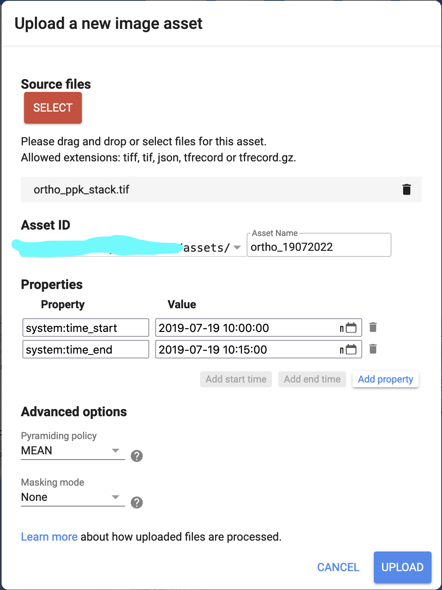

# Second assignment
The second class assignment entails working with and analyzing a time series of drone data, from processing the orthomosaicks, to adding the data to Earth Engine as assets, and finally highlighting vegetation changes. 

# Tasks: 

- Download the following drone image collections (I will provide the links in Slack): 

  - EP-01-20622_0052 from 13 July, 2022, and log file EP-01-20622_0052.bb3
  - EP-01-20622_0056 from 6 August, 2022, and log file EP-01-20622_0056.bb3
  - EP-01-20622_0058 from 19 August, 2022, and log file EP-01-20622_0058.bb3

- Team up in groups of two. Each group will jointly process one of these sets of images into PPK-corrected orthomosaicks, using the camera target to calibrate the surface reflectance conversion (I will provide credentials for PIX4D when your group is ready)

- Each group will then upload the reflectance images for green, red, red edge, and NIR to one of your Google Drive accounts, and then follow the steps to stack the individual bands into a single, cloud-optimized geotiff, as demonstrated in this [notebook](https://github.com/agroimpacts/nmeo/blob/class/f2023/materials/code/notebooks/drone_image_analysis.ipynb). 

- Working in the same group, upload the image to Earth Engine as an asset. Unfortunately this has to be done manually using the javascript code editor, as the programmatic option does not work unless you have a Google Cloud bucket. This means you will first have to download the geotiff to your hard drive and then use the asset dialog to do this. Go to Assets > New > Image Upload and select "geotiff". The dialog shown below will come up.  Select your downloaded ortho-cog and then enter the necessary date details to match that of your image, as seen below (this corresponds to the orthomosiac we made in class). For image hh:mm:ss, just use the same values used below (start 10:00:00; end 10:15:00). 

```{r, echo=FALSE, out.width="50%", fig.align='center'}

```
  Once you have completed the ingestion as an asset, go to the sharing tab and check the box that lets the image be readable by anyone with the link. Share the asset link as well as the asset path with the rest of the class on slack. 
  
- Now that the team part is complete, you will each work individually to do the following, in colab: 

  1. Name your notebook `<yourinitialshere>_nmeo_2023_ee_assn2`
  2. Do the usual installs and imports needed. Make sure that all imports are done at the top.
  3. Have a section with the code that you used to make the COG stack in your team, to demonstrate this part of the work. 
  4. Read each of the shared images in with `ee.Image`, including the July 19 image (I will share the link), and then make all four of them into an `imageCollection`.
  5. Use the `display_image` function to show each of the images in RGB in `geemap`. Do that in a loop for an extra dose of fanciness. 
  6. Within the same `geemap`, select a small polygon somewhere over the crop fields. Save the polygon as an ROI feature collection. 
  7. Working with the collection of ortho-cogs, add a normalized difference red edge index (NDRI) band to each image, and then extract the average NDRI values from your ROI and plot them on a line chart (hint: adapt your `reduce_evi` and `fitted_harmonic` functions from previous assignments to do this).
  8. Use the provided `whittier_fields.geojson` to mask the image collection, and then calculate the sum of NDRI across the image collection (instead of median image, you are doing an image sum), and then from that summed image, calculate a standardized image using the formula: (x - $\hat{x}$) / sd(x), where x is each pixel value in the summed image, $\hat{x}$ is the average pixel value in the summed image, and sd(x) is the standard deviation of the summed pixel values. That means you will need to find the image mean and standard deviation, and then apply them within an image calculation.  
  9. Finally, use geemap to display the summed NDRI image and standardized summed NDRI image. 

- Make sure your notebook has some documentation describing the various steps. Please use #, ##, ###, etc to make nice headers in the notebook TOC. 
- Please send the link to the completed notebook, which is due Monday, November 20th. Assessment will be out of 50 points, using the same rubric as the previous assignment. 
