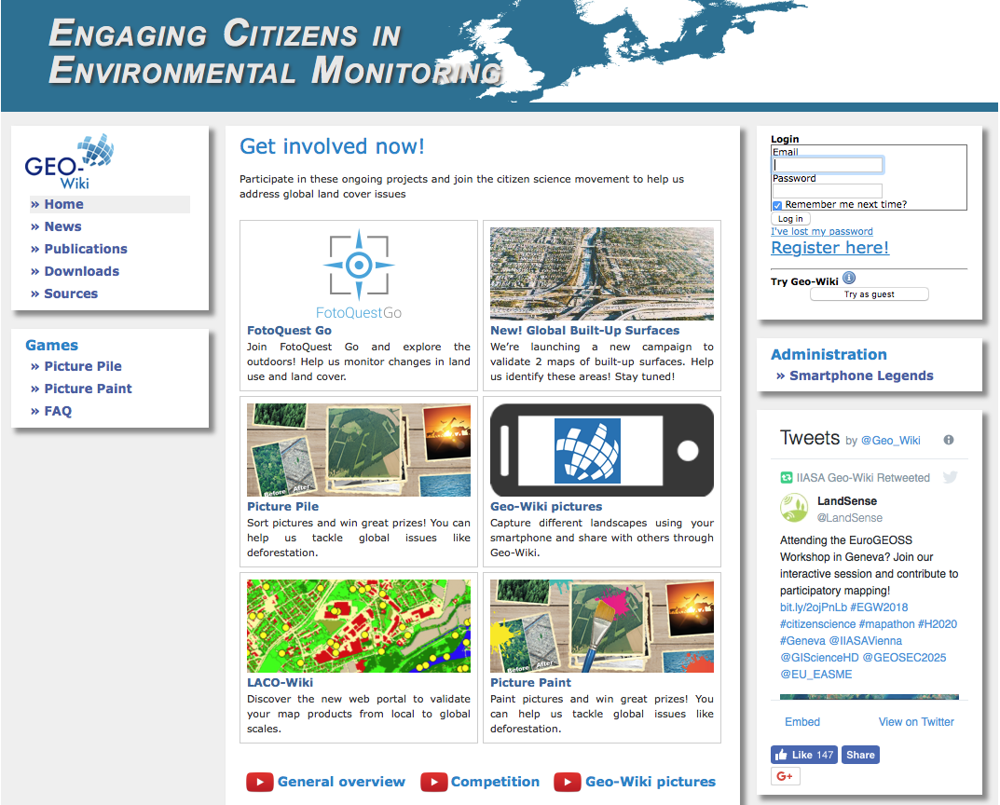
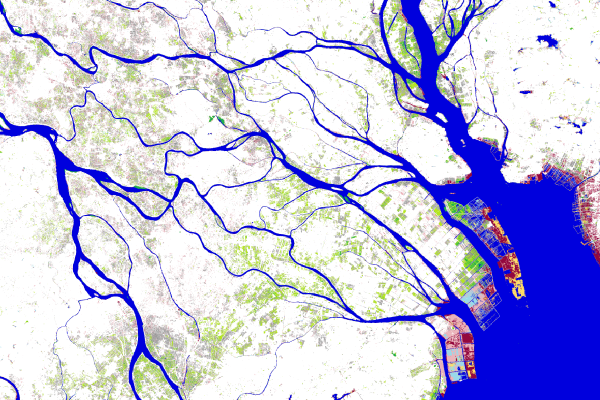

## Introduction
- Today: 
  - Course introduction
  - Housekeeping: computing, class, etc
  - Background and introduction

---

## Overview of EO Limits

- Physical 
- Methodological
- Societal

---

## Physical Limits 1

- Space-time tradeoff
- Initiated by conflict between resolution and extent

---

## Physical Limits 2

- Temporal: length of record

---

## Physical limits 3

- Surface characteristics: terrain and vegetation
- Atmosphere
- Perspective

---

## Methodological Limits

- Inadequate models: 
    - Need these to solve the inverse problem 
    - Models outpaced by EO data
- Not enough cal/val data
- Competing standards

---

## Societal Limits
- Expertise barrier
- Institutional limitations
    - Data access and collection policies
    - Coordination
- Accessibility to methods
- Collection biases

---

## The Combined Effect of Limits

{width=90%} 

---

## Innovation Pushing Back Limits 1

- More Eyes in the Sky

```{r, echo = FALSE, fig.height=4, fig.width=8, fig.align='center', fig.cap="Left: max. resolution versus year of launch (Belward & Skøien, 2015), Right: number of launches (Radtke et al, 2017) "}
library(png)
library(grid)
library(gridExtra)
img1 <-  rasterGrob(as.raster(readPNG("figures/02/b&s_fig8.png")),
                    interpolate = FALSE)
img2 <-  rasterGrob(as.raster(readPNG("figures/02/radtke_fig1.png")), 
                    interpolate = FALSE)
grid.arrange(img1, img2, ncol = 2)
```

---

## Limits Addressed

- Physical:
    - Space-time tradeoff mitigated: 
        - Resolution versus extent
        - Atmospheric interference
    - Terrain effects (more radar)
    - Perspective (more radar and lidar)
- Societal:
    - Accessibility (cheaper)

---

## How Our Methods Fit In

- PlanetScope

---

## Innovation Pushing Back Limits 2

- Upping the N

{width=70%}

---

## Limits Addressed

- Physical:
    - Perspective
- Methodological:
    - Inadequate calibration/validation data
    - Better models
- Societal:
    - Accesibility
  
---

## How Our Methods Fit In

- Crowdsourcing platform
- Arable

---

## Innovation Pushing Back Limits 3

- Peering into the gaps

{width=70%}

---

## Limits Addressed

- Physical
    - Space-time tradeoff
    - Perspective
- Methodological
    - Inadequate cal/val
- Societal
    - Cost/accessibility

---

## How Our Methods Fit In

- UAS

---

## Innovations Pushing Back Limits 4

- Advances in sensors/communications

{width=60%}

---

## Limits Addressed

- Physical:
    - Space-time tradeoff
    - Perspective
- Methodological
    - Better models
    - Inadequate cal/val
- Societal
    - Cost/accessibility

---

## How Our Methods Fit In

- Sequioa

---

## Innovations Pushing Back Limits 5

- Data and model-data fusion

{width=80%} 

---

## SCYM

{width=80%}

---

## Limits Addressed

- Physical:
    - Space-time tradeoff
    - Duration
- Methodological
    - Better models

---

## How Our Methods Fit In

- Would be great to implement STAIR!
- Arable Marks + Ebee + Planet + DSSAT crop model & R package

---

## Innovations Pushing Back Limits 6
- Computer vision, machine, and deep learning

{width=60%}

---

## Limits Addressed

- Methodological:
    - Inadequate models

---

## How Our Methods Fit In

{width=70%}

## How Our Methods Fit In

{width=60%}

---

## Innovations Pushing Back Limits 7

- Cloud-based data and analytical platforms

{width = 80%}

---

## Limits Addressed

- Methodological:
    - Inadequate models
- Societal:
    - Accessibility

---

## How Our Methods Fit In

- Use it to fit STAIR/STARFM
- Process Planet
- Host and view UAS imagery


---

## Computing set up

- eMotion3
- PIX4D

