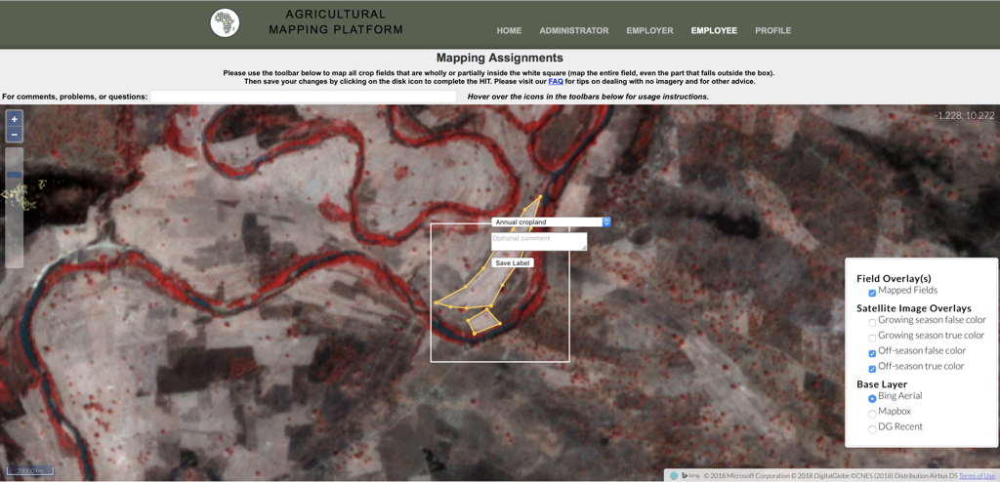
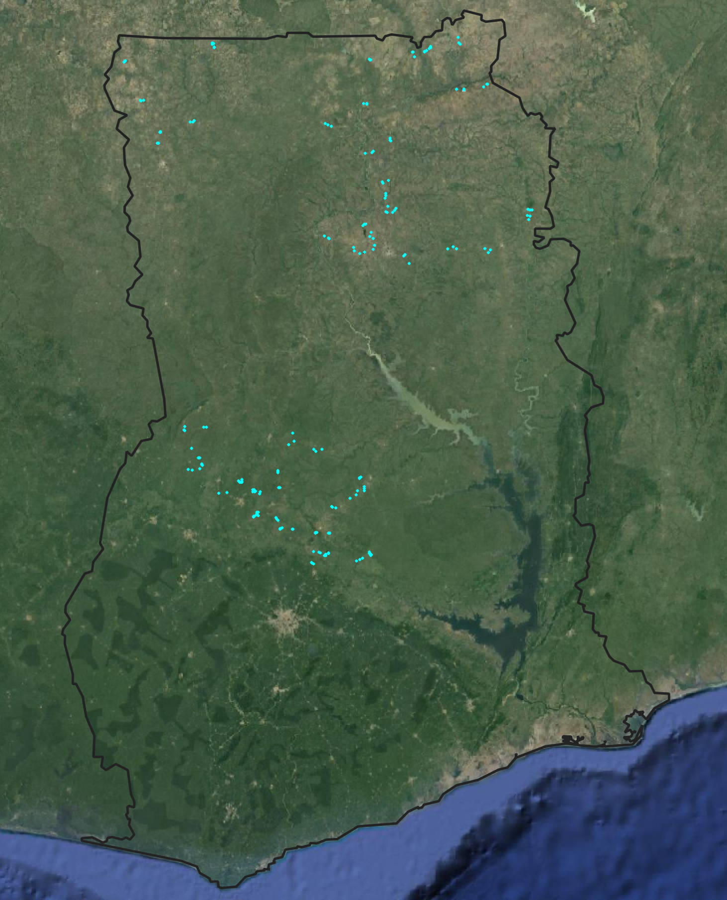
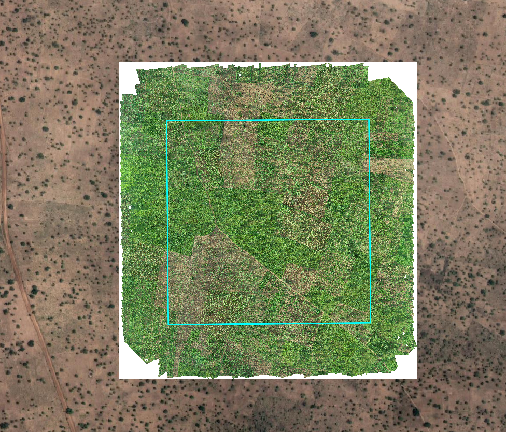
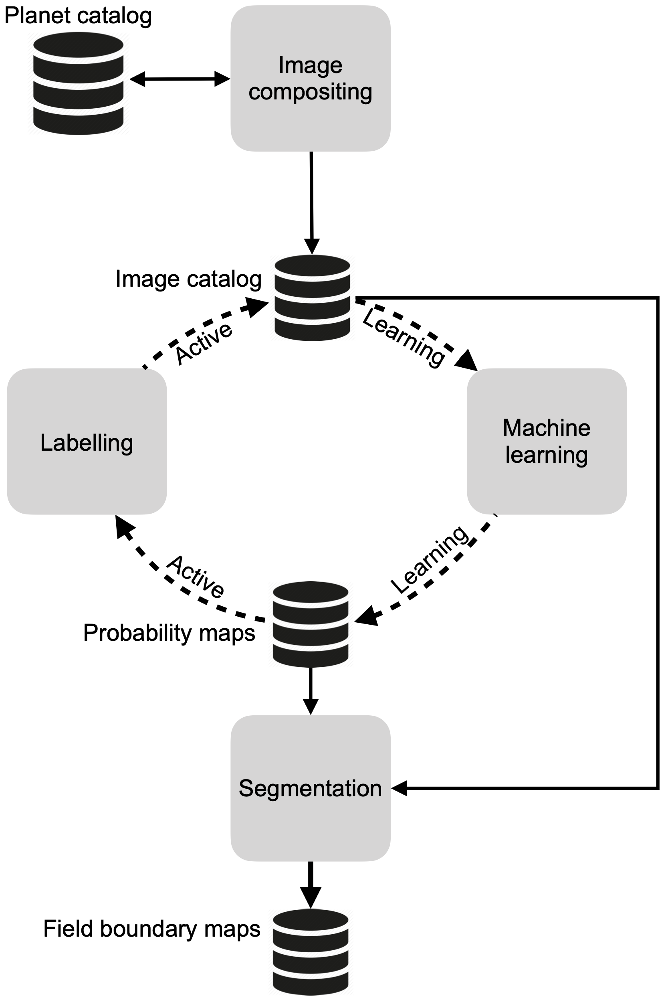
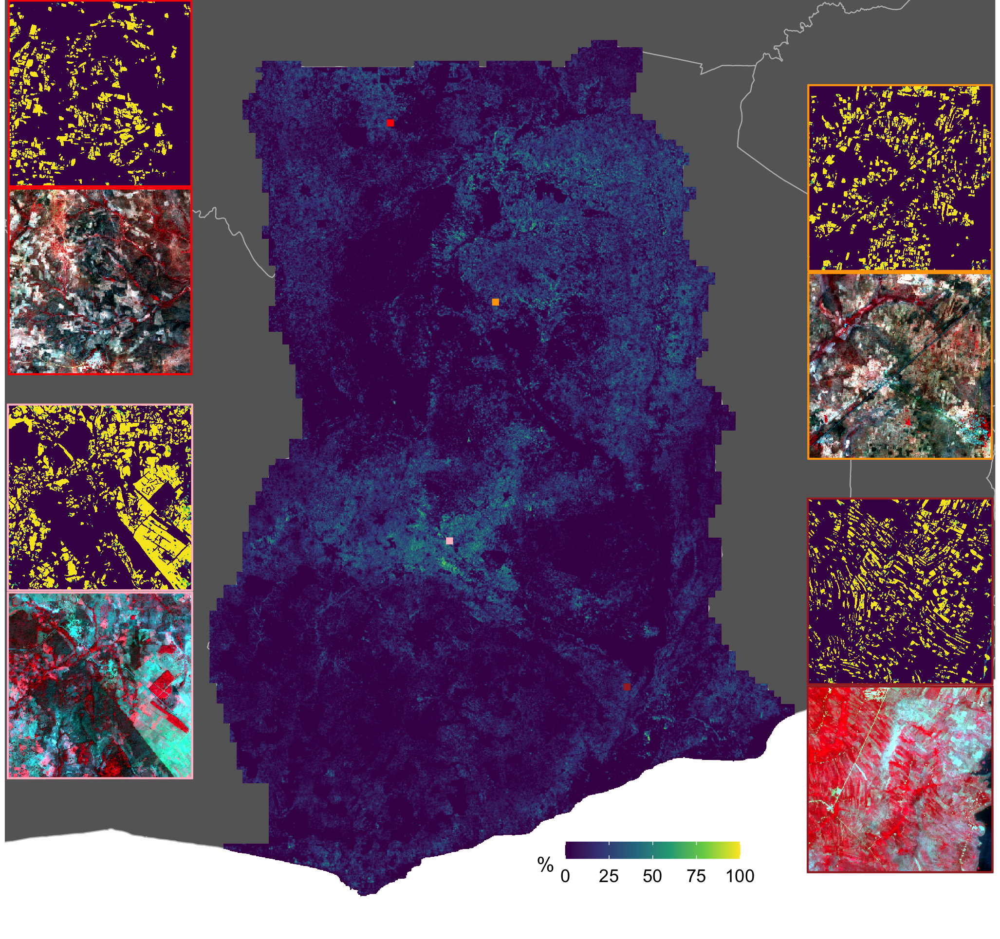
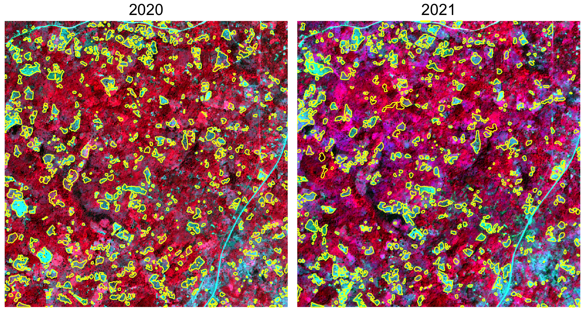

## Overview of EO Limits

- Physical 
    - Space-time tradeoff
    - Temporal: length of record
    - Surface characteristics: terrain and vegetation
    - Atmosphere
    - Perspective
- Methodological
    - Inadequate models, outpaced by EO data
    - Not enough cal/val data
    - Competing standards

---
## Overview of EO Limits

- Societal
    - Expertise barrier
    - Institutional limitations
    - Accessibility to methods
    - Collection biases

---
## Key innovations

- ~~More eyes in the sky~~
- ~~Advances in sensors/communications~~
- Seeing into the blind spots
- Upping the N
- Data and model-data fusion
- Computer vision, machine, and deep learning
- Earth Observation and analytical platforms

---
background-image: url(figures/01/geowiki.png)
background-size: 60%
background-position: bottom
## Innovation Pushing Back Limits 2

- Upping the N

---


```{r, echo=FALSE, out.width="100%", fig.align='center'}

```

---
  
## Limits Addressed
  
- Physical:
  - Perspective
- Methodological:
  - Inadequate calibration/validation data
- Better models
- Societal:
  - Accessibility

---
  
## How Our Methods Fit In
  
- Crowdsourcing platform
- Arable
- UAS

---
  
```{r, echo=FALSE, out.width="80%", fig.align='center'}

```

---
## Innovation Pushing Back Limits 3

- Peering into the gaps

```{r, echo=FALSE, out.width="80%", fig.align='center', fig.cap="Gaveau et al, 2014"}
knitr::include_graphics("figures/01/gaveau_etal2014.png")
```

---
  
```{r, echo=FALSE, out.width="80%", fig.align='center'}

```

---
  
```{r, echo=FALSE, out.width="100%", fig.align='center'}
knitr::include_graphics("figures/01/uas_2.png")
```

---
  
```{r, echo=FALSE, out.width="100%", fig.align='center'}
knitr::include_graphics("figures/01/uas_3.png")
```

---
  
## Limits Addressed
  
- Physical
  - Space-time tradeoff
  - Perspective
- Methodological
  - Inadequate cal/val
- Societal
  - Cost/accessibility

---
  
## How Our Methods Fit In
  
- UAS

---
background-image: url(https://ngee-arctic.ornl.gov/sites/default/files/9.jpeg)
background-size: 40%
background-position: bottom

## Innovations Pushing Back Limits 4

- Advances in sensors/communications


---
  
## Limits Addressed

- Physical:
  - Space-time tradeoff
  - Perspective
- Methodological
  - Better models
  - Inadequate cal/val
- Societal
  - Cost/accessibility

---
background-image: url(figures/whittier10082018.png)
background-size: 50%
background-position: center


## How Our Methods Fit In

- Sequioa

---
  
## Innovations Pushing Back Limits 5
  
- Data and model-data fusion


---
background-image: url(http://2.bp.blogspot.com/-JpPn3jLt5Nw/VVDSnQ3WNEI/AAAAAAAAAR0/wmhUJp7SQ1c/s1600/output_SAPgfu.gif)
background-size: 50%
background-position: center

## SCYM
- Scalable Yield Mapping (Lobell et al, 2015)

---
  
## Limits Addressed
  
- Physical:
  - Space-time tradeoff
  - Duration
- Methodological
  - Better models

---
## How Our Methods Fit In
  
- Arable Marks + Sentinel + DSSAT crop model & R package

---
background-image: url(http://2rct3i2488gxf9jvb1lqhek9-wpengine.netdna-ssl.com/wp-content/uploads/2017/05/isprs-potsdam-predicitions-4.gif)
background-size: 50%
background-position: bottom

## Innovations Pushing Back Limits 6
- Computer vision, machine, and deep learning
- Azavea's `rastervision`
- Our own [CNN that runs on AWS](https://github.com/agroimpacts/pytorch_planet)

---

## Limits Addressed

- Methodological:
  - Inadequate models

---
## How Our Methods Fit In

- Active learning (Debats et al, 2017; Estes et al, 2021)

```{r, echo=FALSE, out.width="40%", fig.align='center'}

```

---

```{r, echo=FALSE, out.width="100%", fig.align='center'}
knitr::include_graphics("figures/02/rf_map.png")
```
---

```{r, echo=FALSE, out.width="100%", fig.align='center'}

```

---

```{r, echo=FALSE, out.width="100%", fig.align='center'}

```
---


## Innovations Pushing Back Limits 7

- Cloud-based data and analytical platforms


---

## Limits Addressed

- Methodological:
    - Inadequate models
    - Competing standards
- Societal:
    - Expertise barrier
    - Institutional limitations
    - Accessibility to methods
    - Collection biases

---

## How Our Methods Fit In

- Process Planet
- Host and view UAS imagery
- Run deep learning models for cropland classification

---

## Computing set up

- eMotion3
- PIX4D
- Anaconda, with Jupyter Notebooks and RStudio
- AWS accounts
- EarthEngine account

