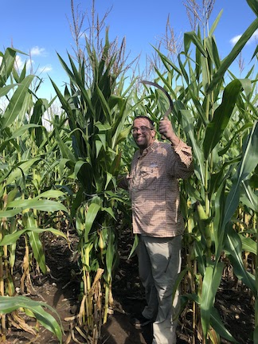
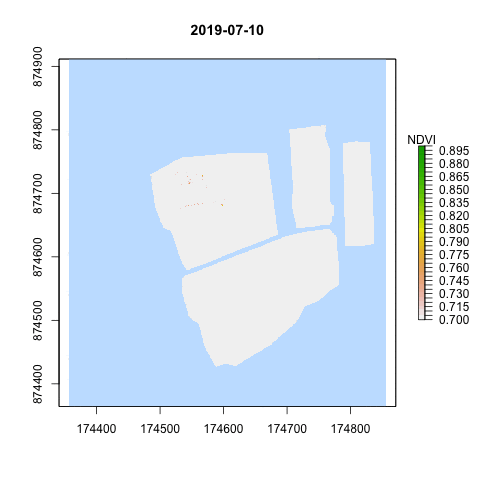

## Introduction
- Today: 
  - Course introduction
  - Housekeeping: computing, class, etc
  - Background and introduction

---

## Instructor: Michael Cecil
- 4th year Geography Ph.D. student
- Pronouns: he/his/him

---

## Instructor: Michael Cecil
- Research: Multi-sensor data integration for smallholder agriculture
- Image below shows footprint of drone (black and white image), Sentinel-2 (yellow squares), and ground sensor (red circle)

---

## Course Assistant: Laurence SanBoeuf
- 2nd year GIS Master's student

---
## Class Introductions
- Name
- Personal pronouns
- Year, Department
- Interests in Earth Observation (EO)

---

## Background

- Limits to Earth Observation

---

## Background 
Collapsed limits down to:

- Physical 
- Methodological
- Societal

---
## Background
Innovations:

- More eyes in the sky 
- Advances in sensors/communications
- Seeing into the blind spots
- Upping the N 
- Data and model-data fusion
- Computer vision, machine, and deep learning
- Earth Observation and analytical platforms

---
## Course Walk-through

- [Home page](https://github.com/agroimpacts/geog287387/tree/class/s2021)
- [Approach](https://github.com/agroimpacts/geog287387/blob/class/s2021/docs/general-information.md)
- [Syllabus](https://github.com/agroimpacts/geog287387/blob/class/s2021/docs/syllabus.md)
- [Projects](https://github.com/agroimpacts/geog287387/blob/class/s2021/docs/projects.md)

---
## Course Units

- UAV imagery (drones) 
- SmallSats and Planet imagery
- Cloud-based computing platforms and Google Earth Engine
- Ground Sensors
- Machine, and Deep learning
- Data visualization

---
## Course Units

- UAV imagery (drones) 

---
## Course Units

- UAV imagery (drones) 

---
background-image: url(figures/uas.jpg)
background-size: 60%
background-position: right

## Project Tools

- UAS
- [Sensors](https://clark.arable.com/dashboard/locations)
- [Cloud-processing](https://www.mlhub.earth)
- [Active learning](https://mappingafrica.io)

---

## Computing set up

- Slack
- RStudio and Git
- eMotion3
- PIX4D
- Anaconda, with Jupyter Notebooks

---

## For next class

- Read McCabe et al. [(2017)](https://agupubs.onlinelibrary.wiley.com/doi/epdf/10.1002/2017WR022240) 
- Get connected on Slack
- Install RStudio and Git (instructions to be sent on Slack)

