class: center, middle
# What Can UAS Do That Field Scientists and Cheap Satellites Can't?


---

background-image: url(figures/10/uas_slides/uas_slides.002.png)
background-size: cover

---
background-image: url(figures/10/uas_slides/uas_slides.004.png)
background-size: cover

---
background-image: url(figures/10/uas_slides/uas_slides.005.png)
background-size: cover

---
background-image: url(figures/10/uas_slides/uas_slides.006.png)
background-size: cover

---
background-image: url(figures/10/uas_slides/uas_slides.007.png)
background-size: cover

---
background-image: url(figures/10/uas_slides/uas_slides.008.png)
background-size: cover

---
background-image: url(figures/10/uas_slides/uas_slides.009.png)
background-size: cover

---
background-image: url(figures/10/uas_slides/uas_slides.010.png)
background-size: cover

---
background-image: url(figures/10/uas_slides/uas_slides.011.png)
background-size: cover

---
background-image: url(figures/10/uas_slides/uas_slides.012.png)
background-size: cover

---
background-image: url(figures/10/uas_slides/uas_slides.013.png)
background-size: cover

---
background-image: url(figures/10/uas_slides/uas_slides.014.png)
background-size: cover

---
background-image: url(figures/10/uas_slides/uas_slides.015.png)
background-size: cover

---
background-image: url(figures/10/uas_slides/uas_slides.016.png)
background-size: cover

---
class: center, middle

# UAS Use Cases

---
background-image: url(figures/10/uas_slides/uas_slides.024.png)
background-size: cover

<!-- .footnote[*Ecology + Conservation*] -->
 

---
background-image: url(figures/10/uas_slides/uas_slides.025.png)
background-size: cover

---
background-image: url(figures/10/uas_slides/uas_slides.026.png)
background-size: cover

---
background-image: url(figures/10/uas_slides/uas_slides.031.png)
background-size: cover

---
background-image: url(figures/10/uas_slides/uas_slides.032.png)
background-size: cover

---
background-image: url(figures/10/uas_slides/uas_slides.033.png)
background-size: cover

---
background-image: url(figures/10/uas_slides/uas_slides.034.png)
background-size: cover

---
# Drones as Scaling Tools

```{r, echo = FALSE, message = FALSE, fig.height=6, fig.width=6, fig.align='center'}
library(png)
library(grid)
library(gridExtra)
img1 <-  rasterGrob(as.raster(readPNG("figures/10/gaveau_etal_2b.png")),
                    interpolate = FALSE)
grid.arrange(img1, ncol = 1)
```

.center[Gaveau et al (2014), Figure 2b]

---


.center[Gaveau et al (2014), Figure 3]

---
# Drones as Sampling Tools
```{r, echo=FALSE, out.width="60%", fig.align='center', fig.cap="A collaboration between Farmerline and Clark"}
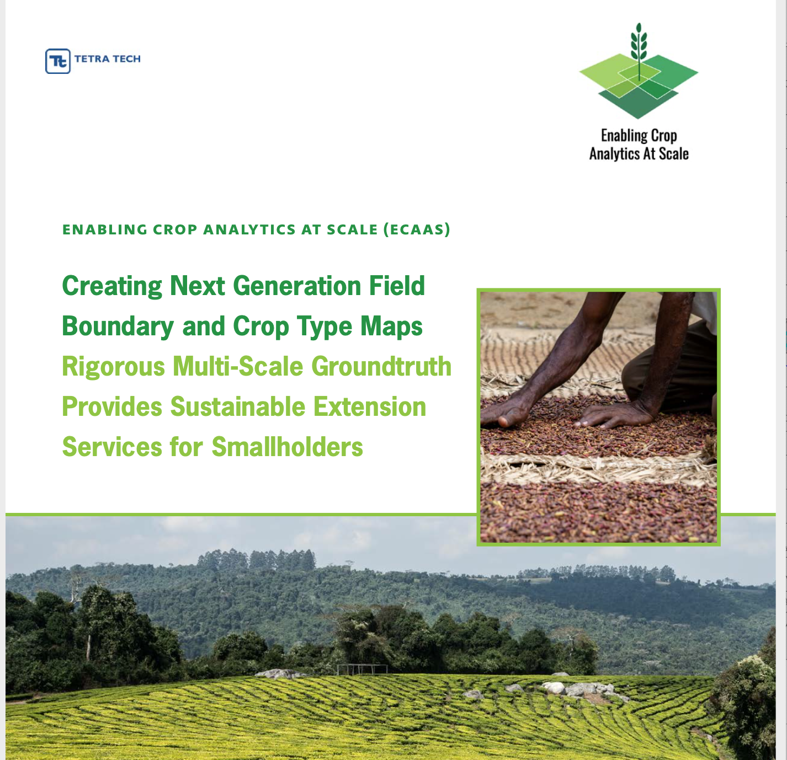
```
---
```{r, echo=FALSE, out.width="50%", fig.align='center', fig.cap="Study region"}
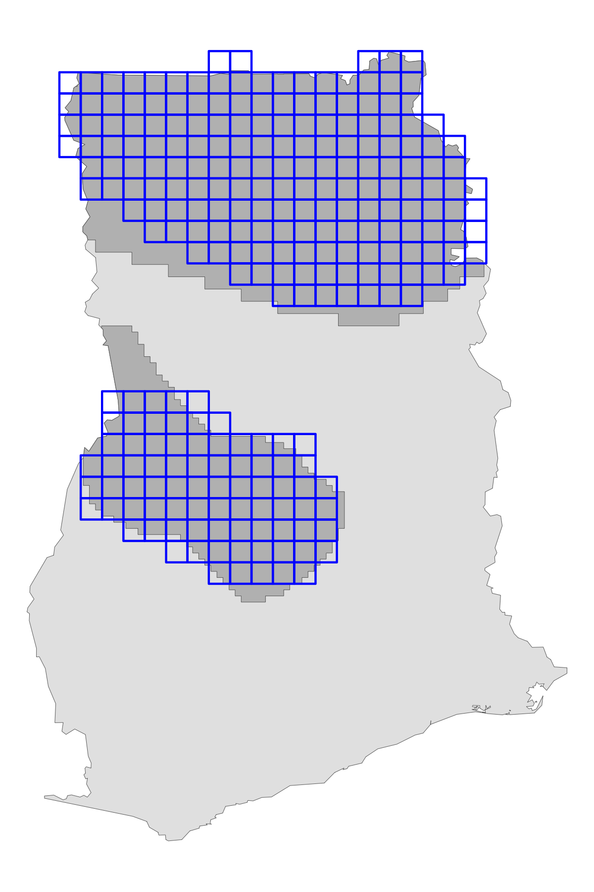
```

---
```{r, echo=FALSE, out.width="100%", fig.align='center', fig.cap="Cropland/croptype maps"}
knitr::include_graphics("figures/11/ecaas3.png")
```
---
```{r, echo=FALSE, out.width="100%", fig.align='center', fig.cap="Crop type sample distribution"}
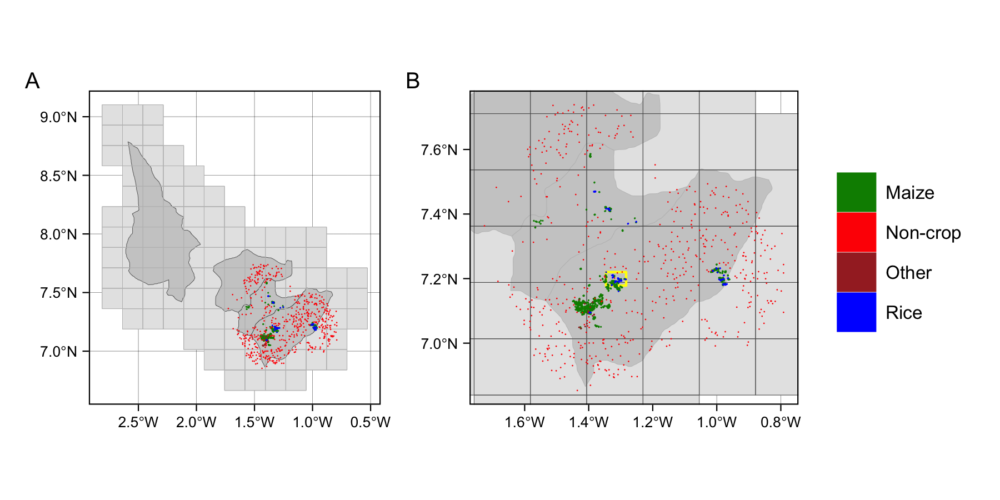
```

---
```{r, echo=FALSE, out.width="80%", fig.align='center', fig.cap="Drone-based sampling strategy"}
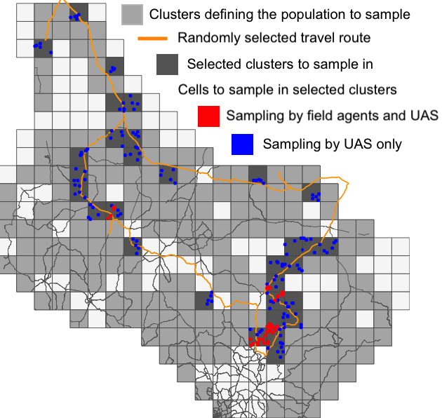
```

---

```{r, echo=FALSE, out.width="60%", fig.align='center', fig.cap="Resulting sample distribution"}
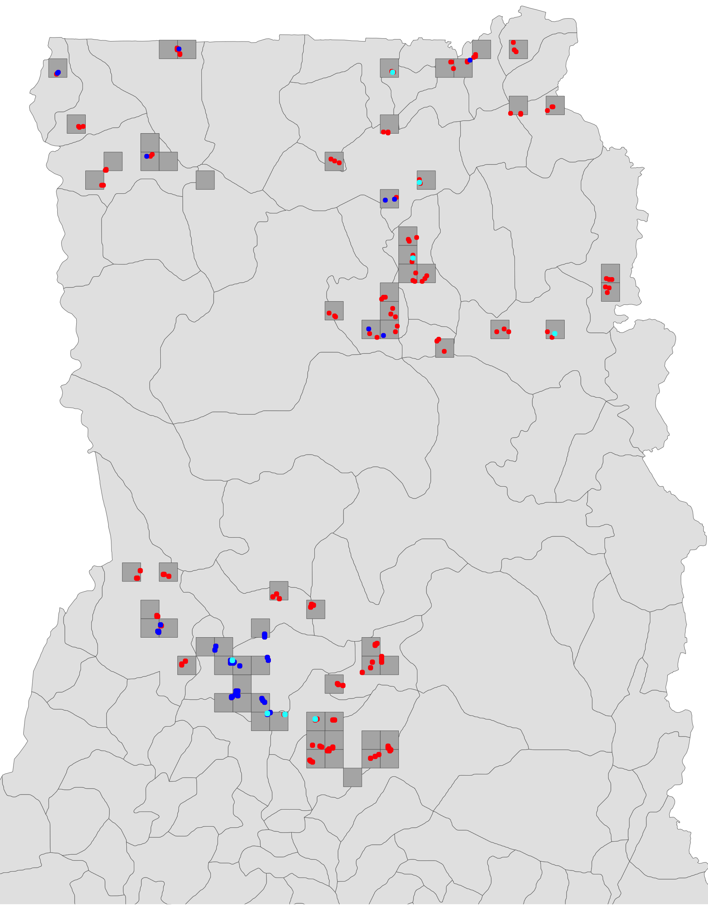
```

---

```{r, echo=FALSE, out.width="70%", fig.align='center', fig.cap="Orthomosaic at one site"}
knitr::include_graphics("figures/11/ecaas7.png")
```
---
```{r, echo=FALSE, out.width="100%", fig.align='center', fig.cap="Close-up"}
knitr::include_graphics("figures/11/ecaas8.png")
```
---
```{r, echo=FALSE, out.width="100%", fig.align='center', fig.cap="Crop types manually labelled and predicted in drone imagery"}
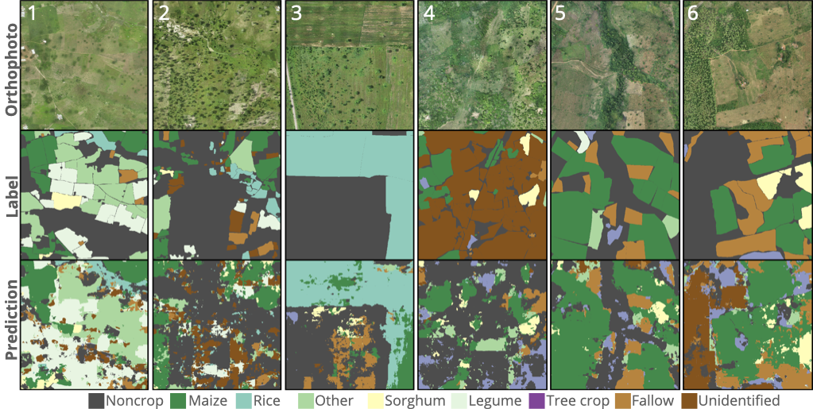
```
---

```{r, echo=FALSE, out.width="100%", fig.align='center', fig.cap="Simplified"}
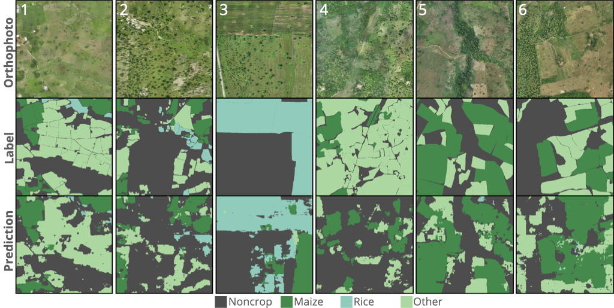
```
---

```{r, echo=FALSE, out.width="70%", fig.align='center', fig.cap="Labelling is not easy"}
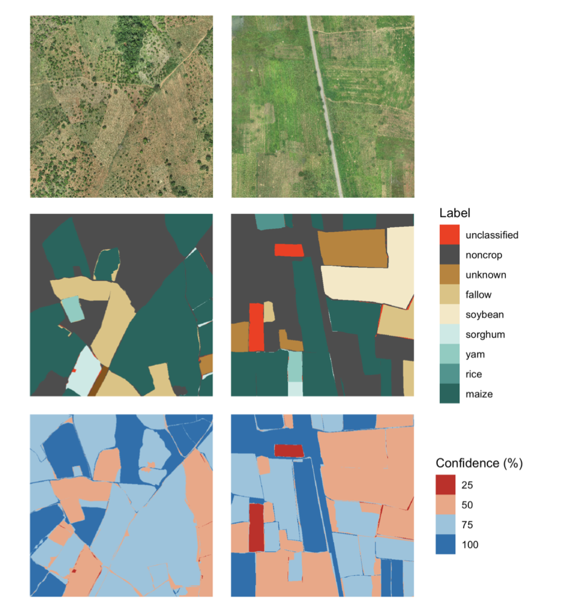
```
---

```{r, echo=FALSE, out.width="100%", fig.align='center', fig.cap="Train and validate satellite-based models"}
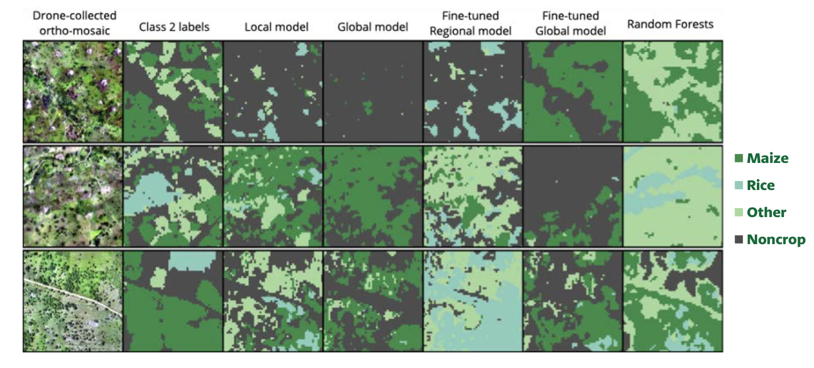
```
---


background-image: url(http://upload.wikimedia.org/wikipedia/commons/c/c9/FEMA_-_45355_-_Firefighting_helicopter_hovering_over_a_lake_in_Colorado.jpg)
background-size: cover

# Key Characteristics of Drones
- Cannot cover large areas like satellites and crewed aircraft
- Unmatched spatial and temporal resolution
- Variable perspective

---

background-image: url(figures/10/uas_slides/uas_slides.021.png)
background-size: cover
---

# The Scales of Ecological Observations


.center[Estes et al (2018), Figure 2]
---
# The Scales of Ecological Observations


.center[Manfreda et al (2018), Figure 5]

---

```{r, echo=FALSE, fig.cap="Padua et al (2017)", out.width="70%", fig.align='center'}
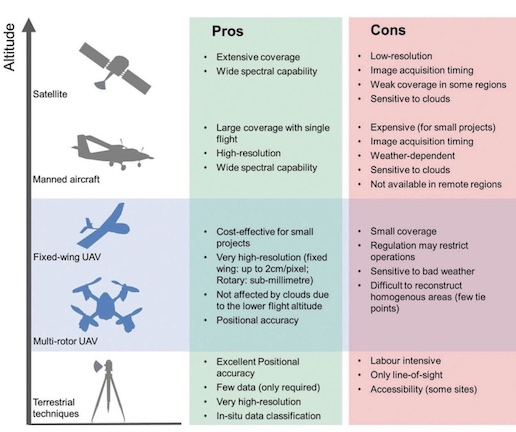
```

---
background-image: url(figures/10/uas_slides/uas_slides.035.png)
background-size: cover

---
background-image: url(figures/10/uas_slides/uas_slides.036.png)
background-size: cover

---
background-image: url(figures/10/uas_slides/uas_slides.037.png)
background-size: cover

---
background-image: url(figures/10/uas_slides/uas_slides.039.png)
background-size: cover

---
background-image: url(figures/10/uas_slides/uas_slides.040.png)
background-size: cover

---
background-image: url(figures/10/uas_slides/uas_slides.041.png)
background-size: cover

---
background-image: url(figures/10/uas_slides/uas_slides.042.png)
background-size: cover

---
background-image: url(figures/10/uas_slides/uas_slides.043.png)
background-size: cover

---
background-image: url(figures/10/uas_slides/uas_slides.044.png)
background-size: cover

---
background-image: url(figures/10/uas_slides/uas_slides.045.png)
background-size: cover

---
background-image: url(figures/10/uas_slides/uas_slides.046.png)
background-size: cover

---
background-image: url(figures/10/uas_slides/uas_slides.047.png)
background-size: cover

---
background-image: url(figures/10/uas_slides/uas_slides.048.png)
background-size: cover

---
background-image: url(figures/10/uas_slides/uas_slides.049.png)
background-size: cover

---
background-image: url(figures/10/uas_slides/uas_slides.050.png)
background-size: cover

---
background-image: url(figures/10/uas_slides/uas_slides.051.png)
background-size: cover

---
background-image: url(figures/10/uas_slides/uas_slides.052.png)
background-size: cover

---
background-image: url(figures/10/uas_slides/uas_slides.053.png)
background-size: cover

---
background-image: url(figures/10/uas_slides/uas_slides.054.png)
background-size: cover

---
# Working With Drones
## Preflight Planning
- Flight properties: Height, overlap
- Control: GCPs, base stations, calibration targets
- Environment: wind, cloud cover, rain

---
## Sensors
+ Choice of sensor: Off-the-shelf versus dedicated sensors

---
background-image: url(figures/10/spectral-char.png)
background-size: 80%
background-position: bottom

### Camera spectral characteristics

---

## Software 

Structure From Motion

<iframe width="600" height="450" src="https://www.youtube.com/embed/i7ierVkXYa8" frameborder="0" allow="autoplay; encrypted-media" allowfullscreen></iframe>

If you want to learn more about the math, go here [here](https://www.youtube.com/watch?v=zdKX7Xo3Cb8)

---

```{r, echo=FALSE, fig.cap="Anderson and Gaston (2013)", out.width="70%", fig.align='center'}
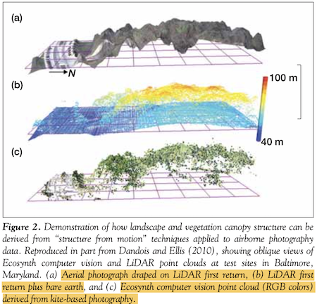
```

---
# Sources of Error

## Geometric 
### Orthomosaic from SfM
### Geometric correction (RTK/PPK/GCP)
## Atmospheric effects


---
# RTK/PPK links
### [RTK/PPK/GCP video](https://www.youtube.com/watch?v=1A3ZmYwx330)
### [Sensefly link](https://www.sensefly.com/blog/gcps-rtk-ppk-when-what-why/)
### [Wingtra link](https://wingtra.com/ppk-drones-vs-rtk-drones/)

---
# Sources of Error

## RTK scehmatic (Wingtra)

```{r, echo=FALSE, fig.cap="source: wingtra.com", out.width="70%", fig.align='center'}
knitr::include_graphics("figures/10/rtk_schematic_wingtra.png")
```


---

# Sources of Error

## PPK scehmatic (Wingtra)

```{r, echo=FALSE, fig.cap="source: wingtra.com", out.width="70%", fig.align='center'}
knitr::include_graphics("figures/10/ppk_schematic_wingtra.png")
```

---
### Radiometric calibration

.center[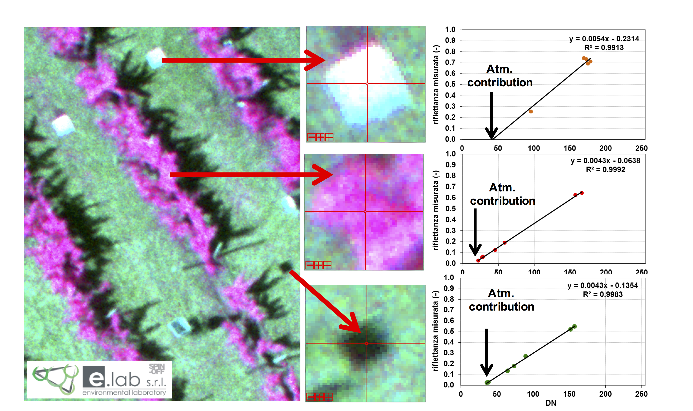]
.center[Credit: Giuseppe Ciraolo, Università degli Studi di Palermo]

---

## Hard to Correct/Uncorrectable Errors
- Blur
- Hotspots / BRDF

---
background-image: url(figures/10/blurry.png)
background-size: 70%
### Blurry Flight (transects go downwind)


---
background-image: url(figures/10/nonblurry.png)
background-size: 70%
### Less Blurry (transects go upwind)


---
background-image: url(figures/10/IMG_4796.JPG)
background-size: cover
### Blurry

---
background-image: url(figures/10/IMG_4267.JPG)
background-size: cover
### Less Blurry

---
background-image: url(figures/10/orth-artifacts.png)
background-size: cover
### Missing Data

---
background-image: url(figures/10/schaaf_brdf_1.png)
background-size: 70%
### BRDF effects (backscattering vs. forward scattering)
#### [Dr. Crystal Schaaf's Lab](https://www.umb.edu/spectralmass/terra_aqua_modis/modis)

---
background-image: url(figures/10/schaaf_brdf_2.png)
background-size: 70%
### BRDF effects (backscattering vs. forward scattering)


---
background-image: url(figures/10/hotspots.png)
background-size: cover


# Collecting Data

---

class: center, middle

# Flight Simulation
## [Pre-flight checklist](https://docs.google.com/document/d/1E_k8FtFEPNm1VbdBeYy1wgPX22jcMSnUrJtBy5e8Vmo/edit?usp=sharing)

---

### Plan mission eMotion3
#### Create new mission
##### - Select plane (eBee Plus and eBee RTK) and camera characteristics (Sequioa)
--

##### - if simulating, set start, home, working area on map, select arrow icon (see image below) to place point on map where you want to simulate flight


---
##### - Examine wind (estimated mission wind)

--

##### - Set start point (initial launch point) to be into wind from where you plan to launch


##### - Set home to be where you want to land.

--

##### - Adjust landing sector so that it provides a funnel into wind (plane should land into wind--a wider pie slice gives more options). Add another one if needed


##### - Create a new mission block, select correct camera, desired pixel resolution (which adjusts height), and orient flight lines to be perpendicular to wind.  First transect points should be the further downwind

--

##### - Calibrate camera

---

##### - Connect to plane (if simulating, have to choose start simulation)

--

##### - After selecting plane, set RTK tab to standalone mode


##### - You are now ready to fly, either for real, or as a simulation.

---

### Post-mission
- Transfer photos from camera to computer

--

- Transfer flight logs from drone to computer

---
### Post-mission
####Process flight logs and images
- Got to post-flight section of eMotion3, create new project

--

- Select "No" under the "Did you use this computer to fly?" question (unless you did!)

--

- Choose a name convention that provides the date of the flight and the location, and click next

--

- Load in drone flight logs (ending in .bb3, e.g. EP-01-18467_0029.bb3), and click next. Note, you don't need eMotion's flight logs

--

- Under RTK/PPK, you have two choices:
  
  - Standalone: geotag your images with low accuracy
  - PPK: Process drone's raw GNSS data
      - For PPK, collect and load in RINEX file from [here](https://www.ngs.noaa.gov/UFCORS/), for our demo area we want MASB (the Sturbridge station), for the date and time of our flight. Note the RINEX request should cover the entire flight interval. Download and unzip the file, and load in the observations (.18o file).  The other fields will populate. Click next. Some calculations will be made.
---


#### Import the images collected on the flight 

- Easiest way is to provide the location of the folder holding the images

- Click next a total of three times, after which the images will be converted to compressed .tifs, and .p4d project file will be created.

- The images will be shown over the flight paths

- You can click finish

---
class: center, middle

# Image Mosaicking
## [Post-processing steps](https://docs.google.com/document/d/1gHhvpTWcttZ7V7v3K58-kpIGM2xct0BsLmwzX9rMGBU/edit?usp=sharing)

---
## Open PIX4D
- Create new project
- Name it something related to the eMotion3 project name

--

- Add images
  - Select the "msp" directory from the eMotion3 project folder you just created (under an img sub-folder), click next, and it will upload the images.

--

  - The imported images include any reflectance target images that were taken.

--

  - These images should be excluded if you don't want PIX4D to calculate reflectance from the targets.

--

  - To do that, you can either choose to import photos by using the "Add images" dialog, and leaving out the calibration images from the dataset (they are the first 12 images by timestamp in our sample datasets).  The other way we will see in a little while.

--

  - Once images are imported, click next and next through defaults, until you arrive at the Processing Options Template. Choose the Ag Multispectral template, and click finish.

---

#### Choose post-processing options

You will see an image that looks like the one below now. Click the "Processing Options Button at the Bottom", which will pop up a dialog.


---

The dialog lists

*1. Initial processing*
*2. Point cloud and mesh*
*3. DSM, orthomosaic, and index*

---

- Leave *initial processing* as is

--

- Under *Point cloud and mesh*'s Point Cloud tab, select "Classify Point Cloud", "LAS" (under export), and "Merge Tiles into One File"

--

- Under *DSM, orthomosaic, and index*, the settings you should select for the first two tabs (DSM and Orthomosaic and Additional Outputs) should like the images in the next two slides


---

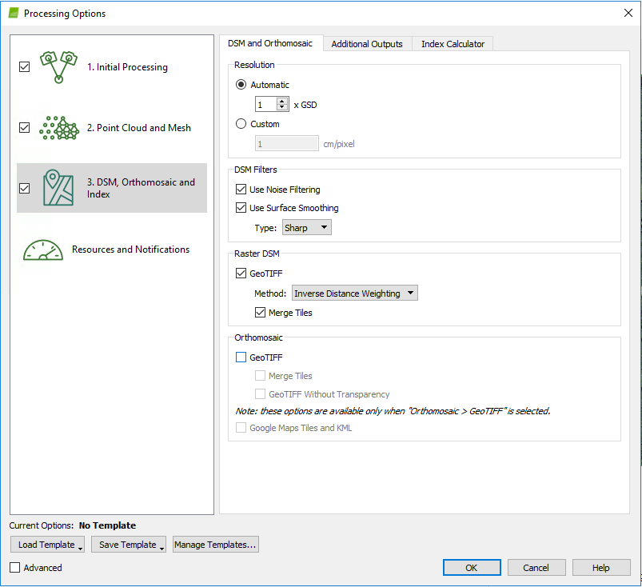

---

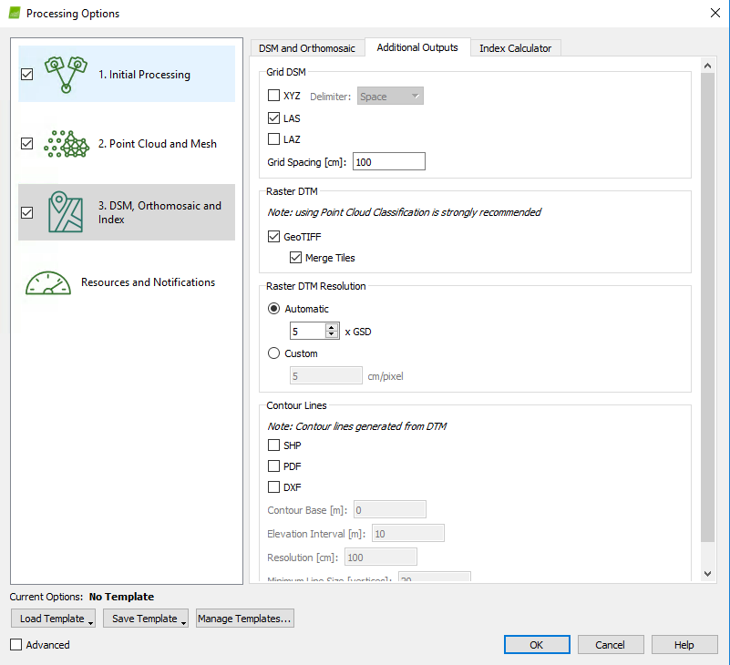

---

##### - The Index Calculator tab should look like this (uncheck the two export options at bottom)


---

##### - Now, under the Radiometric Processing and Calibration tabs, here is the second place you can remove the calibration targets, which aren't always detected. If you click "calibrate" under each band, you will see this:

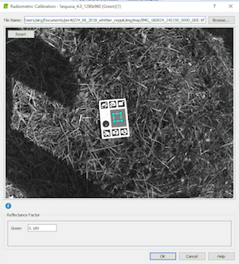

If there is a blue box in there, the software detected the target successfully. It not, you can manually draw in a box.  You can also close the dialog and choose "Reset", to clear the calibration images. When you do this, PIX4d will draw on conversion coefficients that were calculated from the plane's sunshine sensor (as it will do if you choose not to import the calibration images).

---

### Start Processing


It will take a while, but when finished view the results. Check out the Ray Cloud, the Quality Report, and then inspect the actual output reflectance images and the DSM/DTMs. You will find them in the project folder that you named.

---
class: center, middle

# Homework

---

### For homework, run the following processing tasks:

#### On the imagery you have been given (EP-01-20622_0043) (link in slack, data includes a .bb3 flight log having the same name), run the following tasks:

##### - Create a PPK and reflectance-target corrected set of imagery (reflectance orthomosaics and DSM/DTM). i.e. Do the PPK corrections from Rinex file in eMotion3, and let PIX4D pick up the reflectance target images.

##### - Create a PPK and non-reflectance target image (i.e. don't let PIX4D find the reflectance target images)

##### - Create a non-PPK corrected (standalone geotags mode in eMotion3), non-reflectance target corrected set of images

#### On the next batch of imagery (EP-01-20622_0050, with .bb3 flight log having the "_20" suffix):

##### - PPK (you need a new Rinex file) + non-reflectance target corrected images.

### We will analyze the differences next class!


