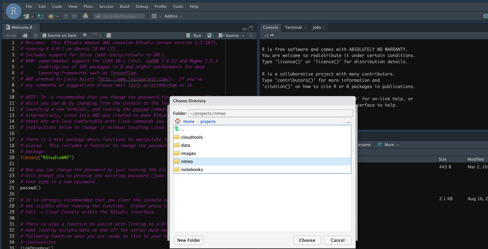
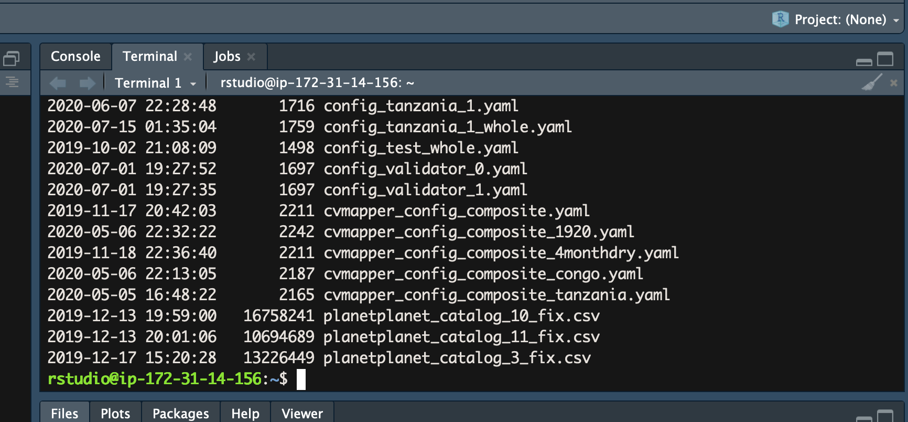

## Processing and comparing data

A look at imagery we processed from August 25 and October 1, 2021

---

## Comparing data with and without reflectance, PPK corrections

- Start your AWS instances
- ssh into it
- Then run through the following commands, in sequence

```{bash, eval = FALSE}
cd /home/rstudio/projects/data/
wget https://www.dropbox.com/s/thhs8k95f27cgpb/pix4d.zip  # download images
unzip pix4d.zip  # unzip them
rm pix4d.zip # remove the zip

cd /home/rstudio/projects/
chmod -R o+wr /nmeo  # change permissions
```

---
## Using Rstudio Server

We are now going to use Rstudio Server on our instances. Find your instance's current IP address, and then copy and paste it into your browser address bar. 

You will be given a login prompt. Enter `rstudio` as the user name and use the password I provide to you on slack. 

You will then log into the Rstudio interface. 

---
## Set-up

- From the Rstudio menu, choose File > New Project > From Existing Directory
- From the next interface, navigate until you find the directory for the nmeo. Choose that as the new directory. 

```{r, echo=FALSE}

```

---
## Set-up

In the terminal tab, run the following commands:

```{bash, eval=FALSE}
git stash
git pull
```

```{r, echo=FALSE, fig.cap='Rstudio Server terminal tab'}

```

---
## Set-up

Navigate in Rstudio's Files menu to materials/code/R/, find the `uas_image_comparison.R` file and open it. Then use File > Save As > `uas_image_comparison_untracked.R`.  

We will run through this code together now. 


