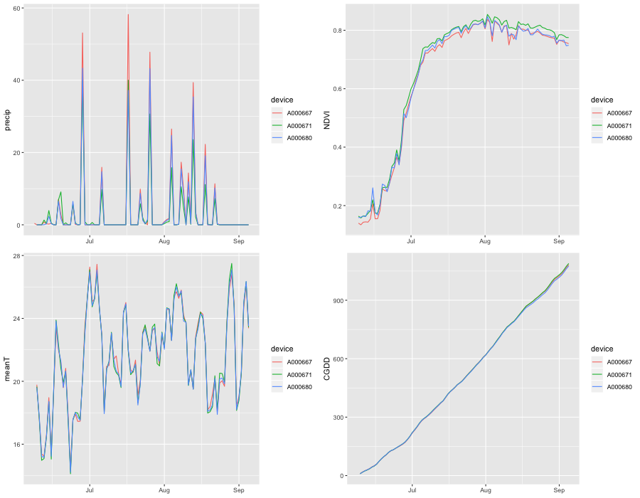

## Today
### Sensor Practicals
### Wednesday

---

## Let's review homework 

Extract full summer's worth of data from one pod
```{r, echo = FALSE, message=FALSE, warning=FALSE}
library(aRable)
library(data.table)
library(raster)
library(gridExtra)
library(ggplot2)
library(lubridate)
library(leaflet)
```

```{r, eval = FALSE}
library(aRable)
library(data.table)
library(raster)
library(gridExtra)
library(ggplot2)
library(lubridate)
library(leaflet)

dev1 <- ArableClient(device = "A000667", measure = "daily", 
                     start = "2018-06-01", end = "2018-09-06", 
                     email = "lestes@clarku.edu", 
                     password = "rollinghills88",  # replace this w/ actual p
                     tenant = "clark")
# a little cleaning
dev1 <- data.table(dev1)
dev1[is.na(precip), precip := 0]  # set NA precip to 0
# dev1 <- na.omit(dev1)
```
---

And for the other two pods
```{r, eval = FALSE}
# A000671
dev2 <- ArableClient(device = "A000671", measure = "daily", 
                     start = "2018-06-01", end = "2018-09-06", 
                     email = "lestes@clarku.edu", 
                     password = "rollinghills88",  # replace this w/ actual p
                     tenant = "clark")
dev2 <- data.table(dev2)
dev2[is.na(precip), precip := 0]  # set NA precip to 0

# A000680
dev3 <- ArableClient(device = "A000680", measure = "daily", 
                     start = "2018-06-01", end = "2018-09-06", 
                     email = "lestes@clarku.edu", 
                     password = "rollinghills88",  # replace this w/ actual p
                     tenant = "clark")
dev3 <- data.table(dev3)
dev3[is.na(precip), precip := 0]  # set NA precip to 0
```

Now combine all three pods into a single dataset
```{r, eval = FALSE}
devs <- rbind(dev1, dev2, dev3)  # put them together
```

---
### Have a look at the data

Combining all three pods' results into a single plot
```{r, eval = FALSE}
# plot(precip ~ datetime, data = devs[device == "A000667"], type = "l")
# lines(precip ~ datetime, data = devs[device == "A000671"], col = "red")
# lines(precip ~ datetime, data = devs[device == "A000680"], col = "purple")
mytheme <- function() theme(axis.title.x = element_blank())
p1 <- ggplot(devs) + geom_line(aes(x = datetime, y = precip, colour = device)) +
  mytheme()
p2 <- ggplot(devs) + geom_line(aes(x = datetime, y = NDVI, colour = device)) +
  mytheme()
p3 <- ggplot(devs) + geom_line(aes(datetime, meanT, colour = device)) +
  mytheme()
p4 <- ggplot(devs) + geom_line(aes(datetime, CGDD, colour = device)) +
  mytheme()
grid.arrange(p1, p2, p3, p4, ncol = 2)
```

---
```{r, eval = FALSE, echo = FALSE}
png(filename = "materials/slides/figures/13/pods_4panel.png", height = 700,
    width = 900)
grid.arrange(p1, p2, p3, p4, ncol = 2)
dev.off()
```

.center[]

---
## Let's try a more programmatically advanced way 

Download everything with a single procedure
```{r, eval = FALSE}
pods <- c("A000667", "A000671", "A000680")
devs_list <- lapply(pods, function(x) {
  dev <- ArableClient(device = x, measure = "daily", 
                      start = "2018-06-01", end = "2018-09-06", 
                      email = "lestes@clarku.edu", 
                      password = "rollinghills88",  # replace this w/ actual p
                      tenant = "clark")
  dev <- data.table(dev)
  dev[is.na(precip), precip := 0]  # set NA precip to 0
  dev
})
devs <- rbindlist(devs_list)  # joint them into a single dataset
```

---
### Summary Statistics

We can now calculate some simple summary statistics for data collected by each of the three pods
```{r, eval = FALSE}
devs[, sum(precip), by = device]  # total precip 
devs[, sum(ET, na.rm = TRUE), by = device]  # total ET
devs[, sum(NDVI, na.rm = TRUE), by = device]  # Summed NDVI
devs[, mean(meanT, na.rm = TRUE), by = device]  # average temp
devs[, mean(maxT, na.rm = TRUE), by = device]  # average Tmax
devs[, mean(minT, na.rm = TRUE), by = device]  # average Tmin
devs[, mean(SWdw, na.rm = TRUE), by = device]  # average incoming shortwave
# dev1[, plot(datetime, SWdw, type = "l")]
```

---

```{r, echo = FALSE, eval = FALSE}
save(devs, file = "materials/data/13/devs.rda")
```
```{r, echo = FALSE}
load("../data/13/devs.rda")
```

## Comparing with gridded/RS data
We'll start by getting the coordinates of the pods. Let's take a look at them. 
```{r, message=FALSE, warning=FALSE, fig.align="center", fig.width=5, fig.height=4, results="hold"}
ggplot(devs) + geom_point(aes(x = long, y = lat, colour = device))
```

---

They are not fixed in two cases! So let's calculate the mean lat, long of each. 
```{r, eval = FALSE}
dev_coords <- devs[, list("lat" = mean(lat, na.rm = TRUE), 
                          "long" = mean(long, na.rm = TRUE)), by = device]
```

```{r, echo = FALSE, eval = FALSE}
save(dev_coords, file = "materials/data/13/dev_coords.rda")
```
```{r, echo = FALSE}
load(file = "../data/13/dev_coords.rda")
```

---
Let's have a look at the pod locations now. We'll use the leaflet package for this (install it first!)

```{r, eval = FALSE}
planet1 <- paste0("https://tiles.rasterfoundry.com/", 
                  "7a4b4cb3-fe35-46c9-9896-6e98eec46665/{z}/{x}/{y}/?tag=",
                  "1538578249206&mapToken=8ab506f7-9ef0-46f2-afe6-db5ec1c9e9e4")
sequoia <- paste0("https://tiles.rasterfoundry.com/", 
                  "e319cae9-4093-40b1-8961-033fa6753ec6/{z}/{x}/{y}/?tag=",
                  "1538580563314&mapToken=3438e35f-07d3-4644-a52a-aea0a4bf7aec")
m <- leaflet() %>% addProviderTiles("Esri.WorldImagery") %>% 
  setView(dev_coords[2, long], dev_coords[1, lat], zoom = 15) %>%
  addTiles(planet1, group = "planet6/12") %>% 
  addTiles(sequoia, group = "sequoia") %>% 
  addCircleMarkers(lng = dev_coords$long, lat = dev_coords$lat, radius = 1, 
                   col = "red", opacity = 1) %>% 
  addLayersControl(overlayGroups = c("sequoia", "planet6/12"),
                   options = layersControlOptions(collapsed = FALSE, 
                                                  autoZIndex = FALSE))
m
```

---

```{r, eval = TRUE, echo = FALSE, warning = FALSE, message = FALSE}
# code is repeated and hidden for plotting purposes
planet1 <- paste0("https://tiles.rasterfoundry.com/", 
                  "7a4b4cb3-fe35-46c9-9896-6e98eec46665/{z}/{x}/{y}/?tag=",
                  "1538578249206&mapToken=8ab506f7-9ef0-46f2-afe6-db5ec1c9e9e4")
sequoia <- paste0("https://tiles.rasterfoundry.com/", 
                  "e319cae9-4093-40b1-8961-033fa6753ec6/{z}/{x}/{y}/?tag=",
                  "1538580563314&mapToken=3438e35f-07d3-4644-a52a-aea0a4bf7aec")
m <- leaflet() %>% addProviderTiles("Esri.WorldImagery") %>% 
  setView(dev_coords[2, long], dev_coords[1, lat], zoom = 15) %>%
  addTiles(planet1, group = "planet6/12") %>% 
  addTiles(sequoia, group = "sequoia") %>% 
  addCircleMarkers(lng = dev_coords$long, lat = dev_coords$lat, radius = 1, 
                   col = "red", opacity = 1) %>% 
  addLayersControl(overlayGroups = c("sequoia", "planet6/16"),
                   options = layersControlOptions(collapsed = FALSE, 
                                                  autoZIndex = FALSE))
m
```


---


### Bring in the rainfall data

Find the CHIRPs data you downloaded from Google Drive. You need to put your file path into that. 

We are going to quickly look at that dataset, and where the pods lie in relation to it. 
```{r, eval = FALSE}
chirpsrf <- brick("~/gdrive/chirps/class_chirps_2018.tif")
rfsum <- calc(chirpsrf, sum)  # sum the rainfall

# plot it
plot(rfsum)
points(dev_coords$long, dev_coords$lat, pch = "+")
```

---
```{r, echo = FALSE, message = FALSE, warning = FALSE, fig.align="center"}
# code repeated, hidden for slide building purposes
chirpsrf <- brick("~/gdrive/chirps/class_chirps_2018.tif")
rfsum <- calc(chirpsrf, sum)  # sum the rainfall

# plot it
plot(rfsum)
points(dev_coords$long, dev_coords$lat, pch = "+")
```

---

Let's try that with leafet instead, making our own little mini-GIS
```{r, eval = FALSE}
m <- leaflet() %>% addProviderTiles("Esri.WorldImagery") %>% 
  setView(dev_coords[2, long], dev_coords[1, lat], zoom = 11) %>%
  addTiles(planet1, group = "planet6/12") %>% 
  addTiles(sequoia, group = "sequoia") %>% 
  addRasterImage(rfsum, group = "CHIRPS") %>% 
  addCircleMarkers(lng = dev_coords$long, lat = dev_coords$lat, radius = 1, 
                   col = "red", opacity = 1, group = "Pods") %>% 
  addLayersControl(overlayGroups = c("sequoia", "planet6/12", "CHIRPS", "Pods"),
                   options = layersControlOptions(collapsed = FALSE, 
                                                  autoZIndex = FALSE))
m
```

---

```{r, eval = TRUE, echo = FALSE, warning = FALSE, message = FALSE}
# code repeated, hidden for slide building purposes
chirpsrf <- brick("~/gdrive/chirps/class_chirps_2018.tif")
rfsum <- calc(chirpsrf, sum)  # sum the rainfall

m <- leaflet() %>% addProviderTiles("Esri.WorldImagery") %>% 
  setView(dev_coords[2, long], dev_coords[1, lat], zoom = 11) %>%
  addTiles(planet1, group = "planet6/12") %>% 
  addTiles(sequoia, group = "sequoia") %>% 
  addRasterImage(rfsum, group = "CHIRPS") %>% 
  addCircleMarkers(lng = dev_coords$long, lat = dev_coords$lat, radius = 1, 
                   col = "red", opacity = 1, group = "Pods") %>% 
  addLayersControl(overlayGroups = c("sequoia", "planet6/16", "CHIRPS", "Pods"),
                   options = layersControlOptions(collapsed = FALSE, 
                                                  autoZIndex = FALSE))
m
```


---

Now we are going to use the pod coordinates to `extract` (a function from the raster package) data from CHIRPs and the UAS data. Let's start with CHIRPs. Since the pods all sit in one CHIRPs pixel, we only need to use one point to extract the data. 

```{r}
rfvals <- extract(chirpsrf, dev_coords[1, 3:2])
```

That gives us a data.frame with one row, with all CHIRPs values from 5/1 to 8/31. We need to do some extra work to: 

1) convert the data to a vector 

2) reduce it to just the dates for which we have pod data.

```{r}
rfvals <- unname(rfvals[1, ])  # remove column names, convert to vector

# create date, using lubridate library
dts <- seq(as_date("2018-05-01"),  as_date("2018-08-31"), by = "day")
start_date <- which(dts %in% as_date("2018-06-08"))  # starting date for pods
end_date <- length(rfvals)  # last date in CHIRPs
rfvals_forpods <- rfvals[start_date:end_date] # subset the CHIRPs to pod dates
dts_forpods <- dts[start_date:end_date]  # extract the dates from dts
rfvals_dts <- data.table(dts_forpods, rfvals_forpods)  # combine into data.table
setnames(rfvals_dts, c("date", "chirpsrf")) # rename the columns
```
---
Now that we have our CHIRPs data extracted, we join it back into our pod data, using a function called `merge`. We are going to merge by the date variable, but we need to make a new date variable in `devs` first

```{r}
# combine with devs
devs[, date := as_date(datetime)]  # make new date column
devs2 <- merge(devs, rfvals_dts, by = "date", all.x = TRUE)  # merge data
```

Let's look at the results now, comparing how well the pod rainfall aligns with the CHIRPs rainfall

```{r, fig.align="center", fig.height=4, fig.width=4, message=FALSE, warning=FALSE}
# ggplot(devs2) + geom_line(aes(date, precip, colour = device))
ggplot(devs2) + geom_point(aes(precip, chirpsrf, colour = device))
```
---
So that's not great.  Why might that be? 

How about we see how it looks at weekly time steps?
```{r, fig.align="center", fig.height=4, fig.width=4, message=FALSE, warning=FALSE}
devs2[, week := week(date)]  # create a variable indicating week of year
weeklypre <- devs2[, list("podpre" = sum(precip), "chirppre" = sum(chirpsrf)), 
      by = list(device, week)]  # sum rainfall by device and week

ggplot(weeklypre) + geom_point(aes(podpre, chirppre, colour = device))
```

Now, that's starting to look like a bit better. So what does that tell us?

---
 
## Next-class and homework

Divide into 5 groups: 

- Group 1: Download MODIS land surface temperature from EE, masked by cloud quality, clipped to Whittier. Extract and compare to pod mean temp.

- Group 2: Download Landsat 8 surface reflectance, cloud mask applied, clipped to Whittier, NDVI calculated. Extract and compare to pod NDVI.

- Group 3: Download Sentinel 2 TOA reflectance, cloud mask applied, clipped to Whittier, NDVI caclulated. Extract and compare to pod NDVI.

- Group 4: Assemble Planet data from classmates into `ee.ImageCollection()`. clip to Whittier, calculate NDVI. Extract and compare to pod NDVI.

- Group 5: Collect from groups 2-4 Planet, Sentinel, and Landsat 8 datasets from cloud-free image over Whittier AOI nearest in date to August 24 UAS image. Calculate NDVI from all images. Resample all to Landsat resolution. Download and compare NDVI differences. 

