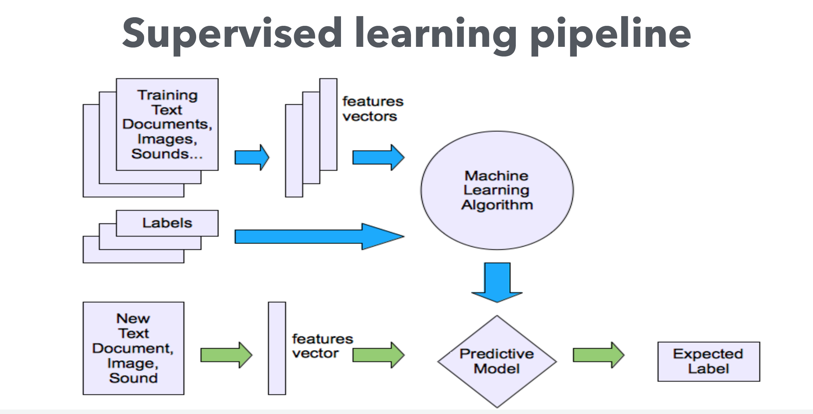
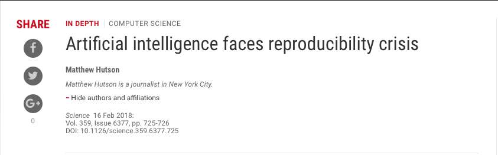
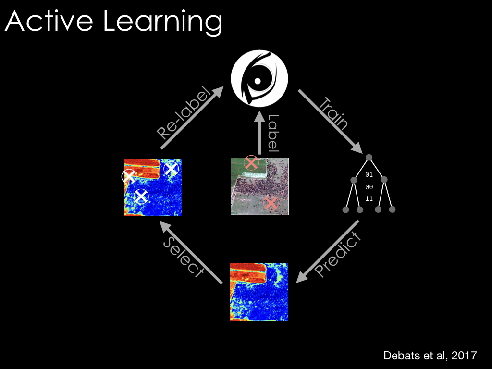

## Today
- Review your practical assignments from last week
- A word on finalizing group projects
- Start on final introductory module: combining human & machine intelligence  

---
class: center, middle
## Practicals from last week

---
class: center, middle
## Current Trends in EO

.center[]

---
background-image: url(https://upload.wikimedia.org/wikipedia/en/thumb/2/27/Sustainable_Development_Goals_chart.svg/787px-Sustainable_Development_Goals_chart.svg.png)
background-size: 80%

---
- Earth Observations and Machine Learning on the Cloud for Improved Agricultural Decision Making
- Using Remote Sensing / Satellite Data for Human Disease Surveillance
- Estimating crop production at village level and mapping locally attainable yield gap from Sentinel time series using Sen2Agri in a smallholder farming system 
- Cost Effective Measurement of Soil Health Management Practices with Remote Sensing 
- Estimating impact and resilience via convolutional neural network-generated synthetic variables and remotely sensed imagery 
- Plantix - The agricultural app to empower family farms with the help of AI 
- Zoonotic prediction with machine learning 

---

- Getting the big picture right: integrating ground-based surveys and remote sensing for better data and insights
- Crowdsourcing real-time crop surveillance data from small-holder farmers
- e-Agri – low cost sensing and communication systems to augment agricultural disease forecasting
- Nuru an AI system working with CGIAR, FAO and local extension to help smallholder farmers 
- Chameleon: a soil moisture sensor for smallholder farmers 
- A Cost-Effective Way of Collecting Crop Observations using Ultralight Aircraft - From SMS to Social Chat: How mobile messaging can support crop surveillance and audience engagement in Africa 

---
  
## Heavy emphasis on "ground-truth"

- [Plant Village](https://plantvillage.psu.edu/solutions)

---
background-image: url(figures/14/nuru.jpg)
background-size: 60%

---

- [GeoSurvey](https://qed.ai/geosurvey-collect/)
  - [GeoSurvey - cheap spectroscopy](https://qed.ai/scanspectrum/)

---
## Combining Human & Machine Intelligence

.center[]
.center[An increasingly typical data science workflow]

---

.center[]
.center[Increasingly typical tools]

---

## Background
- Algorithms of increasing complexity + predictive power
- Machine learning
  - [Definition](https://en.wikipedia.org/wiki/Machine_learning): 
      - Ability to progressively improve predictions without explicit programming
  - Characteristics:
      - Non-parametric
      - Can predict complex classes
      - Can handle highly dimensioned data
      - More effective than traditional classifiers

---
background-image: url(https://cdn-images-1.medium.com/max/1600/1*xGsYc6aXehD7lyoLEn-mMA.png)
background-size: 50%
background-position: bottom

## Classes of algorithms

Check out this [nice overview](https://www.dropbox.com/s/y7boyxe4ao2fppo/Computer%20Vision%20Machine%20Learning%20Deep%20Learning.pdf?dl=0) by Luisa and Lei from GEOG391

### Decision trees

- Simple or ensemble (random forest)

---
background-image: url(https://docs.opencv.org/2.4/_images/separating-lines.png)
background-size: 50%
background-position: bottom

### Support Vector Machines
- Optimal plane separating two classes

---
background-image: url(https://cdn-images-1.medium.com/max/2000/1*bhFifratH9DjKqMBTeQG5A.gif)
background-size: 50%
background-position: bottom

### Neural networks
- Mimics structure of animals brains
- Artificial neurons connected by "edges" (synapses)
- Hidden layers determine how inputs mapped to outputs
- One output neuron (node) per class

---
## Machine learning and training data

- Need large amounts of training data
- Typically human interpretation of imagery

---
background-image: url(figures/14/cropland-org.png)
background-size: 50%
background-position: bottom

## Examples
- croplands.org (Xiong et al, 2017)

---
background-image: url(figures/14/croplands-workflow.png)
background-size: 75%

---

background-image: url(https://36qxd1l7f7y2pa9s2h6gbwi1-wpengine.netdna-ssl.com/wp-content/uploads/2018/06/microsoft-building-footprints.png)
background-size: 60%
background-position: bottom

## Examples
- Microsoft building footprints

---
## Potential Problems with machine learning

---
# Our solution

---

