## Today
- Group projects
- More on active learning  

---
# Active Learning

---

---
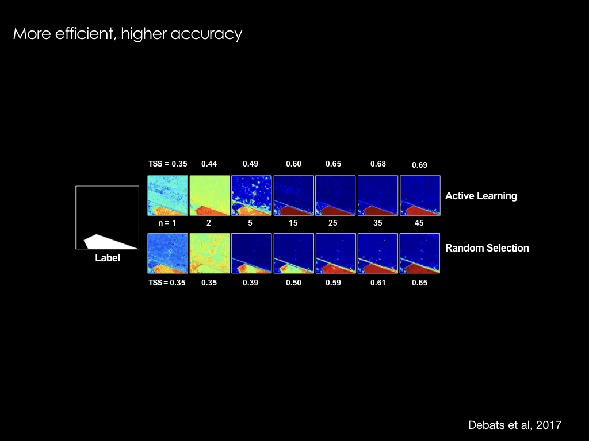
---

---
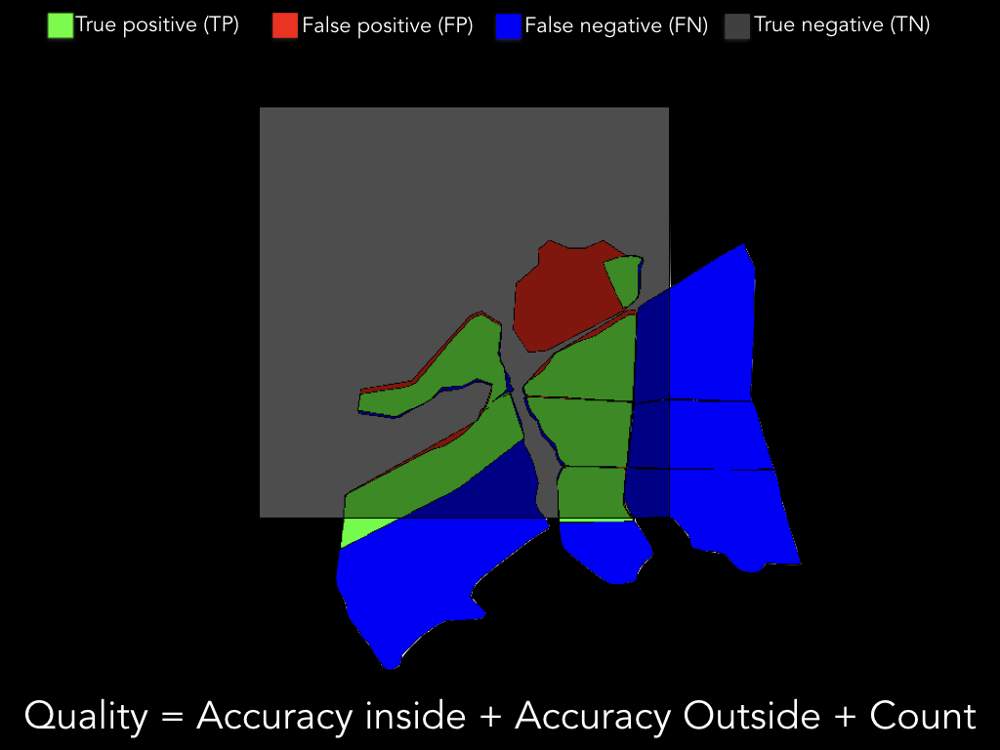

---
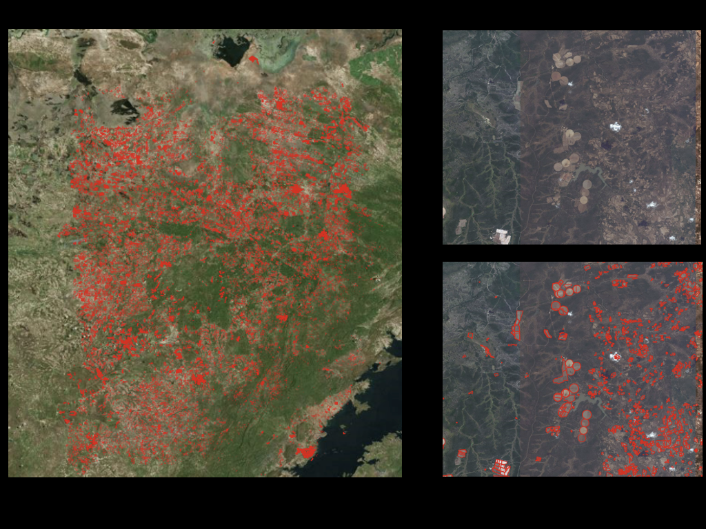
---
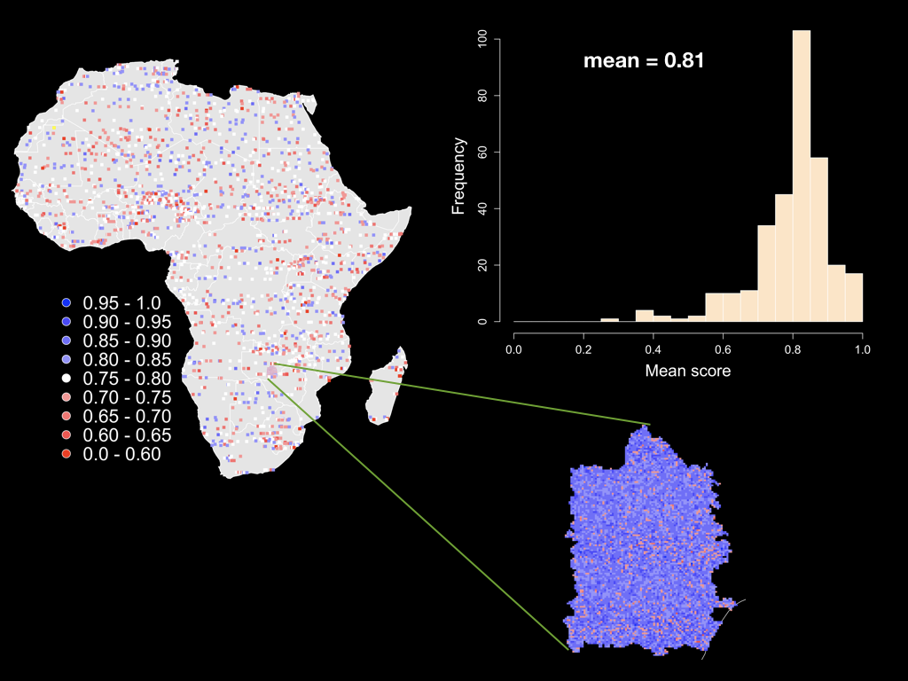
---

---
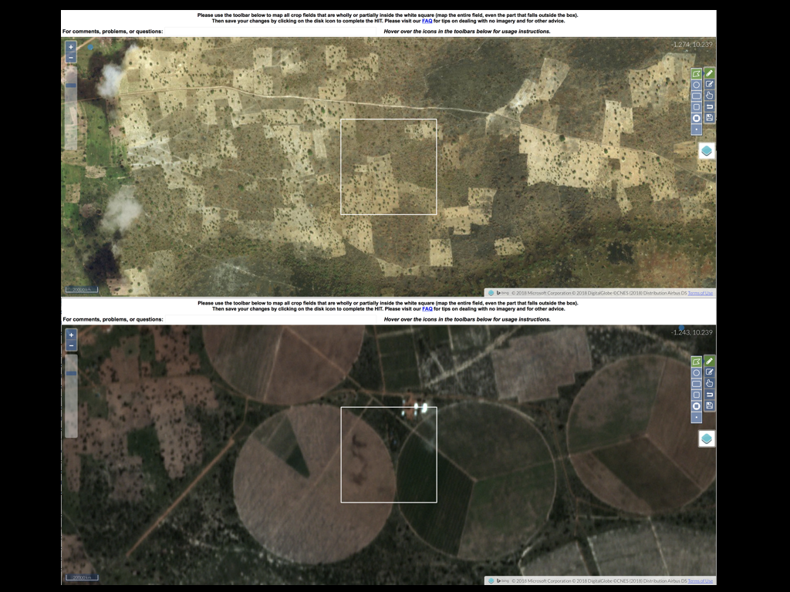

---
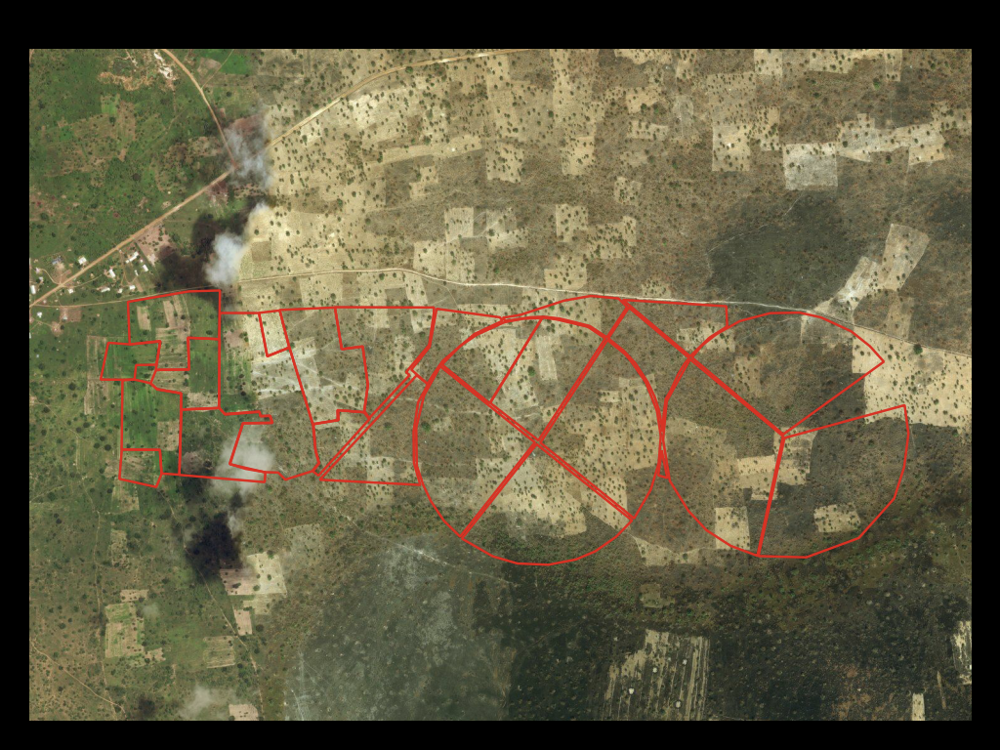

---

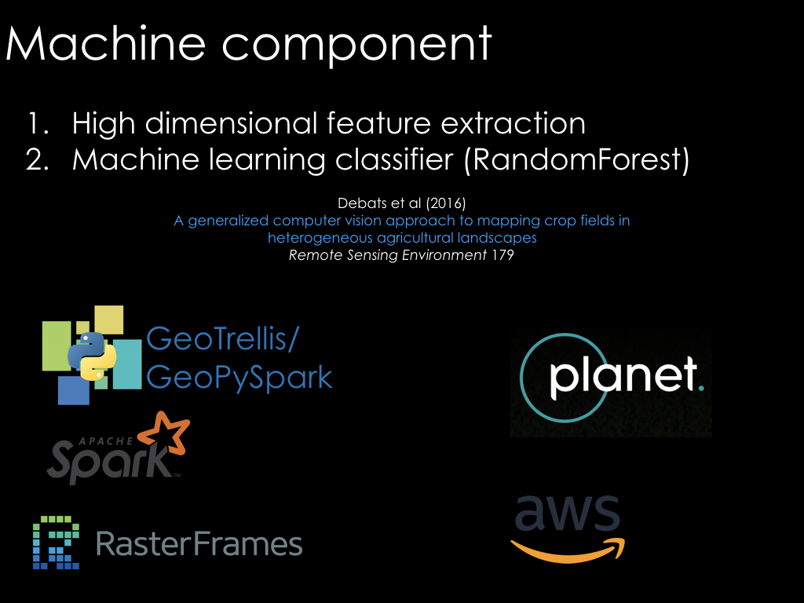

---
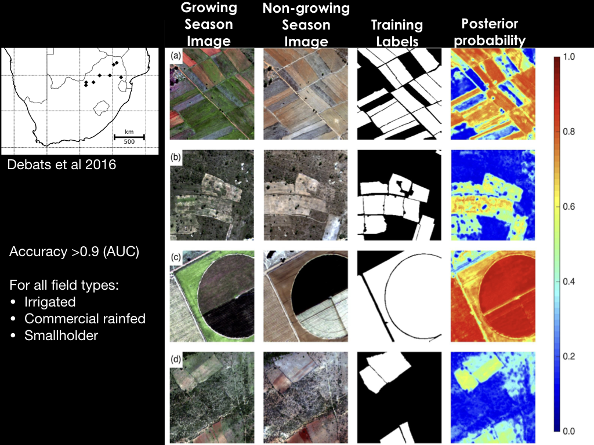
---

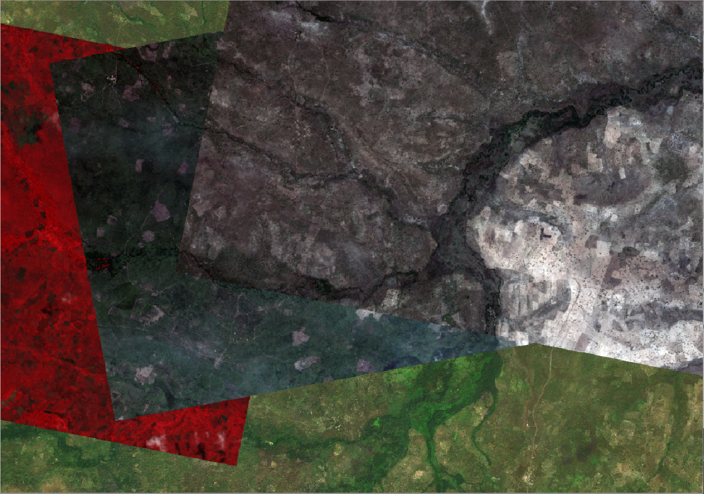

---

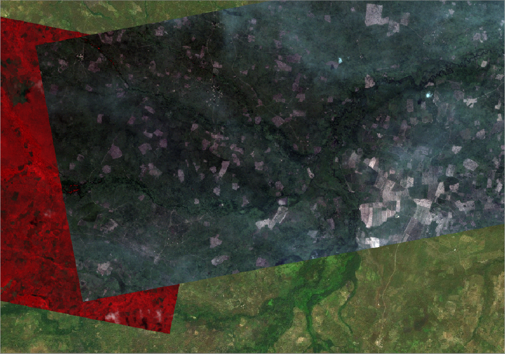
---

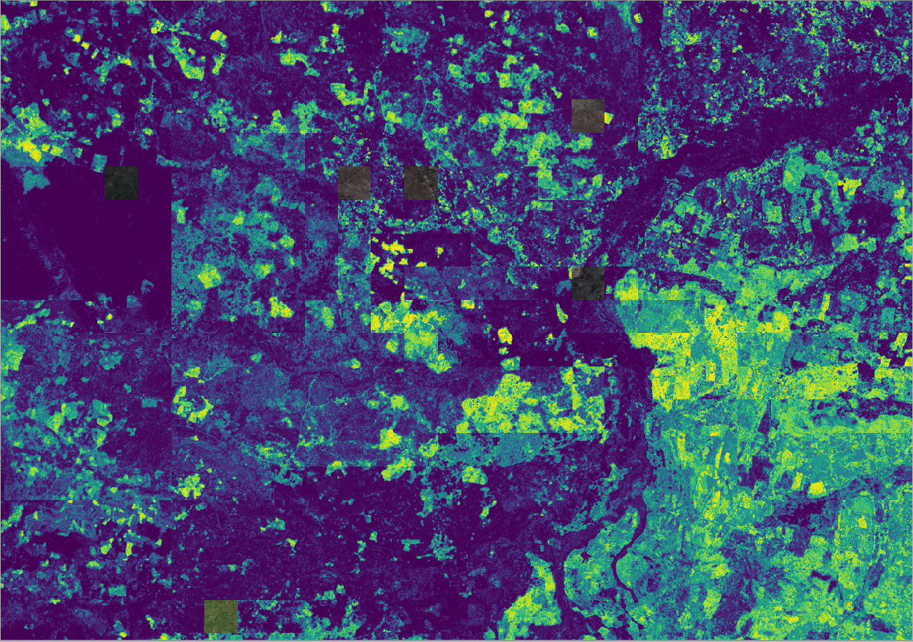

---

## Practical work

- Demo mapping
- A look at SQL

