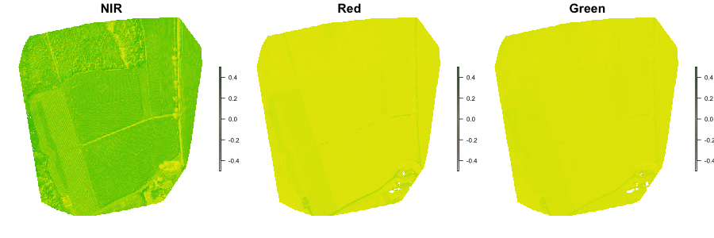
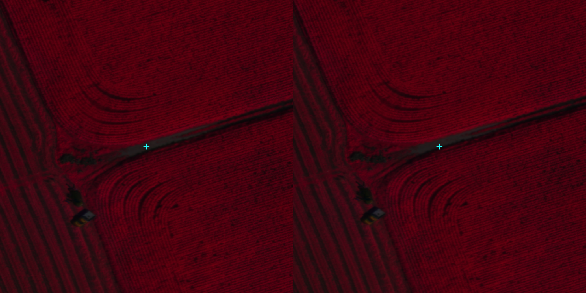
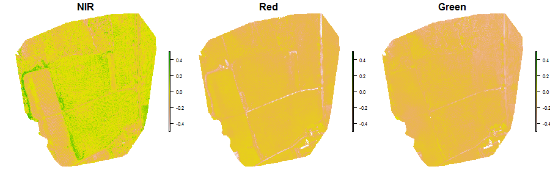
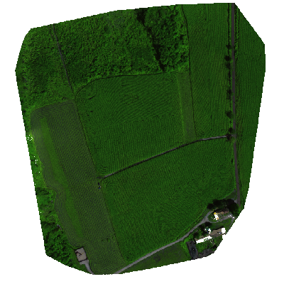
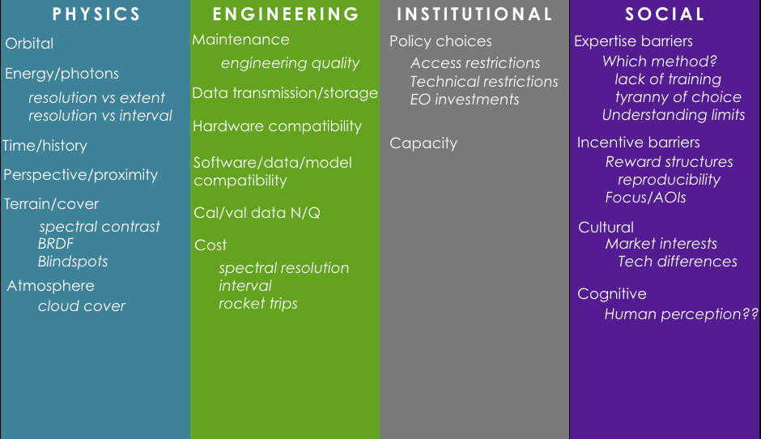

# Wrap-up
## UAS
## Where we have been so far

---
## Drone results (from earlier years)
### Reflectance strategies 
```{r, echo = FALSE, out.width="100%", fig.align='center'}

```

---
### PPK/no-PPK differences 
```{r, echo = FALSE, out.width="100%", fig.align='center'}
knitr::include_graphics('figures/14/uas_2018_ppk_difference.png')
```

---
### Date differences 
```{r, echo = FALSE, out.width="100%", fig.align='center'}
knitr::include_graphics('figures/14/uas_2018_date_difference.png')
```

---
### Spatial offset
```{r, echo = FALSE, out.width="100%", fig.align='center'}

```

<!--  -->

---
### 2018-2019 difference (no reflectance target)
```{r, echo = FALSE, out.width="100%", fig.align='center'}

```

---
### Pseudo-True From Sequioa Imagery

- Make pseudo green from red and green: 
  - pseudo_green = (red * 3 + green) / 4
- pseudo_rgb: red = red, green = pseudo_green, blue = green
```{r, echo=FALSE, eval=FALSE}
library(raster)
img1 <- brick(here::here("materials/data/04/aug24_ngb_noreftarget_cog_gcs.tif"))
green <- (img1[[3]] * 3 + img1[[1]]) / 4  # pseudo green band
red <- img1[[3]]  # red as red
blue <- img1[[2]]  # green serves as blue
plotRGB(stack(red, green, blue), scale = 0.41, zlim = c(0, 0.41))
```

```{r, echo = FALSE, eval=FALSE}
png("materials/slides/figures/14/pseudo_rgb.png", height = 400, width = 400)
par(mar = c(0, 0, 0, 0), bg = "transparent")
plotRGB(stack(red, green, blue), scale = 0.41, zlim = c(0, 0.41), bgalpha = 0)
dev.off()
```
```{r, echo = FALSE, out.width="50%", fig.align='center'}

```
---

### GCVI => LAI

GCVI = (NIR / GRN) – 1

GCVI = 1.4 * LAI^1.03 + 0.93

```{r, echo=FALSE, eval=FALSE}
gcvi <- (img1[[1]] / img1[[3]]) - 1
par(mar = rep(0, 4))
plot(gcvi)
```

```{r, echo=FALSE, eval=FALSE}
gcvi[gcvi > 10] <- 10
png("materials/slides/figures/14/gcvi.png", height = 400, width = 400)
par(mar = c(0, 0, 0, 0), bg = "transparent")
plot(gcvi, axes = FALSE, axis.args = list(col = "white", col.axis = "white"))
dev.off()
```

.center[]

---

LAI = ((GCVI - 0.93) / 1.4)^(1 / 1.03)

```{r, echo=FALSE, eval=FALSE}
lai <- ((gcvi - 0.93) / 1.4)^(1 / 1.03)
```

```{r, echo = FALSE, eval=FALSE}
png("materials/slides/figures/14/lai.png", height = 400, width = 400)
par(mar = c(0, 0, 0, 0), bg = "transparent")
plot(lai, axes = FALSE, axis.args = list(col = "white", col.axis = "white"))
dev.off()
```

.center[]


---
class: center, middle
# A look back at what we have covered so far

---

background-image: url(figures/10/uas_slides/uas_slides.002.png)
background-size: cover
---

## Physical Limits 1

- Space-time tradeoff
- Initiated by conflict between resolution and extent
- Temporal: length of record
- Surface characteristics: terrain and vegetation
- Atmosphere
- Perspective

---
## Methodological Limits

- Inadequate models: 
    - Need these to solve the inverse problem 
    - Models outpaced by EO data
- Not enough cal/val data
- Competing standards

---

## Societal Limits
- Expertise barrier
- Institutional limitations
    - Data access and collection policies
    - Coordination
- Accessibility to methods
- Collection biases

---
## Where we are headed
.center[]

---
## Sensors

- [Arable Labs](https://www.arable.com/)
- [Mark Sensor](https://www.arable.com/mark3)

---

## Antony et al (2020)

- Typical structure of IoT device?

---

```{r, echo = FALSE, out.width="100%", fig.align='center', fig.cap="Anthony et al, 2020, Figure 1"}
knitr::include_graphics('https://www.mdpi.com/sustainability/sustainability-12-03750/article_deploy/html/images/sustainability-12-03750-g001.png
')
```

---
- Agricultural (EO) uses?

---
```{r, echo = FALSE, out.width="100%", fig.align='center', fig.cap="Anthony et al, 2020, Figure 5"}
knitr::include_graphics('https://www.mdpi.com/sustainability/sustainability-12-03750/article_deploy/html/images/sustainability-12-03750-g004-550.jpg')
```

---

- Key challenges?

---

```{r, echo = FALSE, out.width="100%", fig.align='center', fig.cap="Anthony et al, 2020, Figure 12"}
knitr::include_graphics('https://www.mdpi.com/sustainability/sustainability-12-03750/article_deploy/html/images/sustainability-12-03750-g012.png')
```

