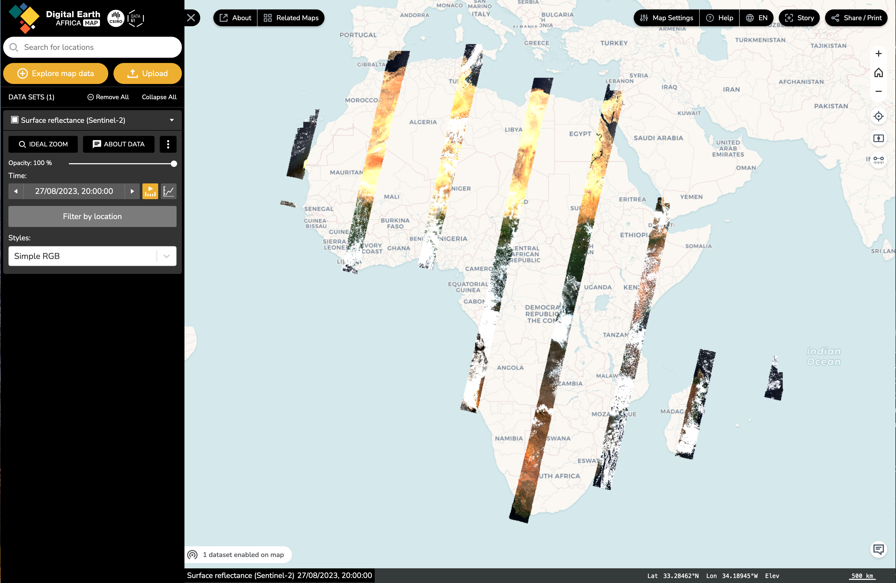
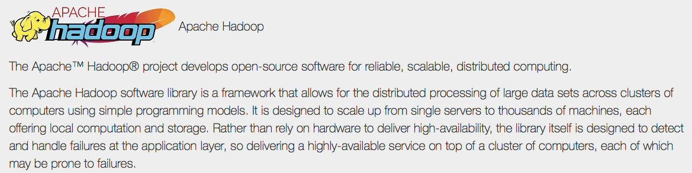

# Cloud-based Processing

## Objectives
### Understand: 
&nbsp;&nbsp; - What has enabled it?

&nbsp;&nbsp; - What is its value?

&nbsp;&nbsp; - What are the limitations?

### Know how to:
&nbsp;&nbsp; - Access Google Earth Engine and AWS virtual machines

&nbsp;&nbsp; - Perform some processing on each

&nbsp;&nbsp; - Ingest and do some basic analyses of our datasets
---

## What Has Enabled Cloud-Based Processing?

#### 1. Large-scale processing + Internet
#### 2. Open image archives
#### 3. Software Advances

---
### Large-scale processing + Internet


---
### Large-scale processing + Internet


---
### [Open Image Archives](https://registry.opendata.aws)


```{r, echo = FALSE, out.width="100%", fig.align='center'}

```

---

### Software Advances

Libraries and algorithms that can process these images at scale, e.g.

&nbsp;&nbsp; - Hadoop

&nbsp;&nbsp; - GeoSpark

&nbsp;&nbsp; - TerraLib

---

```{r, echo = FALSE, out.width="80%", fig.align='center'}

```

---

```{r, echo = FALSE, out.width="80%", fig.align='center'}
knitr::include_graphics("https://media.geeksforgeeks.org/wp-content/uploads/20200621102239/Hadoop-componants.png")
```

---
```{r, echo = FALSE, out.width="80%", fig.align='center'}
knitr::include_graphics("https://media.geeksforgeeks.org/wp-content/uploads/20200621105657/mapreduce-workflow.png")
```

---
```{r, echo = FALSE, out.width="80%", fig.align='center'}
knitr::include_graphics("https://media.geeksforgeeks.org/wp-content/uploads/20200621121959/3164-1.png
")
```


<!--  -->

---

```{r, echo = FALSE, out.width="50%", fig.align='center'}
knitr::include_graphics('figures/06/geospark.png')
```

<!-- .center[] -->
.center[[Yu et al, 2015](http://dl.acm.org/citation.cfm?doid=2820783.2820860)]

---

### Image hosting 

> A Cloud Optimized GeoTIFF (COG) is a regular GeoTIFF file, aimed at being hosted on a HTTP file server, with an internal organization that enables more efficient workflows on the cloud. It does this by leveraging the ability of clients issuing HTTP GET range requests to ask for just the parts of a file they need.

[COG Maps](https://cholmes.github.io/cog-map/)

---
### Vectors

- [GeoParquet](https://geoparquet.org/)
  - [More on Geoparquet](https://forrest.nyc/geoparquet-will-be-the-most-important-tool-in-modern-gis-in-2022/)
  
- [Vector tiles](https://docs.mapbox.com/data/tilesets/guides/vector-tiles-introduction/)

- [PMTiles](https://protomaps.com/blog/dynamic-maps-static-storage#pmtiles:-pyramids-of-map-tiles)

---


---
## Bringing These All Together

.center[]
.center[Gorelick et al, 2017]

---
## Value and Capabilities

&nbsp;&nbsp; - Opened new scales to analysis

&nbsp;&nbsp; - Much Greater Accessibility


---

### New Scales

[Global Surface Water](https://global-surface-water.appspot.com)

[Global Forest Watch](https://www.globalforestwatch.org/)

---

### Greater Accessibility

[Remap](https://remap-app.org)

[Sepal](https://docs.sepal.io/en/latest/)

[Digital Earth Africa](https://www.digitalearthafrica.org/)

[Sentinel-Hub](https://www.sentinel-hub.com/)

---

## Limitations

&nbsp;&nbsp; - Less control?

&nbsp;&nbsp; - More opacity?


