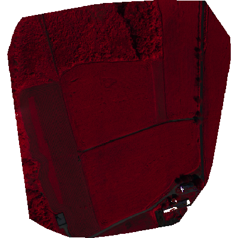
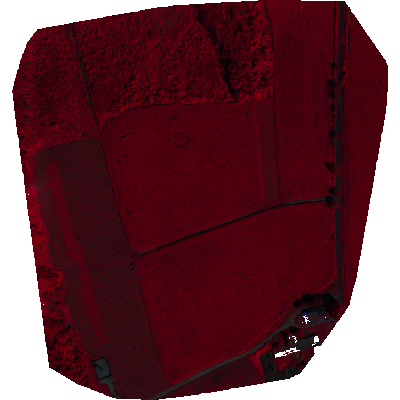
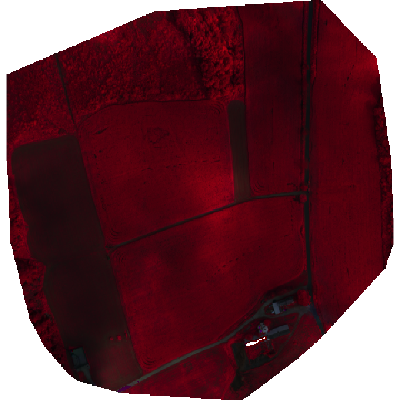
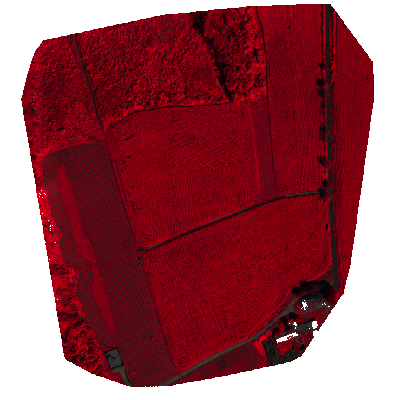
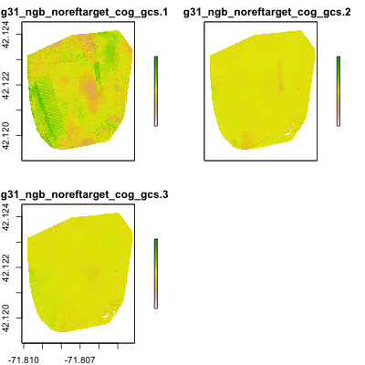
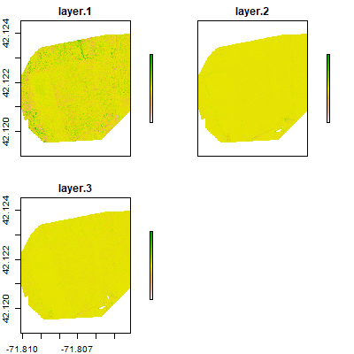
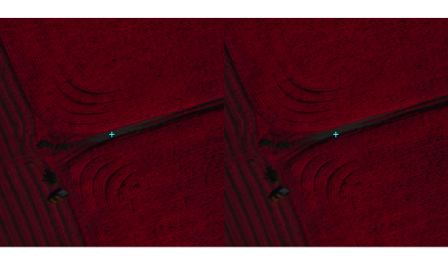

```{r setup, include=FALSE}
knitr::opts_chunk$set(echo = TRUE)
```

## Review of previous class
- Drones and scaling 
- PIX4d questions

## Analyzing Drone Orthomosaics

#### - eMotion/flight correction
#### - Examine PIX4D outputs
#### - Exercises using `R`, `gdal`, and `leaflet` to examine the drone orthomosaics we created for homework. 
&nbsp;&nbsp;+ Requires working `R`, Rstudio, `gdal` installs, and changing a few parameters 

&nbsp;&nbsp;+ If that fails, ArcGIS/Terrset/QGIS as a substitute

---
## Setup
Working with our Anaconda-installed versions of RStudio, we will have to first install:

- `gdal` into the Anaconda Rstudio environment
- in RStudio, in a new script or console prompt::

```{r, eval = FALSE}
install.packages("Rcpp")
install.packages("gdalUtils")
install.packages("raster")
install.packages("knitr")
```

This provides necessary libraries for our analyses

---
class: center, middle
# eMotion and PIX4D outputs

---

### Open Up eMotion3
#### Set up new mission over Whittier
#### Run simulation
### PIX4D project
#### Quality Reports
#### Ray clouds

---
class: center, middle
# Examining Our Orthomosaic Results

We'll use examples of 2018 imagery to start. 
---
## Starting with Pre-processing

### Preamble: 

We are going to use R and Rstudio to perform these analyses.  These slides provide a walk through of the code and results.  A companion script puts all the code in one place, which you should use so that you can run it more easily.  

### Coding Tips
#### - To execute code, simply highlight the lines you want to run, and then hit Ctrl + Enter (windows) or CMD + Enter (Mac)
#### - Assuming you have all the libraries and `gdal` properly installed, this code should work. The only things you have to change are path settings for files. 
---


## Set up your R code

First you have to set path variables, and load the R packages you need for analysis. The first lines of code are path and name variables, which are the only places where you have to change anything.

```{r, eval = FALSE}
# Path variables
## You have to replace the paths within the quotes to match: 
# 1. the directory path where you put the PIX4D outputs 
img_path <- "~/data/imagery/uas/pix4d"

# 2. The folder names for each of the projects. 
# !!!NOTE!!!: this assumes you put all four PIX4D project folders in one common # directory. Please move them into one if you didn't do so.
project1 <- "whittier_demo_24August2018"
project2 <- "whittier_demo_24August2018_noreftarget"
project3 <- "whittier_demo_24August2018_noppk"
project4 <- "whittier_demo_31August2018_noreftarget"

# 3. the directory where you want your outputs to be written 
out_dir <- "materials/data/05"  

# 4. the directory containing reflectance images in your projects. 
# If you only created tile outputs, your results will live in 
# .../4_index/reflectance/tiles/". If so, set the value to "tiles". If you have # merged outputs, they you will images in 4_index/reflectance/, so set the variable to "merged". In my case, they are merged, so I chose "merged"
ref_dir <- "merged"

# 5. path to companion class5_functions.R script
script_path <- "materials/code/R/external/scripts/class5_functions.R"
```

---

The next lines can be changed, but these are optional

```{r, eval=FALSE}
## The following variables are optional to change. These are the name roots for 
#  each of the images will we be creating. 
mband1 <- "aug24_ngb"
mband2 <- "aug24_ngb_noreftarget"
mband3 <- "aug24_ngb_noppk"
mband4 <- "aug31_ngb_noreftarget"

# Output names for warped and stretched
out1 <- "aug24_ngb_cog"
out2 <- "aug24_ngb_noreftarget_cog"
out3 <- "aug24_ngb_noppk_cog"
out4 <- "aug31_ngb_noreftarget_cog"
```

Then load in the packages and functions we will need
```{r, eval = FALSE}
library(gdalUtils)
library(raster)
source(script_path)  # this loads the companion scripts
```

---

### Exercise 1 

#### - An initial look at August 24th orthomosaic reflectance for permutation 1, with reflectance targets and PPK correction.  

##### - Run this code

Replace the path in `p` with the directory string for the project directory on your computer.  After replacing this, run this chunk of code
```{r, eval = FALSE}
# This reads the path to the four reflectance maps
fp <- file.path(img_path, project1)
img_nms <- refl_paths(fp)

# This creates a stack of the NIR, Red, Green bands, and then plots them in R
s <- stack(lapply(img_nms[c(2, 4, 1)], raster))
plotRGB(s, scale = 1, zlim = c(0, 1))
```

```{r, echo = FALSE, eval=FALSE}
png("materials/slides/figures/05/aug24_1.png", height = 600, width = 600)
par(mar = c(0, 0, 0, 0), bg = "transparent")
plotRGB(s, scale = 1, colNA = "transparent", zlim = c(0, 1), bgalpha = 0)
dev.off()
```
You should see something that looks like this

---


---

Now let's make a multi-band stack of the images, drawing on a customized function that relies on gdal, called `multi_band_stack`, which takes 3 arguments: 

&nbsp;&nbsp;+ `nms`, the paths to the reflectance bands. We want just NIR, Red, Green.

&nbsp;&nbsp;+ `out_dir`, the path to the output directory you select

&nbsp;&nbsp;+ `out_name`, the root base name (no extension) for the stacked geotiff


```{r, eval = FALSE}
nms <- img_nms[c(2, 4, 1)]  
b1 <- multi_band_stack(nms = nms, out_dir = out_dir, out_name = mband1)
plotRGB(b1, scale = 1, colNA = "transparent", zlim = c(0, 1))
```

---

Okay, let's convert the other 4 images to multi-band stacks

August 24, PPK, no reflectance target
```{r, eval = FALSE}
fp <- file.path(img_path, project2)
img_nms <- refl_paths(fp)
nms <- img_nms[c(2, 4, 1)]  
b2 <- multi_band_stack(nms = nms, out_dir = out_dir, out_name = mband2)
plotRGB(b2, scale = 1, colNA = "transparent", zlim = c(0, 1))
```

```{r, echo = FALSE, eval=FALSE}
png("materials/slides/figures/05/aug24_2.png", height = 400, width = 400)
par(mar = c(0, 0, 0, 0), bg = "transparent")
plotRGB(b2, scale = 1, colNA = "transparent", zlim = c(0, 1), bgalpha = 0)
dev.off()
```



---

August 24, no PPK, no reflectance target
```{r, eval = FALSE}
fp <- file.path(img_path, project3)
img_nms <- refl_paths(fp)
nms <- img_nms[c(2, 4, 1)]
b3 <- multi_band_stack(nms = nms, out_dir = out_dir, out_name = mband3)
plotRGB(b3, scale = 1, colNA = "transparent", zlim = c(0, 1))
```

```{r, echo = FALSE, eval=FALSE}
png("materials/slides/figures/05/aug24_3.png", height = 400, width = 400)
par(mar = c(0, 0, 0, 0), bg = "transparent")
plotRGB(b3, scale = 1, colNA = "transparent", zlim = c(0, 1), bgalpha = 0)
dev.off()
```



---

August 31, PPK, no reflectance target
```{r, eval = FALSE}
fp <- file.path(img_path, project4)
img_nms <- refl_paths(fp)
nms <- img_nms[c(2, 4, 1)]
b4 <-  multi_band_stack(nms = nms, out_dir = out_dir, out_name = mband4)
plotRGB(b4, scale = 1, colNA = "transparent", zlim = c(0, 1))
```

```{r, echo = FALSE, eval=FALSE}
png("materials/slides/figures/05/aug31_1.png", height = 400, width = 400)
par(mar = c(0, 0, 0, 0), bg = "transparent")
plotRGB(b4, scale = 1, colNA = "transparent", zlim = c(0, 1), bgalpha = 0)
dev.off()
```



---

```{r, echo = FALSE, eval = FALSE}
ext <- apply(do.call(rbind, lapply(list(b1, b2, b3), sf::st_bbox)), 2, min)
ext <- as(extent(ext[c(1, 3, 2, 4)]), "SpatialPolygons")
proj4string(ext) <- proj4string(b1)
ext <- spTransform(ext, "+proj=longlat +datum=WGS84 +no_defs")
```

Now we are going to process the different images so that we can perform bandmath on them. 

This entails using another custom function that calls `gdalwarp`:

&nbsp;&nbsp;+ reprojects to WGS84

&nbsp;&nbsp;+ aligns images to same extent

This is the extent we are using, so run this

```{r, eval = FALSE}
ext <- c(-71.8101, 42.1193, -71.8041, 42.1242)
```

And now let's process the first image stack

```{r, eval = FALSE}
b1a <- img_align(img = b1@file@name, out_dir = out_dir, out_name = out1, 
                 ext = ext)
```

And have a look at it

---

```{r, eval = FALSE}
plotRGB(b1a, scale = 1, colNA = "transparent", zlim = c(0, 1))
```

```{r, echo = FALSE, eval=FALSE}
png("materials/slides/figures/05/aug24_warp1.png", height = 400, width = 400)
par(mar = c(0, 0, 0, 0), bg = "transparent")
plotRGB(b1a, scale = 1, colNA = "transparent", zlim = c(0, 1), bgalpha = 0)
dev.off()
```


---

Let's do the rest now

```{r, eval = FALSE}
b2a <- img_align(img = b2@file@name, out_dir = out_dir, out_name = out2, 
                 ext = ext)
b3a <- img_align(img = b3@file@name, out_dir = out_dir, out_name = out3, 
                 ext = ext)
b4a <- img_align(img = b4@file@name, out_dir = out_dir, out_name = out4, 
                 ext = ext)
```

---
class: center, middle
# Comparisons

---

## Reflectance calibration strategy

How much difference? Let's visualize with a bit of band math

```{r, eval = FALSE}
ref_diff <- b1a - b2a  # subtract no ref target from ref target

# plot the difference maps, per band
nms <- c("NIR", "Red", "Green")
plot(ref_diff, main = nms, axes = FALSE, zlim = c(-0.5, 0.5))  
```

```{r, echo = FALSE, eval=FALSE}
png("materials/slides/figures/05/ref_diff.png", height = 400, width = 400)
par(mar = c(0, 0, 0, 0), bg = "transparent")
plot(ref_diff, zlim = c(-0.5, 0.5), 
     axis.args = list(col = "white", col.axis = "white"))
dev.off()
```

 

---
How much difference in stats?

```{r, eval = FALSE}
stats <- cellStats(ref_diff, summary)
colnames(stats) <- nms
round(stats, 3)
```

---

## PPK versus not

```{r, eval = FALSE}
ref_diff <- b2a - b3a  # subtract no ref target from ref target
plot(ref_diff, main = nms, axes = FALSE, zlim = c(-0.5, 0.5))
stats <- cellStats(ref_diff, summary)
colnames(stats) <- nms
round(stats, 3)
```

```{r, echo = FALSE, eval=FALSE}
png("materials/slides/figures/05/ref_diff2.png", height = 400, width = 400)
par(mar = c(0, 0, 0, 0), bg = "transparent")
plot(ref_diff, zlim = c(-0.5, 0.5), 
     axis.args = list(col = "white", col.axis = "white"))
dev.off()
```

 

---

## Two different dates

```{r, eval = FALSE}
ref_diff <- b2a - b4a  # subtract no ref target from ref target
plot(ref_diff, main = nms, axes = FALSE, zlim = c(-0.5, 0.5))
stats <- cellStats(ref_diff, summary)
colnames(stats) <- nms
round(stats, 3)
```

```{r, echo = FALSE, eval=FALSE}
png("materials/slides/figures/05/ref_diff3.png", height = 400, width = 400)
par(mar = c(0, 0, 0, 0), bg = "transparent")
plot(ref_diff, zlim = c(-0.5, 0.5), 
     axis.args = list(col = "white", col.axis = "white"))
dev.off()
```

 

---

## Effective Resolution

How much shift between PPK strategies?

```{r, eval = FALSE}
ext <- c(-71.80825, 42.120780, -71.807550, 42.121566)
pt <- cbind(mean(ext[c(1, 3)]), mean(ext[c(2, 4)]))
par(mar = c(0, 0, 0, 0), mfrow = c(1, 2))
plot(as(extent(ext[c(1, 3, 2, 4)]), "SpatialPolygons"), lty = 0)
plotRGB(b2a, scale = 1, colNA = "transparent", zlim = c(0, 1), add = TRUE)
points(pt[, 1], pt[, 2], col = "cyan", pch = "+")
plot(as(extent(ext[c(1, 3, 2, 4)]), "SpatialPolygons"), lty = 0)
plotRGB(b3a, scale = 1, colNA = "transparent", zlim = c(0, 1), add = TRUE)
points(pt[, 1], pt[, 2], col = "cyan", pch = "+")
```

```{r, echo = FALSE, eval=FALSE}
png("materials/slides/figures/05/spat_diff.png", height = 300, width = 500)
ext <- c(-71.80825, 42.120780, -71.807550, 42.121566)
pt <- cbind(mean(ext[c(1, 3)]), mean(ext[c(2, 4)]))
par(mar = c(0, 0, 0, 0), mfrow = c(1, 2), bg = "transparent")
plot(as(extent(ext[c(1, 3, 2, 4)]), "SpatialPolygons"), lty = 0)
plotRGB(b2a, scale = 1, colNA = "transparent", zlim = c(0, 1), add = TRUE)
points(pt[, 1], pt[, 2], col = "cyan", pch = "+")
plot(as(extent(ext[c(1, 3, 2, 4)]), "SpatialPolygons"), lty = 0)
plotRGB(b3a, scale = 1, colNA = "transparent", zlim = c(0, 1), add = TRUE)
points(pt[, 1], pt[, 2], col = "cyan", pch = "+")
dev.off()
```

---

 