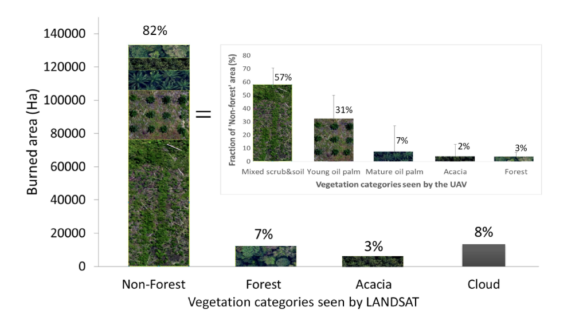

class: center, middle
# What Can UAS Do That Field Scientists and Cheap Satellites Can't?


---

background-image: url(figures/03/uas_slides/uas_slides.002.png)
background-size: cover

---
background-image: url(figures/03/uas_slides/uas_slides.004.png)
background-size: cover

---
background-image: url(figures/03/uas_slides/uas_slides.005.png)
background-size: cover

---
background-image: url(figures/03/uas_slides/uas_slides.006.png)
background-size: cover

---
background-image: url(figures/03/uas_slides/uas_slides.007.png)
background-size: cover

---
background-image: url(figures/03/uas_slides/uas_slides.008.png)
background-size: cover

---
background-image: url(figures/03/uas_slides/uas_slides.009.png)
background-size: cover

---
background-image: url(figures/03/uas_slides/uas_slides.010.png)
background-size: cover

---
background-image: url(figures/03/uas_slides/uas_slides.011.png)
background-size: cover

---
background-image: url(figures/03/uas_slides/uas_slides.012.png)
background-size: cover

---
background-image: url(figures/03/uas_slides/uas_slides.013.png)
background-size: cover

---
background-image: url(figures/03/uas_slides/uas_slides.014.png)
background-size: cover

---
background-image: url(figures/03/uas_slides/uas_slides.015.png)
background-size: cover

---
background-image: url(figures/03/uas_slides/uas_slides.016.png)
background-size: cover

---
class: center, middle

# UAS Use Cases

---
background-image: url(figures/03/uas_slides/uas_slides.024.png)
background-size: cover

<!-- .footnote[*Ecology + Conservation*] -->
 

---
background-image: url(figures/03/uas_slides/uas_slides.025.png)
background-size: cover

---
background-image: url(figures/03/uas_slides/uas_slides.026.png)
background-size: cover

---
background-image: url(figures/03/uas_slides/uas_slides.031.png)
background-size: cover

---
background-image: url(figures/03/uas_slides/uas_slides.032.png)
background-size: cover

---
background-image: url(figures/03/uas_slides/uas_slides.033.png)
background-size: cover

---
background-image: url(figures/03/uas_slides/uas_slides.034.png)
background-size: cover

---
# Drones as Scaling Tools

```{r, echo = FALSE, message = FALSE, fig.height=6, fig.width=6, fig.align='center'}
library(png)
library(grid)
library(gridExtra)
img1 <-  rasterGrob(as.raster(readPNG("figures/03/gaveau_etal_2b.png")),
                    interpolate = FALSE)
grid.arrange(img1, ncol = 1)
```

.center[Gaveau et al (2014), Figure 2b]

---


.center[Gaveau et al (2014), Figure 3]

---

background-image: url(http://upload.wikimedia.org/wikipedia/commons/c/c9/FEMA_-_45355_-_Firefighting_helicopter_hovering_over_a_lake_in_Colorado.jpg)
background-size: cover

# Key Characteristics of Drones
- Cannot cover large areas like satellites and crewed aircraft
- Unmatched spatial and temporal resolution
- Variable perspective

---

background-image: url(figures/03/uas_slides/uas_slides.021.png)
background-size: cover
---

# The Scales of Ecological Observations


.center[Estes et al (2018), Figure 2]

---
background-image: url(figures/03/uas_slides/uas_slides.035.png)
background-size: cover

---
background-image: url(figures/03/uas_slides/uas_slides.036.png)
background-size: cover

---
background-image: url(figures/03/uas_slides/uas_slides.037.png)
background-size: cover

---
background-image: url(figures/03/uas_slides/uas_slides.039.png)
background-size: cover

---
background-image: url(figures/03/uas_slides/uas_slides.040.png)
background-size: cover

---
background-image: url(figures/03/uas_slides/uas_slides.041.png)
background-size: cover

---
background-image: url(figures/03/uas_slides/uas_slides.042.png)
background-size: cover

---
background-image: url(figures/03/uas_slides/uas_slides.043.png)
background-size: cover

---
background-image: url(figures/03/uas_slides/uas_slides.044.png)
background-size: cover

---
background-image: url(figures/03/uas_slides/uas_slides.045.png)
background-size: cover

---
background-image: url(figures/03/uas_slides/uas_slides.046.png)
background-size: cover

---
background-image: url(figures/03/uas_slides/uas_slides.047.png)
background-size: cover

---
background-image: url(figures/03/uas_slides/uas_slides.048.png)
background-size: cover

---
background-image: url(figures/03/uas_slides/uas_slides.049.png)
background-size: cover

---
background-image: url(figures/03/uas_slides/uas_slides.050.png)
background-size: cover

---
background-image: url(figures/03/uas_slides/uas_slides.051.png)
background-size: cover

---
background-image: url(figures/03/uas_slides/uas_slides.052.png)
background-size: cover

---
background-image: url(figures/03/uas_slides/uas_slides.053.png)
background-size: cover

---
background-image: url(figures/03/uas_slides/uas_slides.054.png)
background-size: cover

---
# Working With Drones
## Preflight Planning
- Flight properties: Height, overlap
- Control: GCPs, base stations, calibration targets
- Environment: wind, cloud cover, rain

---
## Sensors
+ Choice of sensor: Off-the-shelf versus dedicated sensors

---
background-image: url(figures/03/spectral-char.pdf)
background-size: cover

### Camera spectral characteristics

---

## Software 

Structure From Motion

<iframe width="600" height="450" src="https://www.youtube.com/embed/i7ierVkXYa8" frameborder="0" allow="autoplay; encrypted-media" allowfullscreen></iframe>

If you want to learn more about the math, go here [here](https://www.youtube.com/watch?v=zdKX7Xo3Cb8)

---

# Sources of Error

## Geometric 
    - Orthomosaic from SfM
    - RTK/PPK and/or GCPs

## Atmospheric effects

---
### Radiometric calibration

.center[]
.center[Credit: Giuseppe Ciraolo, Università degli Studi di Palermo]

---

## Hard to Correct/Uncorrectable Errors
- Blur
- Hotspots / BRDF

---
background-image: url(figures/03/IMG_4796.JPG)
background-size: cover
### Blurry

---
background-image: url(figures/03/IMG_4267.JPG)
background-size: cover
### Less Blurry

---
background-image: url(figures/03/orth-artifacts.png)
background-size: cover
### Missing Data

---
background-image: url(figures/03/hotspots.pdf)
background-size: cover

