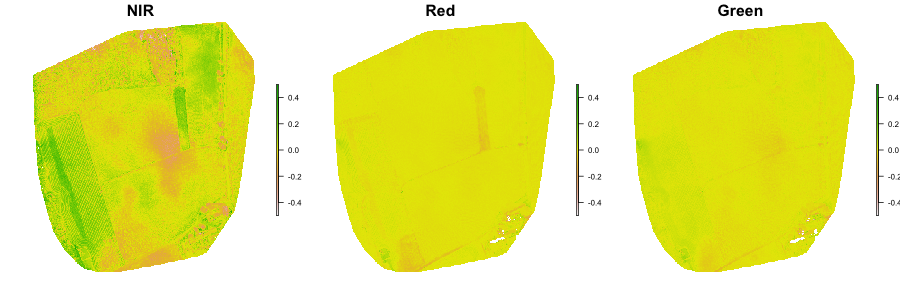
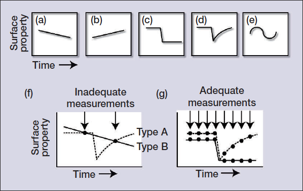
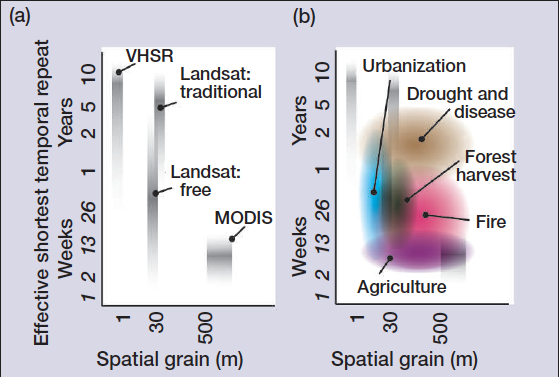
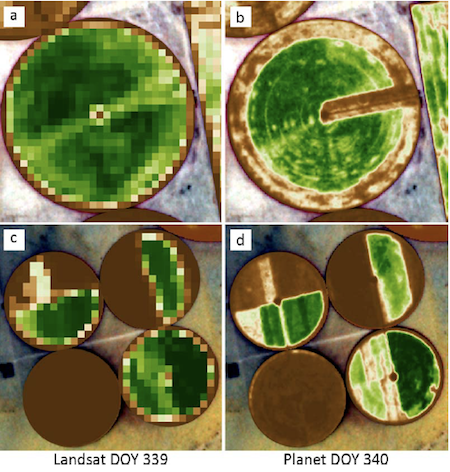
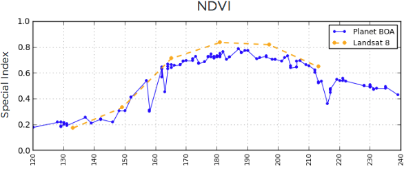
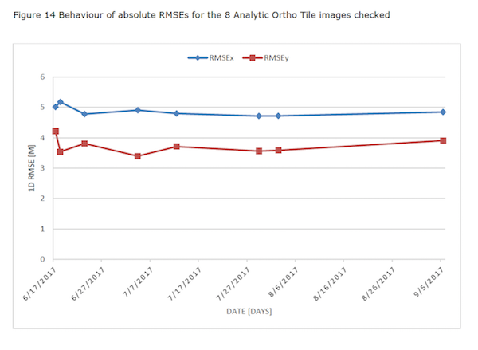
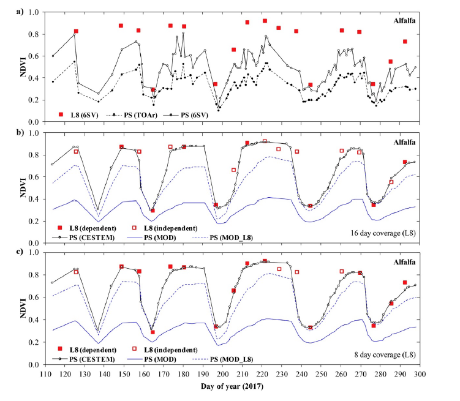
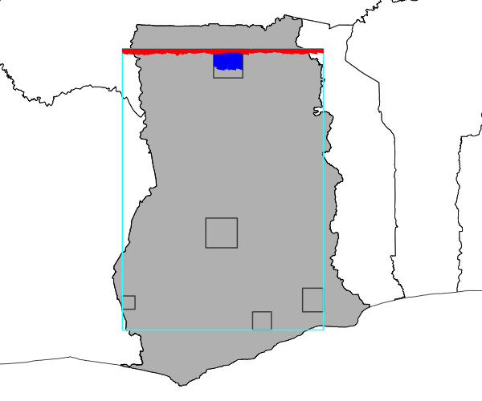
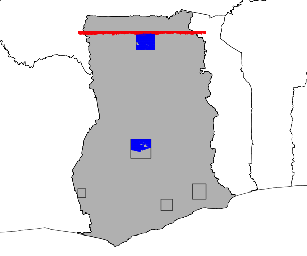

class: center, middle
# Finish-up UAS

---
## Your results
#### - 2018 versus 2019 PPK with reflectance targets
#### - 2019 PPK reflectance target vs 2019 PPK no-reflectance target
#### - 2019 PPK reflectance target vs 2019 no-PPK reflectance target

---
## Comparisons from last year
### Reflectance strategies (2018)
```{r, echo = FALSE, out.width="100%", fig.align='center'}
knitr::include_graphics('figures/04/uas_2018_ref_difference.png')
```
<!--  -->

---
### Date differences (2018)
```{r, echo = FALSE, out.width="100%", fig.align='center'}

```

<!--  -->


---
### PPK/no-PPK differences (2018)
```{r, echo = FALSE, out.width="100%", fig.align='center'}
knitr::include_graphics('figures/04/uas_2018_ppk_difference.png')
```

<!--  -->

---
### Spatial offset
```{r, echo = FALSE, out.width="100%", fig.align='center'}
knitr::include_graphics('figures/04/uas_2018_ppk_offset.png')
```

<!--  -->

---
### 2018-2019 difference (no reflectance target)
```{r, echo = FALSE, out.width="100%", fig.align='center'}
knitr::include_graphics('figures/04/uas_2018-2019_ref_difference.png')
```

---
### Pseudo-True From Sequioa Imagery

```{r, eval = FALSE}
library(raster)
img1 <- brick("materials/data/05/aug24_ngb_noreftarget_cog_gcs.tif")
green <- (img1[[3]] * 3 + img1[[1]]) / 4  # pseudo green band
red <- img1[[3]]  # red as red
blue <- img1[[2]]  # green serves as blue
plotRGB(stack(red, green, blue), scale = 0.41, zlim = c(0, 0.41))
```

```{r, echo = FALSE, eval=FALSE}
png("materials/slides/figures/04/pseudo_rgb.png", height = 400, width = 400)
par(mar = c(0, 0, 0, 0), bg = "transparent")
plotRGB(stack(red, green, blue), scale = 0.41, zlim = c(0, 0.41), bgalpha = 0)
dev.off()
```

```{r, echo = FALSE, out.width="50%", fig.align='center'}
knitr::include_graphics('figures/04/pseudo_rgb.png')
```

<!--  -->

---

### GCVI => LAI

GCVI = (NIR / GRN) – 1

GCVI = 1.4 * LAI^1.03 + 0.93

```{r, eval = FALSE}
gcvi <- (img1[[1]] / img1[[3]]) - 1
```

```{r, echo = FALSE, eval=FALSE}
gcvi[gcvi > 10] <- 10
png("materials/slides/figures/04/gcvi.png", height = 400, width = 400)
par(mar = c(0, 0, 0, 0), bg = "transparent")
plot(gcvi, axes = FALSE, axis.args = list(col = "white", col.axis = "white"))
dev.off()
```

.center[]

---

LAI = ((GCVI - 0.93) / 1.4)^(1 / 1.03)

```{r, eval=FALSE}
lai <- ((gcvi - 0.93) / 1.4)^(1 / 1.03)
```

```{r, echo = FALSE, eval=FALSE}
png("materials/slides/figures/04/lai.png", height = 400, width = 400)
par(mar = c(0, 0, 0, 0), bg = "transparent")
plot(lai, axes = FALSE, axis.args = list(col = "white", col.axis = "white"))
dev.off()
```

.center[]

---
# Take-aways from this Module

&nbsp;&nbsp;- Familiarity with Drone Operations

&nbsp;&nbsp;- Know how to process Sequioia imagery with PIX4D

&nbsp;&nbsp;- Insight into uses, strengths, limitations

---
class: center, middle
# Small Sats
---

## Objectives
### Understand: 
&nbsp;&nbsp; - What has enabled them

&nbsp;&nbsp; - Their value

&nbsp;&nbsp; - Their limitations

### Know how to:
&nbsp;&nbsp; - Access Planet data

&nbsp;&nbsp; - Run some basic searching & filtering (programmatically, with luck)

---
background-image: url(https://cdn.vox-cdn.com/uploads/chorus_image/image/58407563/38583831555_9ae89f5c10_o.0.jpg)
background-size: cover


## What has enabled small sats?

&nbsp;&nbsp; - Technology gains in other sectors

&nbsp;&nbsp;&nbsp;&nbsp;* Cell phones

&nbsp;&nbsp;&nbsp;&nbsp;* Computer (drives)

&nbsp;&nbsp;&nbsp;&nbsp;* Rocketry

&nbsp;&nbsp;&nbsp;&nbsp;* Etc
</div>

---

## Their Value

.center[]

.center[Kennedy et al (2014), Figure 1]

---

.center[]
.center[Kennedy et al (2014), Figure 3]

---
## Examples


.center[Urban growth in Shanghai]

---

## Examples

.center[]
.center[McCabe et al (2017), Figure 1]

---

## Examples

.center[]
.center[McCabe et al (2017), Figure 2]

---

## Examples

.center[]
.center[]

---

## Tradeoffs and Limitations

&nbsp;&nbsp;- Spatial resolution not that high

&nbsp;&nbsp;- Radiometry not superb

&nbsp;&nbsp;&nbsp;&nbsp;* Cross-calibration between sensors an issue (5-6% SD)

&nbsp;&nbsp;&nbsp;&nbsp;* Radiometric resolution fairly low

&nbsp;&nbsp;- Accessibility

background-image: url(figures/04/explorer.png)
background-size: cover

class: center, top
# Working with PlanetScope Data

---
background-image: url(https://www.planet.com/assets/images/approach/orbit-operations.jpg)
background-size: 60%
background-position: bottom
## A bit more on PlanetScope Radiometrics
&nbsp;&nbsp;- Detailed overview of radiometric calibration from [here](https://calval.cr.usgs.gov/wordpress/wp-content/uploads/Nick-Wilson.pdf)

&nbsp;&nbsp;- Independent assessment [here](https://calval.cr.usgs.gov/wordpress/wp-content/uploads/Dmitry-Varlyguin.pdf)

&nbsp;&nbsp; - (both in `materials/papers/`)

---
## Surface Reflectance


---
## Surface Reflectance
&nbsp;&nbsp;- Aerosol optical depth, water vapor from `MOD09CMA`

&nbsp;&nbsp;- Ozone from `MOD09CMG`

&nbsp;&nbsp;- Time difference ~1 hour

&nbsp;&nbsp;- Major uncertainties from MODIS values over clouds, ice, desert

&nbsp;&nbsp;- Sometimes no MODIS nearby--default 6S model

&nbsp;&nbsp;- Haze, cirrus not corrected

&nbsp;&nbsp;- Single, global aerosol model

&nbsp;&nbsp;- Scattering not dealt with

&nbsp;&nbsp;- Lambertian surface assumed

---

.center[]


---

.center[]
.center[[Source](http://www.conabio.gob.mx/conocimiento/premota/doctos/papers/LandVeg/Crystal_Schaaf.ppt.pdf)]

---

### PlanetScope Geometric Accuracy


.center[Dobrinić et al, from [here](https://bib.irb.hr/datoteka/947280.DobrinicGasparovicZupan_manuscript.pdf)]

---

### Another assessment

.center[]
.center[The Joint Research Centre, from [here](http://publications.jrc.ec.europa.eu/repository/bitstream/JRC111221/jrc_technical_report_planetscope-final_2.pdf)]

---
## CESTEM

```{r, echo = FALSE, out.width="100%", fig.align='center', fig.cap='Houbourg and McCabe, 2018'}
knitr::include_graphics('figures/04/cestem_schematic.png')
```

---

## CESTEM
```{r, echo = FALSE, out.width="100%", fig.align='center', fig.cap='Houbourg and McCabe, 2018'}

```

---
## CESTEM
```{r, echo = FALSE, out.width="100%", fig.align='center', fig.cap='Houbourg and McCabe, 2018'}
knitr::include_graphics('figures/04/cestem_lai.png')
```
---

### Working with Planet Explorer
#### The Point and Click Method

[Let's Login](https://www.planet.com/login/)

```{r, echo = FALSE, message = FALSE, warning=FALSE, eval=FALSE, fig.align='center'}
library(dplyr)
library(rmapaccuracy)
library(leaflet)
library(sf)
library(data.table)

coninfo <- mapper_connect("crowdmapper.org")
gcs <- "+proj=longlat +datum=WGS84 +no_defs"
scenes <- tbl(coninfo$con, "scenes_data") %>% filter(tms_url != '') %>% 
  collect()
gss <- scenes %>% filter(season == "GS")
oss <- scenes %>% filter(season == "OS")
allss <- scenes %>% 
  filter(cell_id %in% oss$cell_id[which(oss$cell_id %in% gss$cell_id)])
ids <- (allss %>% distinct(cell_id))$cell_id
idv <- ids[sample(1:length(ids), 1)]
name <- tbl(coninfo$con, "master_grid") %>% filter(id == idv) %>%
  select(id, name, x, y) %>% collect()
gpoly <- rmapaccuracy::point_to_gridpoly(data.table::data.table(name), 
                                         w = 0.005 / 2, gcs, gcs)
scenes_sel <- scenes %>% filter(cell_id == idv)
os <- (scenes_sel %>% filter(season == "OS") %>% select(tms_url))$tms_url
gs <- (scenes_sel %>% filter(season == "GS") %>% select(tms_url))$tms_url

slist <- list("color" = "white")
m <- leaflet() %>% addProviderTiles("Esri.WorldImagery") %>% 
  setView(name$x, name$y, zoom = 11) %>% 
  addTiles(os, group = "OS") %>% addTiles(gs, group = "GS") %>% 
  addPolygons(data = gpoly, color = "white", fill = FALSE, group = "Cell", 
              weight = 1, opacity = 1) %>% 
  addLabelOnlyMarkers(name$x, name$y, label = name$name, 
                      labelOptions = labelOptions(noHide = TRUE, 
                                                  style = slist,
                                                  direction = 'top', 
                                                  textOnly = TRUE)) %>% 
  addLayersControl(overlayGroups = c("Cell", "GS", "OS"),
                   options = layersControlOptions(collapsed = FALSE, 
                                                  autoZIndex = FALSE))
m

```

---

## Point and click only gets you so far

.center[]
.center[September 15th, 10:30 AM]

---

## Point and click only gets you so far

.center[]
.center[September 17th, 3:30 PM]

---

## Point and click only gets you so far

.center[]
.center[11:30 AM Today]

---

## Automation is key

### Getting a Python downloader running

&nbsp;&nbsp;- Install Python 3, if you don't have it

&nbsp;&nbsp;- Key libraries:

&nbsp;&nbsp;&nbsp;&nbsp; - rasterio 

&nbsp;&nbsp;&nbsp;&nbsp; - retry

&nbsp;&nbsp;&nbsp;&nbsp; - planet

&nbsp;&nbsp;&nbsp;&nbsp; - scipy

&nbsp;&nbsp;&nbsp;&nbsp; - skimage https://scikit-image.org/download.html

```
python -m pip install --user numpy scipy matplotlib ipython jupyter pandas sympy nose
pip install planet
pip install rasterio
pip install retry
```

