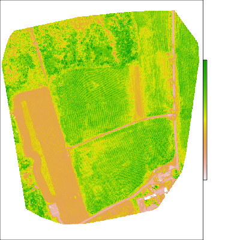
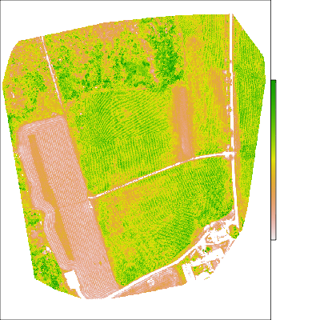
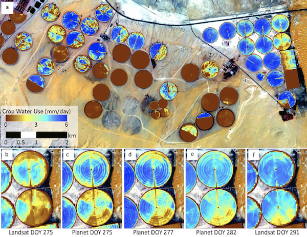

class: center, middle
# UAS Review

---
### Pseudo-True From Sequioa Imagery

```{r, eval = FALSE}
library(raster)
img1 <- brick("materials/data/05/aug24_ngb_noreftarget_cog_gcs.tif")
green <- (img1[[3]] * 3 + img1[[1]]) / 4  # pseudo green band
red <- img1[[3]]  # red as red
blue <- img1[[2]]  # green serves as blue
plotRGB(stack(red, green, blue), scale = 0.41, zlim = c(0, 0.41))
```

```{r, echo = FALSE, eval=FALSE}
png("materials/slides/figures/06/pseudo_rgb.png", height = 400, width = 400)
par(mar = c(0, 0, 0, 0), bg = "transparent")
plotRGB(stack(red, green, blue), scale = 0.41, zlim = c(0, 0.41), bgalpha = 0)
dev.off()
```


---

### GCVI => LAI

GCVI = (NIR / GRN) – 1

GCVI = 1.4 * LAI^1.03 + 0.93

```{r, eval = FALSE}
gcvi <- (img1[[1]] / img1[[3]]) - 1
```

```{r, echo = FALSE, eval=FALSE}
gcvi[gcvi > 10] <- 10
png("materials/slides/figures/06/gcvi.png", height = 400, width = 400)
par(mar = c(0, 0, 0, 0), bg = "transparent")
plot(gcvi, axes = FALSE, axis.args = list(col = "white", col.axis = "white"))
dev.off()
```


.center[]

---

LAI = ((GCVI - 0.93) / 1.4)^(1 / 1.03)

```{r, eval=FALSE}
lai <- ((gcvi - 0.93) / 1.4)^(1 / 1.03)
```

```{r, echo = FALSE, eval=FALSE}
png("materials/slides/figures/06/lai.png", height = 400, width = 400)
par(mar = c(0, 0, 0, 0), bg = "transparent")
plot(lai, axes = FALSE, axis.args = list(col = "white", col.axis = "white"))
dev.off()
```

.center[]

---
# Take-aways from this Module

&nbsp;&nbsp;- Familiarity with Drone Operations

&nbsp;&nbsp;- Know how to process Sequioia imagery with PIX4D

&nbsp;&nbsp;- Insight into uses, strengths, limitations

---
class: center, middle
# Small Sats
---

## Objectives
### Understand: 
&nbsp;&nbsp; - What has enabled them

&nbsp;&nbsp; - Their value

&nbsp;&nbsp; - Their limitations

### Know how to:
&nbsp;&nbsp; - Access Planet data

&nbsp;&nbsp; - Run some basic searching & filtering (programmatically, with luck)

---
background-image: url(https://cdn.vox-cdn.com/uploads/chorus_image/image/58407563/38583831555_9ae89f5c10_o.0.jpg)
background-size: cover


## What has enabled small sats?

&nbsp;&nbsp; - Technology gains in other sectors

&nbsp;&nbsp;&nbsp;&nbsp;* Cell phones

&nbsp;&nbsp;&nbsp;&nbsp;* Computer (drives)

&nbsp;&nbsp;&nbsp;&nbsp;* Rocketry

&nbsp;&nbsp;&nbsp;&nbsp;* Etc
</div>

---

## Their Value

.center[]

.center[Kennedy et al (2014), Figure 1]

---

.center[]
.center[Kennedy et al (2014), Figure 3]

---
## Examples


.center[Urban growth in Shanghai]

---

## Examples

.center[]
.center[McCabe et al (2017), Figure 1]

---

## Examples

.center[]
.center[McCabe et al (2017), Figure 2]

---

## Examples

.center[]
.center[]

---

## Tradeoffs and Limitations

&nbsp;&nbsp;- Spatial resolution not that high

&nbsp;&nbsp;- Radiometry not superb

&nbsp;&nbsp;&nbsp;&nbsp;* Cross-calibration between sensors an issue (5-6% SD)

&nbsp;&nbsp;&nbsp;&nbsp;* Radiometric resolution fairly low

&nbsp;&nbsp;- Accessibility


