## Objectives
### Understand: 
&nbsp;&nbsp; - What has enabled them

&nbsp;&nbsp; - Their value

&nbsp;&nbsp; - Their limitations

### Know how to:
&nbsp;&nbsp; - Access Planet data

&nbsp;&nbsp; - Run some basic searching & filtering (programmatically, with luck)

---
background-image: url(https://cdn.vox-cdn.com/uploads/chorus_image/image/58407563/38583831555_9ae89f5c10_o.0.jpg)
background-size: cover


## What has enabled small sats?

&nbsp;&nbsp; - Technology gains in other sectors

&nbsp;&nbsp;&nbsp;&nbsp;* Cell phones

&nbsp;&nbsp;&nbsp;&nbsp;* Computer (drives)

&nbsp;&nbsp;&nbsp;&nbsp;* Rocketry

&nbsp;&nbsp;&nbsp;&nbsp;* Etc
</div>

---

## Their Value

.center[]

.center[Kennedy et al (2014), Figure 1]

---

.center[]
.center[Kennedy et al (2014), Figure 3]

---
## Examples


.center[Urban growth in Shanghai]

---

## Examples

.center[]
.center[McCabe et al (2017), Figure 1]

---

## Examples

.center[]
.center[McCabe et al (2017), Figure 2]

---

## Examples

.center[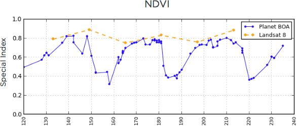]
.center[]

---

## Tradeoffs and Limitations

&nbsp;&nbsp;- Spatial resolution not that high

&nbsp;&nbsp;- Radiometry not superb (but changing)

&nbsp;&nbsp;&nbsp;&nbsp;* Cross-calibration between sensors an issue (5-6% SD)

&nbsp;&nbsp;&nbsp;&nbsp;* Radiometric resolution fairly low (but changing)

&nbsp;&nbsp;- Accessibility

---
background-image: url(https://www.planet.com/assets/images/approach/orbit-operations.jpg)
background-size: 60%
background-position: bottom
## PlanetScope Radiometrics
&nbsp;&nbsp;- Detailed overview of radiometric calibration from [here](https://calval.cr.usgs.gov/wordpress/wp-content/uploads/Nick-Wilson.pdf)

&nbsp;&nbsp;- Independent assessment [here](https://calval.cr.usgs.gov/wordpress/wp-content/uploads/Dmitry-Varlyguin.pdf)

&nbsp;&nbsp; - (both in `materials/papers/`)

---

### Bands

```{r, echo=FALSE, fig.align='center', fig.cap="https://bit.ly/3uMlmac d"}
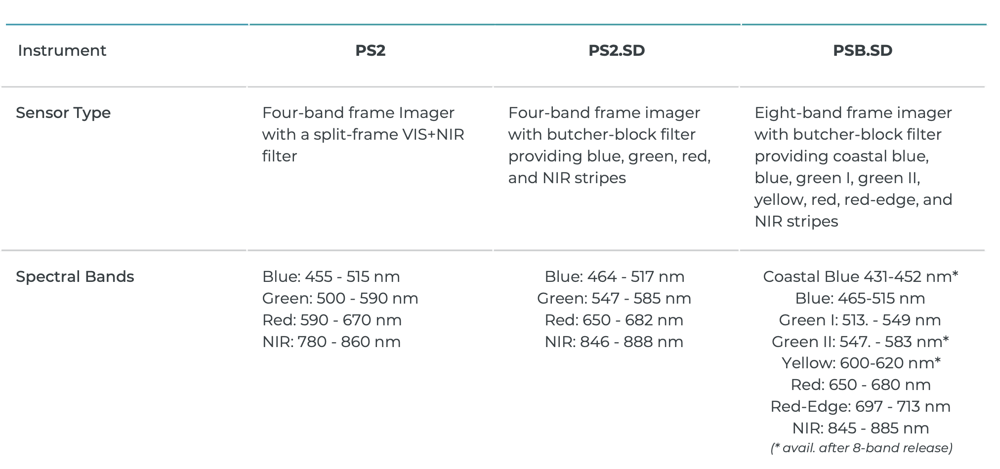
```

[44 Super Doves in orbit](https://www.planet.com/pulse/44-superdove-satellites-successfully-launch-on-spacex-falcon-9-rocket/)


---
## Surface Reflectance

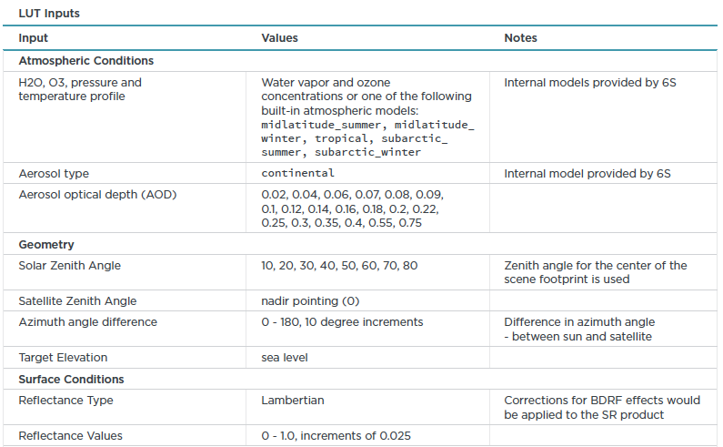

---
## Surface Reflectance
&nbsp;&nbsp;- Aerosol optical depth, water vapor from `MOD09CMA`

&nbsp;&nbsp;- Ozone from `MOD09CMG`

&nbsp;&nbsp;- Time difference ~1 hour

&nbsp;&nbsp;- Major uncertainties from MODIS values over clouds, ice, desert

&nbsp;&nbsp;- Sometimes no MODIS nearby--default 6S model

&nbsp;&nbsp;- Haze, cirrus not corrected

&nbsp;&nbsp;- Single, global aerosol model

&nbsp;&nbsp;- Scattering not dealt with

&nbsp;&nbsp;- Lambertian surface assumed

---


```{r, echo=FALSE, out.width = "70%", fig.cap="From https://caps.umb.edu/spectralmass/terra_aqua_modis/modis", fig.align='center'}
p <- "https://www.umb.edu/editor_uploads/images/school_for_the_environment_cs/"
knitr::include_graphics(
  c(glue::glue("{p}brdf1.gif"))
)

```

---

```{r, echo=FALSE, out.width = "30%", fig.align='center'}
p <- "https://www.umb.edu/editor_uploads/images/school_for_the_environment_cs/"
knitr::include_graphics(
  c(glue::glue("{p}brdfspruce.jpg"), glue::glue("{p}brdf3.jpg"),
    glue::glue("{p}brdf4.jpg"))
)
```
.center[[Source](https://caps.umb.edu/spectralmass/terra_aqua_modis/modis)]


<!-- .center[] -->


---

.center[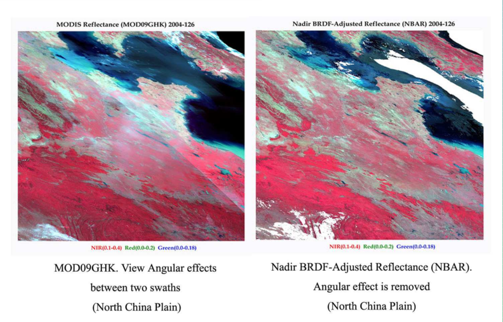]
.center[[Source](http://www.conabio.gob.mx/conocimiento/premota/doctos/papers/LandVeg/Crystal_Schaaf.ppt.pdf)]

---

### PlanetScope Geometric Accuracy

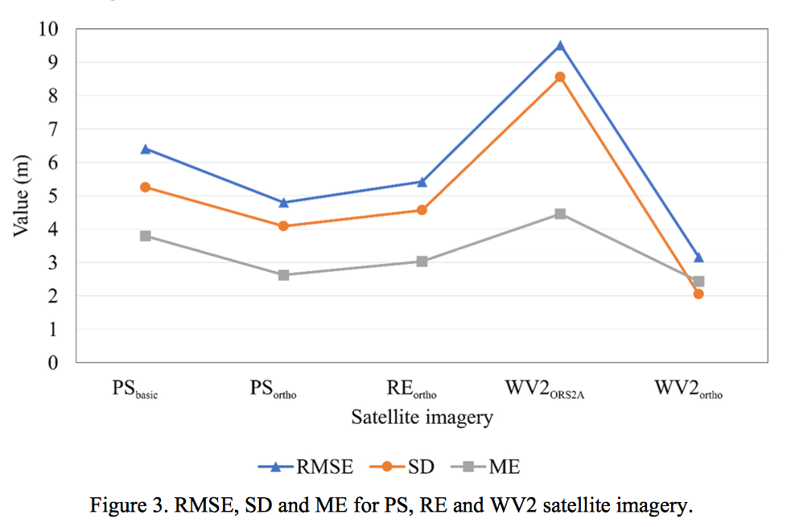
.center[Dobrinić et al, from [here](https://bib.irb.hr/datoteka/947280.DobrinicGasparovicZupan_manuscript.pdf)]

---

### Another assessment

.center[]
.center[The Joint Research Centre, from [here](http://publications.jrc.ec.europa.eu/repository/bitstream/JRC111221/jrc_technical_report_planetscope-final_2.pdf)]

---
## CESTEM

```{r, echo = FALSE, out.width="80%", fig.align='center', fig.cap='Houbourg and McCabe, 2018'}
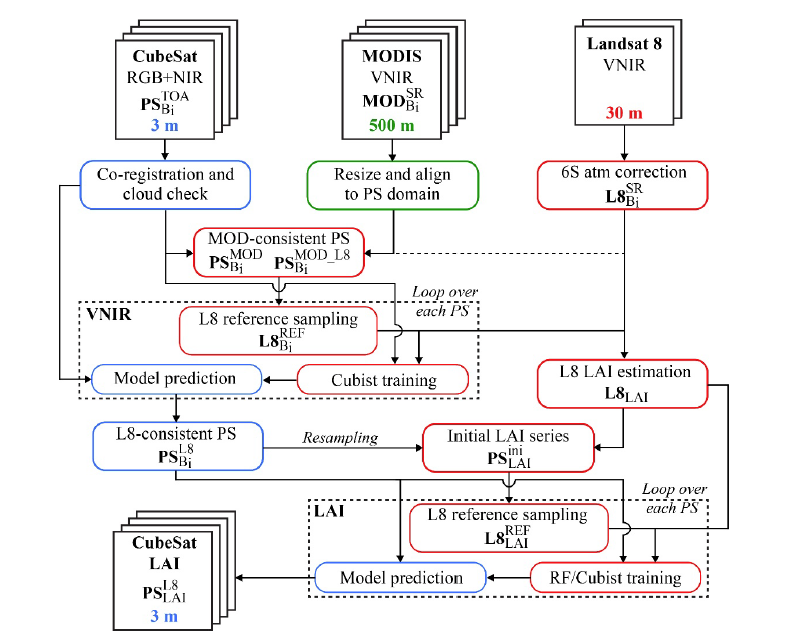
```

---

## CESTEM
```{r, echo = FALSE, out.width="80%", fig.align='center', fig.cap='Houbourg and McCabe, 2018'}
knitr::include_graphics('figures/07/cestem_ndvi.png')
```

---
## CESTEM
```{r, echo = FALSE, out.width="80%", fig.align='center', fig.cap='Houbourg and McCabe, 2018'}
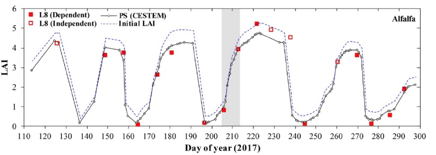
```

---
```{r, echo = FALSE, out.width="80%", fig.align='center', fig.cap="https://bit.ly/3JrokVM"}
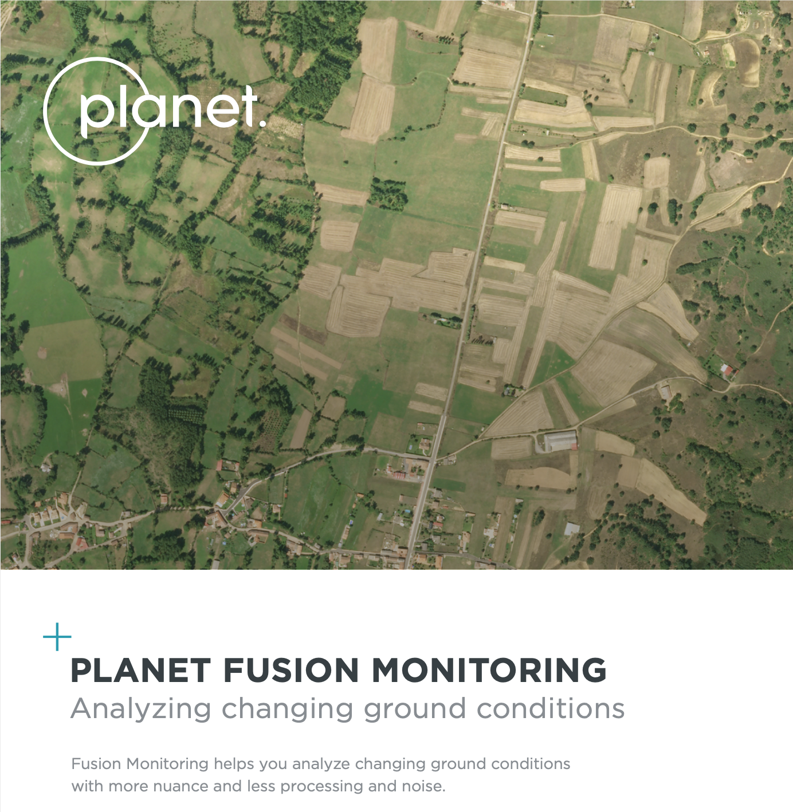
```

---

```{r, echo = FALSE, out.width="80%", fig.align='center', fig.cap="https://bit.ly/3JrokVM"}
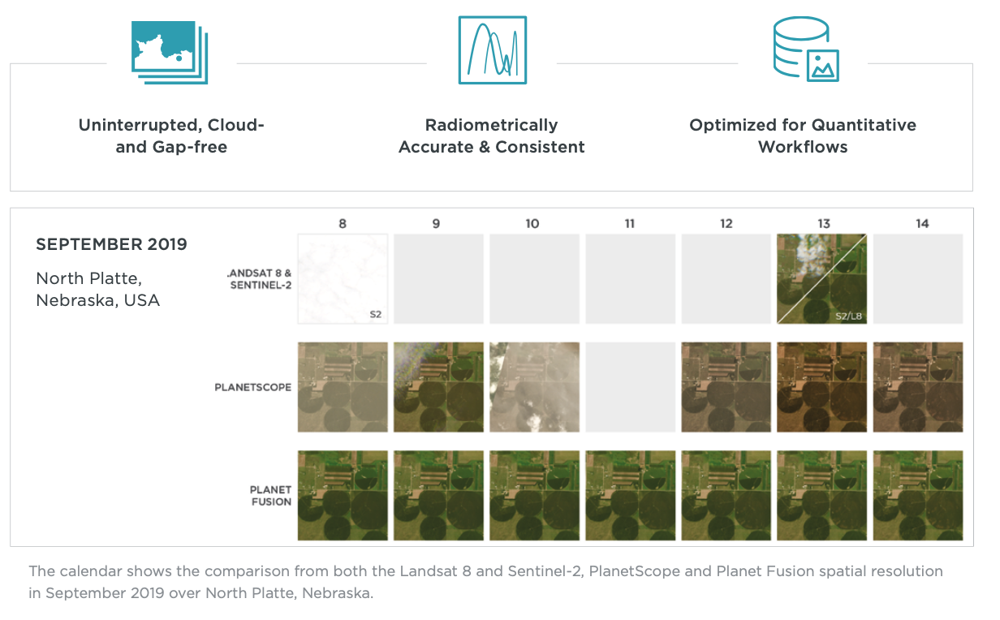
```

---
```{r, echo = FALSE, out.width="80%", fig.align='center', fig.cap="https://bit.ly/3JrokVM"}
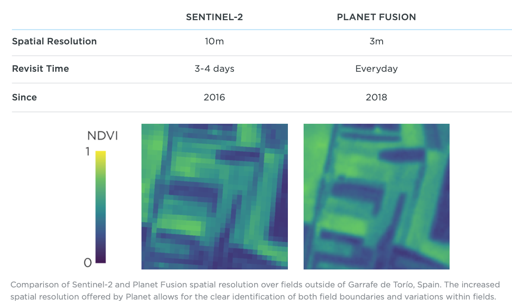
```

---
```{r, echo = FALSE, out.width="80%", fig.align='center', fig.cap="https://bit.ly/3JrokVM"}
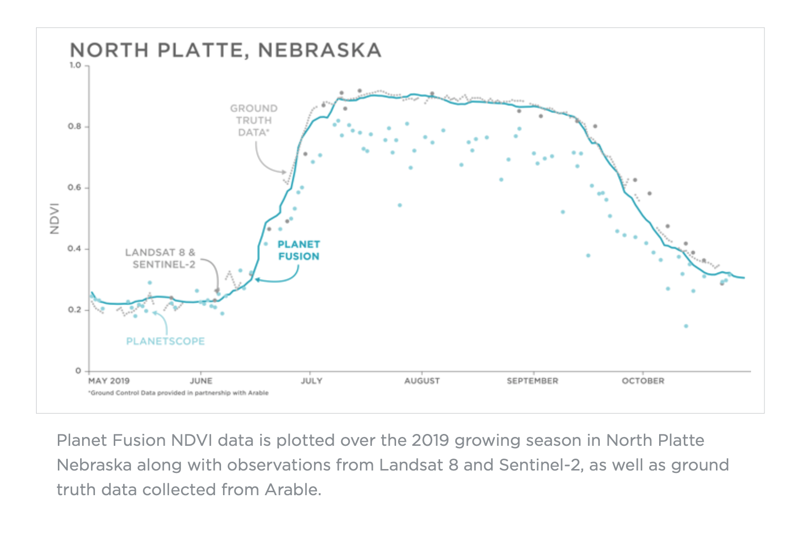
```


---

background-image: url(figures/07/explorer.png)
background-size: cover

class: center, top
# Working with PlanetScope Data

---

### Working with Planet Explorer
#### The Point and Click Method

[Login](https://www.planet.com/login/), after [first signing up](https://www.planet.com/nicfi/)

---

## Point and click only gets you so far

.center[]
.center[September 15th, 10:30 AM]

---

## Point and click only gets you so far

.center[]
.center[September 17th, 3:30 PM]

---

## Point and click only gets you so far

.center[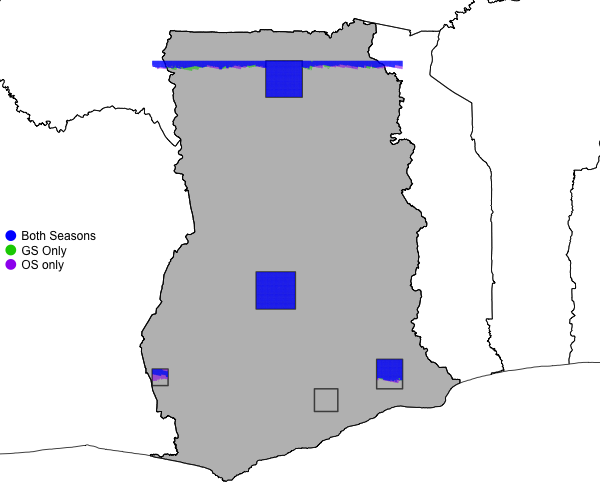]
.center[11:30 AM Today]

---

## Automation is key
Updated approach (from Estes et al, 2021, and available [here](https://github.com/agroimpacts/imager))

```{r, echo = FALSE, out.width="80%", fig.align='center'}
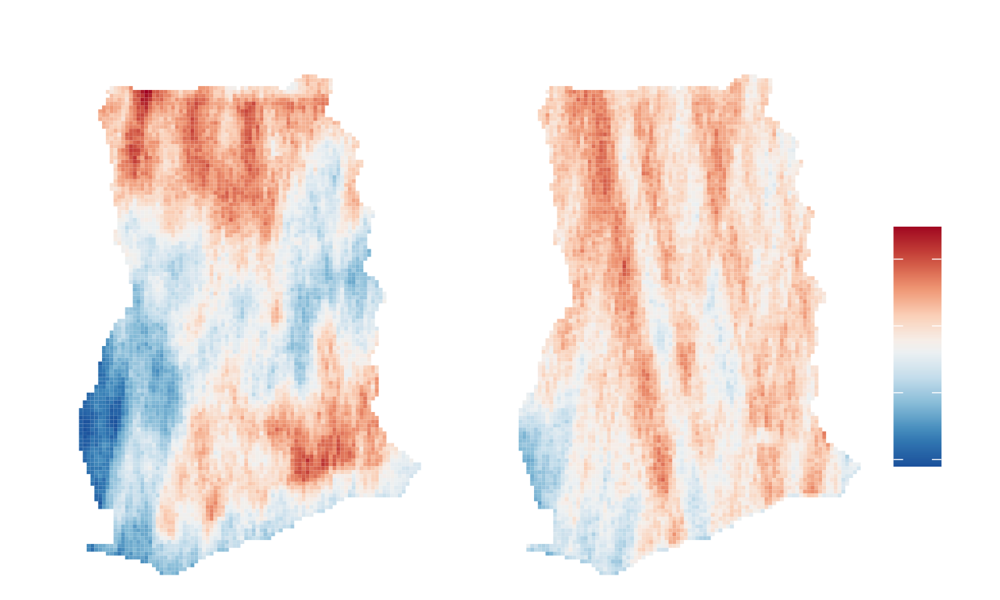
```

---
### Compositing daily images
[Compositing approach](http://mappingafrica.io/technology/#panel1)

```{r, echo = FALSE, out.width="35%", fig.align='center', fig.cap="From Estes et al (2021)"}
knitr::include_graphics(
  glue::glue(
    "https://github.com/agroimpacts/activemapper/blob/main/inst/",
    "manuscript/figures/figure3.png?raw=True"
  ))
```

---
### Next steps

- Work with PlanetScope NICFI basemaps
- Download by area, date, and then analyze


