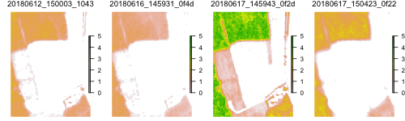
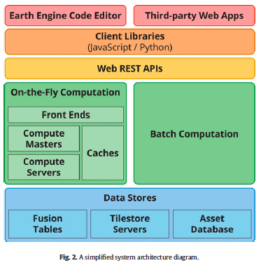

class: center, middle
# Small Sats Review

---
### A look at our data

```{r, eval = FALSE, echo = FALSE}
library(raster)
p <- dir("materials/data/09", pattern = "tif", full.names = TRUE)
rl <- lapply(p, function(x) {
  b <- brick(x)
  b / cellStats(b, max)
})

# plot
png("materials/slides/figures/09/planet_clips.png", width = 500, height = 150)
par(mfrow = c(1, 4), mar = c(0, 0, 1, 0), bg = "transparent")
for(i in 1:length(rl)) {
  b <- rl[[i]]
  nm <- gsub("_aoi.tif", "", basename(p[i]))
  plot(as(extent(b), "SpatialPolygons"), lty = 0, axes = FALSE)
  plotRGB(b[[1:3]], axes = FALSE, scale = 1, add = TRUE)
  mtext(nm, side = 3, line = 0, cex = 0.8, col = "white")
}
dev.off()
```

.center[]

---

### GCVI => LAI

GCVI = (NIR / GRN) – 1

GCVI = 1.4 * LAI^1.03 + 0.93

LAI = ((GCVI - 0.93) / 1.4)^(1 / 1.03)

```{r, eval = FALSE}
png("materials/slides/figures/09/planet_lai.png", width = 500, height = 150)
par(mfrow = c(1, 4), mar = c(0, 0, 1, 0))
for(i in 1:length(rl)) {
  b <- rl[[i]]
  gcvi <- b[[4]] / b[[1]] - 1
  lai <- ((gcvi - 0.93) / 1.4)^(1 / 1.03)
  nm <- gsub("_aoi.tif", "", basename(p[i]))
  plot(as(extent(lai), "SpatialPolygons"), lty = 0, axes = FALSE)
  plot(lai, axes = FALSE, add = TRUE, zlim = c(0, 5))#, 
       #axis.args = list(col = "white", col.axis = "white"))
  mtext(nm, side = 3, line = 0, cex = 0.8)#, col = "white")
}
dev.off()
```

---

.center[]

---

# Take-aways from Small-Sats Module

&nbsp;&nbsp; - Understand what has enabled Small Sats

&nbsp;&nbsp; - Understand their value

&nbsp;&nbsp; - Understand their limitations

&nbsp;&nbsp; - Know how to access Planet data

&nbsp;&nbsp; - Run some basic searching & filtering

&nbsp;&nbsp; - Can do these things both programmatically and through Explorer

---
# Cloud-based Processing

## Objectives
### Understand: 
&nbsp;&nbsp; - What has enabled them?

&nbsp;&nbsp; - What is their value?

&nbsp;&nbsp; - What are their limitations?

### Know how to:
&nbsp;&nbsp; - Access Google Earth Engine and Radiant Earth

&nbsp;&nbsp; - Perform some basic large-scale processing on each

&nbsp;&nbsp; - Ingest and do some basic analyses of our datasets
---

## What Has Enabled Cloud-Based Processing?

#### 1. Large-scale processing + Internet
#### 2. Open image archives
#### 3. Software Advances

---
### Large-scale processing + Internet


---
### Large-scale processing + Internet


---
### [Open Image Archives](https://registry.opendata.aws)


---

### Software Advances

Libraries and algorithms that can process these images at scale, e.g.

&nbsp;&nbsp; - Hadoop

&nbsp;&nbsp; - GeoSpark

&nbsp;&nbsp; - TerraLib

---

---


---
.center[]
.center[[Yu et al, 2015](http://dl.acm.org/citation.cfm?doid=2820783.2820860)]

---

### Image hosting 

> A Cloud Optimized GeoTIFF (COG) is a regular GeoTIFF file, aimed at being hosted on a HTTP file server, with an internal organization that enables more efficient workflows on the cloud. It does this by leveraging the ability of clients issuing HTTP GET range requests to ask for just the parts of a file they need.

[COG Maps](https://cholmes.github.io/cog-map/)

---
## Bringing These All Together

.center[]
.center[Gorelick et al, 2017]

---
## Value and Capabilities

&nbsp;&nbsp; - Opened new scales to analysis

&nbsp;&nbsp; - Much Greater Accessibility

---
### New Scales

[Global Surface Water](https://global-surface-water.appspot.com)

[Global Forest Watch](https://www.globalforestwatch.org/map/3/16.52/0.98/ALL/grayscale/loss/607,556,580,592?tab=analysis-tab&begin=2001-01-01&end=2016-01-01&threshold=30&dont_analyze=true)

---

### Greater Accessibility

[Remap](https://remap-app.org)

<!--  -->

---

## Limitations

&nbsp;&nbsp; - Less control?

&nbsp;&nbsp; - More opacity?

