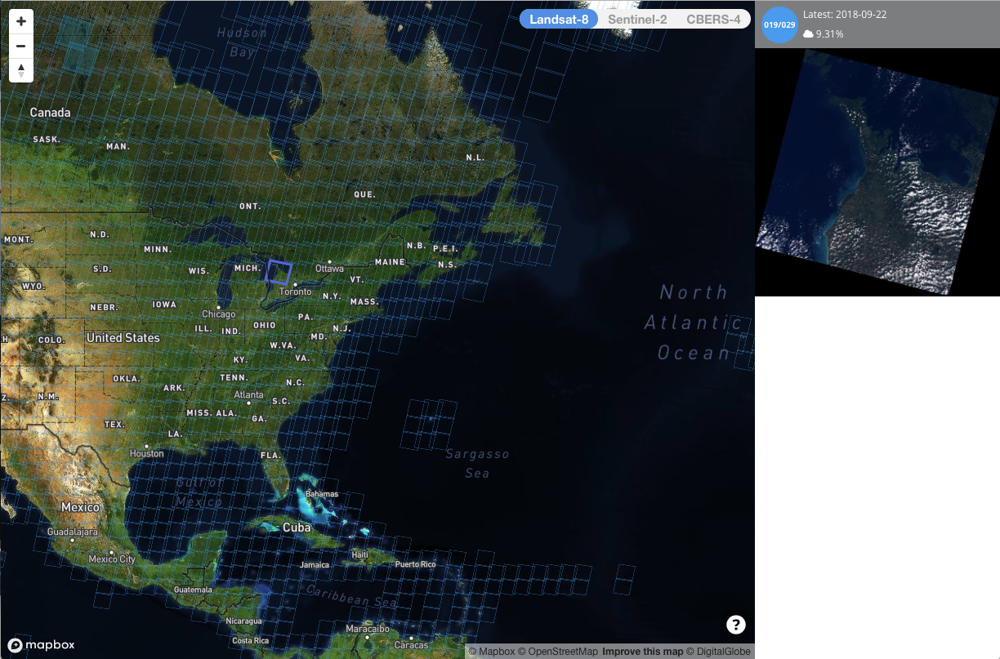

class: center, middle
# Small Sats Review


---

# Take-aways from Small-Sats Module

&nbsp;&nbsp; - Understand what has enabled Small Sats

&nbsp;&nbsp; - Understand their value

&nbsp;&nbsp; - Understand their limitations

&nbsp;&nbsp; - Know how to access Planet data

&nbsp;&nbsp; - Run some basic searching & filtering

&nbsp;&nbsp; - Can do these things both programmatically and through Explorer

---
# Cloud-based Processing

## Objectives
### Understand: 
&nbsp;&nbsp; - What has enabled them?

&nbsp;&nbsp; - What is their value?

&nbsp;&nbsp; - What are their limitations?

### Know how to:
&nbsp;&nbsp; - Access Google Earth Engine 

&nbsp;&nbsp; - Perform some basic large-scale processing on each

&nbsp;&nbsp; - Ingest and do some basic analyses of our datasets
---

## What Has Enabled Cloud-Based Processing?

#### 1. Large-scale processing + Internet
#### 2. Open image archives
#### 3. Software Advances

---
### Large-scale processing + Internet


---
### Large-scale processing + Internet


---
### [Open Image Archives](https://registry.opendata.aws)


```{r, echo = FALSE, out.width="80%", fig.align='center'}

```


---

### Software Advances

Libraries and algorithms that can process these images at scale, e.g.

&nbsp;&nbsp; - Hadoop

&nbsp;&nbsp; - GeoSpark

&nbsp;&nbsp; - TerraLib

---

```{r, echo = FALSE, out.width="80%", fig.align='center'}
knitr::include_graphics('figures/06/hadoop1.png')
```

---

```{r, echo = FALSE, out.width="80%", fig.align='center'}
knitr::include_graphics('https://kapost-files-prod.s3.amazonaws.com/uploads/direct/1461686104-174-6263/SystemIllustration.jpg')
```

<!--  -->

---

```{r, echo = FALSE, out.width="50%", fig.align='center'}
knitr::include_graphics('figures/06/geospark.png')
```

<!-- .center[] -->
.center[[Yu et al, 2015](http://dl.acm.org/citation.cfm?doid=2820783.2820860)]

---

### Image hosting 

> A Cloud Optimized GeoTIFF (COG) is a regular GeoTIFF file, aimed at being hosted on a HTTP file server, with an internal organization that enables more efficient workflows on the cloud. It does this by leveraging the ability of clients issuing HTTP GET range requests to ask for just the parts of a file they need.

[COG Maps](https://cholmes.github.io/cog-map/)

---
## Bringing These All Together - GEE
### [Video](https://sites.google.com/site/globalsnowobservatory/home/Presentations-and-Tutorials/GEE-Introduction/introductiontotheapi)

.center[]
.center[Gorelick et al, 2017]

---
## Value and Capabilities

&nbsp;&nbsp; - Opened new scales to analysis

&nbsp;&nbsp; - Much Greater Accessibility

---
### New Scales

[Global Surface Water](https://global-surface-water.appspot.com)

[Global Forest Watch](https://www.globalforestwatch.org/)

[SCYM](http://www.g-feed.com/2015/05/introducing-scym.html)

[Irrigation mapping](https://www.sciencedirect.com/science/article/abs/pii/S0034425719304195)

---

### Greater Accessibility

[Remap](https://remap-app.org)

<!--  -->

---

## Limitations

&nbsp;&nbsp; - Less control?

&nbsp;&nbsp; - More opacity?

---
## Practicals

&nbsp;&nbsp; - Google Earth Engine

&nbsp;&nbsp; - Astraea Earth AI notebooks

---
## Earth Engine

### [Introduction](https://developers.google.com/earth-engine/)
### [Code Editor](https://developers.google.com/earth-engine/playground)


---
## EE Reference Docs (bookmark these!)
### [Guides](https://developers.google.com/earth-engine/guides)
### [API Reference](https://developers.google.com/earth-engine/api_docs)
### [Datasets](https://developers.google.com/earth-engine/datasets/catalog/)
### [Tutorials](https://developers.google.com/earth-engine/tutorials)

---
## Some Basics

### Load and Display an Image

Adapted from the Earth Engine [introductory tutorial](https://developers.google.com/earth-engine/tutorial_api_02).
```{js, eval = FALSE}
// Instantiate an image with the Image constructor.
var srtm = ee.Image('CGIAR/SRTM90_V4');

// Zoom to a location.
Map.setCenter(-112.8598, 36.2841, 9); // Center on the Grand Canyon.

// Display the image on the map.
Map.addLayer(srtm);
```

Let's point somewhere else (substitute this into script)
```{js, eval = FALSE}
Map.setCenter(28, -13, 6); // Where is this?
```

How about here? 
```{js, eval = FALSE}
Map.setCenter(-71.8067, 42.1214, 14); // Where is this?
```

---

Let's rescale the legend
```{js, eval = FALSE}
Map.addLayer(srtm, {min: 150, max: 250},
             'custom palette');
```

---
### Derived Layers
#### Slope and Aspect

Calculate and then have a look 
```{js, eval = FALSE}
// Slope
var slope = ee.Terrain.slope(srtm);

// Aspect
var aspect = ee.Terrain.aspect(srtm);

// Convert to radians, compute the sin of the aspect.
var sinImage = aspect.divide(180).multiply(Math.PI).sin();

// Add these to your displays
Map.addLayer(slope, {min: 0, max :60}, 'slope');
Map.addLayer(aspect, {min: 0, max: 360, palette: ['blue', 'green', 'red']}, 
             'aspect');
Map.addLayer(sinImage, {min: -1, max: 1, palette: ['blue', 'green', 'red']}, 
             'sin');
```

---
### Image Statistics
#### First, define an area of interest
&nbsp;&nbsp;1. Use the polygon tool to draw a polygon, which you rename to "myaoi"

&nbsp;&nbsp;2. Turn an extent into a geometry feature
```{js, eval = FALSE}
// Clip boundaries (generous margin around Zambia)
var zam = ee.Feature(ee.Geometry.Rectangle(21, -19, 34.5, -7.5));
```

&nbsp;&nbsp;3. Use an existing feature collection
```{js, eval = FALSE}
// Load a region representing Zambia
var zam = ee.Feature(
  ee.FeatureCollection('ft:1tdSwUL7MVpOauSgRzqVTOwdfy17KDbw-1d9omPw')
  .filterMetadata('Country', 'equals', 'Zambia')
  .first());
```

Or:
```{js, eval = FALSE}
var zam = ee.Feature(
  ee.FeatureCollection("USDOS/LSIB/2013")
  .filterMetadata('cc', 'equals', 'ZA')
  .first());
```

---

#### Calculate summary statistics within the AOI
```{js, eval = FALSE}
// Mean elevation
var meanDict = srtm.reduceRegion({
  reducer: ee.Reducer.mean(),
  geometry: zam.geometry(),
  scale: 90,
  maxPixels: 1e8
  //bestEffort: true
});

// Get the mean from the dictionary and print it.
var mean = meanDict.get('elevation');
print('Mean elevation', mean);
```

---
## Image Collections

Landsat 8
```{js, eval = FALSE}
var l8 = ee.ImageCollection('LANDSAT/LC08/C01/T1_TOA');

var spatialFiltered = l8.filterBounds(myaoi);
print('spatialFiltered', spatialFiltered);

var temporalFiltered = spatialFiltered.filterDate('2018-05-01', '2018-09-15');
print('temporalFiltered', temporalFiltered);
```

Find least cloudy
```{js, eval = FALSE}
// Sort from least to most cloudy.
var sorted = temporalFiltered.sort('CLOUD_COVER');

// Get least cloudy image
var scene = ee.Image(sorted.first());
```

Display. Run this then try make a false color. 
```{js, eval = FALSE}
var visParams = {bands: ['B4', 'B3', 'B2'], max: 0.3};
//var visParams = {bands: ['B5', 'B4', 'B3'], max: 0.3};
Map.addLayer(scene, visParams, 'true-color composite');
```

---
Show a collection
```{js, eval = FALSE}
var visParams = {bands: ['B4', 'B3', 'B2'], max: 0.3};
Map.addLayer(temporalFiltered, visParams, 'Whittier L8 collection');
```

### Compositing

```{js, eval = FALSE}
var median = temporalFiltered.median();
Map.addLayer(median, visParams, 'Whittier L8 collection');
```

### Cropping
```{js, eval = FALSE}
var whittier_median = median.clip(myaoi);
```

### Masking
```{js, eval = FALSE}
var elevmask = srtm.gt(100);
var maskedMedian = median.updateMask(elevmask);
```

---
## Calculating NDVI over a collection
```{js, eval = FALSE}
var addNDVI = function(image) {
  var ndvi = image.normalizedDifference(['B5', 'B4']).rename('NDVI');
  return image.addBands(ndvi);
};

// Apply function to single image
var ndvi = addNDVI(scene).select('NDVI');

// Map onto a collection
var withNDVI = temporalFiltered.map(addNDVI);
```
---

## Clip and calculate NDVI over a collection
```{r, eval=FALSE}
var zamNDVI = temporalFiltered.map(function(image) {
    var img = image.clip(myaoi);
    var ndvi = img.normalizedDifference(['B5', 'B4']).rename('NDVI');
    return img.addBands(ndvi);
});
```

## Charts
```{js, eval = FALSE}
// Create chart
var chart = ui.Chart.image.series({
  imageCollection: withNDVI.select('NDVI'),
  region: myaoi,
  reducer: ee.Reducer.first(),
  scale: 30
}).setOptions({title: 'NDVI over time'});

// Display the chart in the console.
print(chart);

```
---
## How can we rerun previous code with Sentinel-2 imagery?


---
## User-Interface
### Left - Scripts, Assets, Documentation
### Center - Code editor, import records
### Right - Inspector, Console (for printing), Tasks (for exporting)
### Bottom - map display


---
## Getting Info from GEE
- Use print() command!
- Inspector tool (right-hand side) - allows you to view layer values


---
## Key concepts
- Client vs Server Side
- Images, Image Collections
- Filtering
- Displaying Layers


---
## General Workflow
- Import image collection
- Filter
- Analysis
- Display Results
- Export Image/Charts/Tables (if needed)

---
## Schedule
### Mar 30 - Intro to GEE
### Apr 01 - Time-series analysis
### Apr 06 - Classification methods
### Apr 08 - Using GEE API in Python, R


---
## For next class

- Assignment 2 (due Thurs 4/1)
- Read [GEE Overview](https://developers.google.com/earth-engine/guides/concepts_overview). Please read each linked article. 
- Watch first 3 videos in [Playlist](https://www.youtube.com/playlist?list=PLivRXhCUgrZpCR3iSByLYdd_VwFv-3mfs). (Intro, Client vs. Server side, Filtering)


