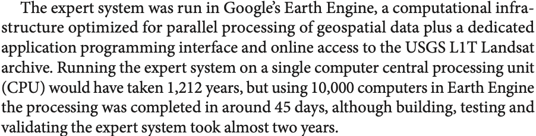
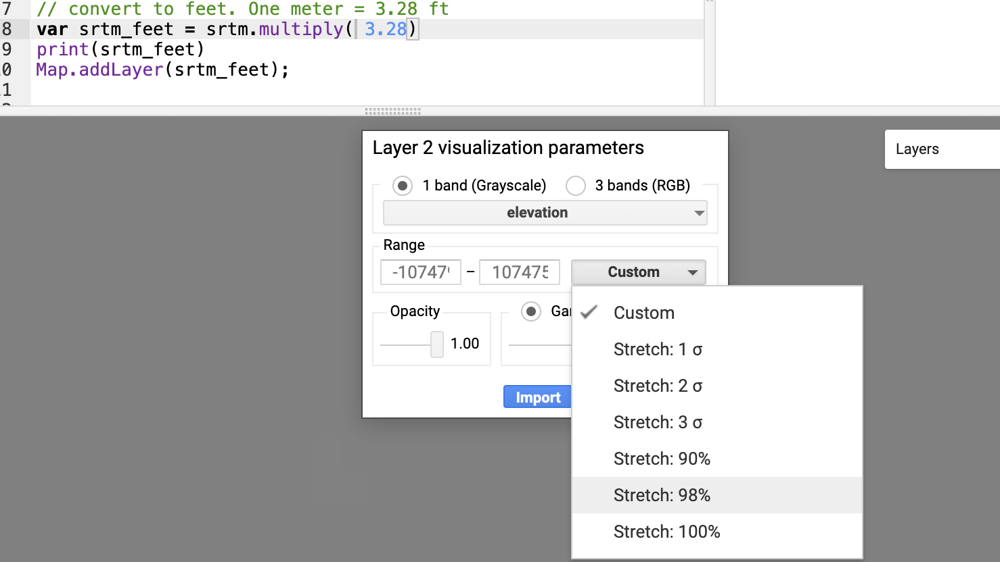
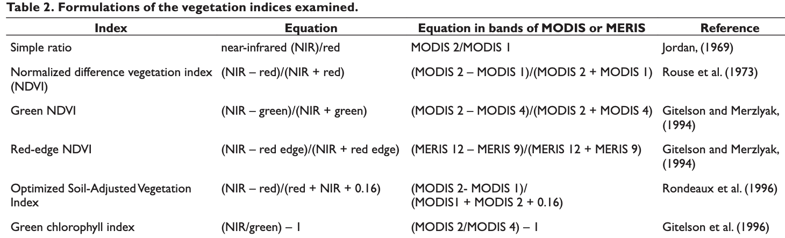
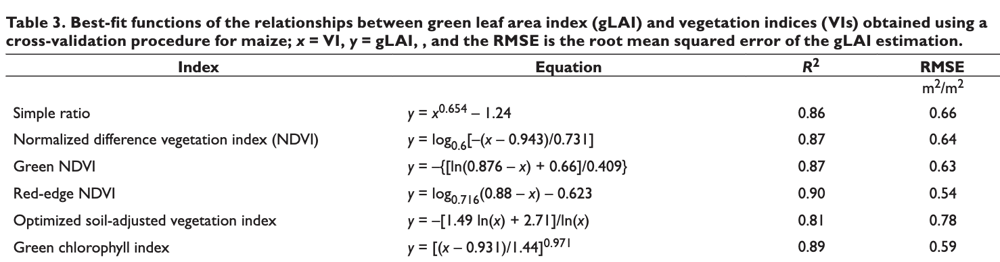

## Schedule
### Mar 30 - Intro to GEE
### Apr 01 - Time-series analysis <---
### Apr 06 - Classification methods
### Apr 08 - Using GEE API in Python, R

---

# Cloud-based Processing

## Objectives
### Understand: 
&nbsp;&nbsp; - What has enabled them?

&nbsp;&nbsp; - What is their value?

&nbsp;&nbsp; - What are their limitations?

### Know how to:
&nbsp;&nbsp; - Access Google Earth Engine 

&nbsp;&nbsp; - Perform some basic large-scale processing on each

&nbsp;&nbsp; - Ingest and do some basic analyses of our datasets
---

## What Has Enabled Cloud-Based Processing?

#### 1. Large-scale processing + Internet
#### 2. Open image archives
#### 3. Software Advances

---

### Image hosting 

> A Cloud Optimized GeoTIFF (COG) is a regular GeoTIFF file, aimed at being hosted on a HTTP file server, with an internal organization that enables more efficient workflows on the cloud. It does this by leveraging the ability of clients issuing HTTP GET range requests to ask for just the parts of a file they need.

[COG Maps](https://cholmes.github.io/cog-map/)

---
## Bringing These All Together - GEE
### [Video](https://sites.google.com/site/globalsnowobservatory/home/Presentations-and-Tutorials/GEE-Introduction/introductiontotheapi)

.center[]
.center[Gorelick et al, 2017]

---
### New Scales

[Global Surface Water](https://global-surface-water.appspot.com)

[Global Forest Watch](https://www.globalforestwatch.org/)

[SCYM](http://www.g-feed.com/2015/05/introducing-scym.html)

[Irrigation mapping](https://www.sciencedirect.com/science/article/abs/pii/S0034425719304195)

---
### Gains in Computation Time

From [Global Surface Water paper](https://www.nature.com/articles/nature20584.epdf?author_access_token=C5JSvooRop4jWxyp_qRPLNRgN0jAjWel9jnR3ZoTv0MqBuzCNsmw_DFxRd7sX93nfPzcbm_xTiPLlZMl7XrUhadm6EiT9cGdDNgn1s6EWrPWH3IeadLUjApplBoaS6xH)

.center[]


---
## Earth Engine

### [Introduction](https://developers.google.com/earth-engine/)
### [Code Editor](https://developers.google.com/earth-engine/playground)


---
## EE Reference Docs (bookmark these!)
### [Guides](https://developers.google.com/earth-engine/guides)
### [API Reference](https://developers.google.com/earth-engine/api_docs)
### [Datasets](https://developers.google.com/earth-engine/datasets/catalog/)
### [Tutorials](https://developers.google.com/earth-engine/tutorials)
---
## [Awesome-GEE](https://github.com/giswqs/Awesome-GEE)
### Lots of great resources

---
## Today's Concepts
- Image Collections
- Mapping functions
- Masking
- Math Expressions

---
## Question - how to convert elevation to feet?

```{js, eval = FALSE}
Map.setCenter(-71.8067, 42.1214, 15); // Where is this?
Map.setOptions("HYBRID")
var srtm = ee.Image('CGIAR/SRTM90_V4');
var visParams = {bands: ['elevation'], min: 100, max: 300};
Map.addLayer(srtm, visParams, 'elevation - meters');

// convert to feet. One meter = 3.28 ft
//var srtm_feet = 
```

---
## Adjusting Layer color ramp 
.center[]


---
## Demo - Find Max NDVI, Leaf-Area Index (LAI)
### These can help determine crop health, yield

---
## L8 bands --> Vegetaton Index
.center[]


---
## Vegetation Index --> LAI
### From [Nguy-Robertson et al 2012](https://doi.org/10.2134/agronj2012.0065)
.center[]


---

## Drawing Polygons
```{js, eval = FALSE}
Map.setCenter(-71.8067, 42.1214, 15); // Where is this?
// Turn on Satellite imagery in the map pane.
// Use the Polygon tool in the map pane to create a polygon boundary around 
// the Whittier Farms fields.
// You should see "geometry" under Imports (top of code editor)Name the polygon "myaoi"
// Rename "geometry" to "myaoi"
```


---
## Image Collections

Landsat 8
```{js, eval = FALSE}
var l8 = ee.ImageCollection('LANDSAT/LC08/C01/T1_TOA');

var spatialFiltered = l8.filterBounds(myaoi);
print('spatialFiltered', spatialFiltered);

var temporalFiltered = spatialFiltered.filterDate('2018-05-01', '2018-09-15').sort('system:time_start');
print('temporalFiltered', temporalFiltered);
```

Find least cloudy
```{js, eval = FALSE}
// Sort from least to most cloudy.
var sorted = temporalFiltered.sort('CLOUD_COVER');

// Get least cloudy image
var scene = ee.Image(sorted.first());
print(scene)
```

Display. Run this then try make a false color. 
```{js, eval = FALSE}
var visParams = {bands: ['B4', 'B3', 'B2'], max: 0.3};
//var visParams = {bands: ['B5', 'B4', 'B3'], max: 0.3};
Map.addLayer(scene, visParams, 'true-color composite');
```

---
Show a collection
```{js, eval = FALSE}
var visParams = {bands: ['B4', 'B3', 'B2'], max: 0.3};
Map.addLayer(temporalFiltered, visParams, 'Whittier L8 collection');
```

### Compositing
Median surface reflectance
```{js, eval = FALSE}
var median = temporalFiltered.median();
Map.addLayer(median, visParams, 'Whittier L8 median');
// is this a median over space or time?
// what is we wanted to see the pixel-wise max?
```

Max surface reflectance
```{js, eval = FALSE}
//add code here

```

---

### Cropping
```{js, eval = FALSE}
var whittier_median = median.clip(myaoi);
```

### Masking
```{js, eval = FALSE}
var srtm = ee.Image('CGIAR/SRTM90_V4');
var elevmask = srtm.gt(200);
var maskedMedian = median.updateMask(elevmask);
```

### Viewing a mask
```{js, eval = FALSE}
var whittier_mask = maskedMedian.mask()
Map.addLayer(whittier_mask, visParams, 'mask');
print(whittier_mask)
```


---
## Calculating NDVI over a collection
```{js, eval = FALSE}
var addNDVI = function(image) {
  var ndvi = image.normalizedDifference(['B5', 'B4']).rename('NDVI');
  return image.addBands(ndvi);
};

// Apply function to single image
var ndvi = addNDVI(scene).select('NDVI');
print(ndvi)

// Map onto a collection
var withNDVI = temporalFiltered.map(addNDVI);
print(withNDVI)
```
---

## Clip and calculate NDVI over a collection
```{r, eval=FALSE}
var whittier_NDVI = temporalFiltered.map(function(image) {
    var img = image.clip(myaoi);
    var ndvi = img.normalizedDifference(['B5', 'B4']).rename('NDVI');
    return img.addBands(ndvi);
});
```

## Charts
```{js, eval = FALSE}
// Create chart
var chart = ui.Chart.image.series({
  imageCollection: withNDVI.select('NDVI'),
  region: myaoi,
  reducer: ee.Reducer.first(),
  scale: 30
}).setOptions({title: 'NDVI over time, no mask'});

// Display the chart in the console.
print(chart);
```

---
## Viewing one image from collection
```{js, eval = FALSE}
// What is happening on June 24?
// code below displays an image
var displayImage = function(imageCollection, imageIndex, visParams, layerName){
  var imageCollection_list = imageCollection.toList(imageCollection.size());
  var scene = ee.Image(imageCollection_list.get(imageIndex));
  Map.addLayer(scene,visParams,layerName);
  return(true);
}

displayImage(withNDVI, 5, visParams_true_color, "June 24" )


```

## Cloud masking 
```{js, eval=FALSE}
var maskL8 = function(image) {
  var qa = image.select('BQA');
  /// Check that the cloud bit is off.
  // See https://www.usgs.gov/land-resources/nli/landsat/landsat-collection-1-level-1-quality-assessment-band
  var mask = qa.bitwiseAnd(1 << 4).eq(0);
  return image.updateMask(mask);
}

var withNDVI_masked = withNDVI.map(maskL8)
// add chart showing NDVI time-series for cloud masked
```

---
## Converting to LAI
https://developers.google.com/earth-engine/guides/image_math
```{js, eval=FALSE}
// compute LAI and add it as a separate band
var addLAI_NDVI = function(image) {
  var lai = image.expression(
    '(log(-(ndvi - 0.943)/0.731))/(log(0.6))', {
    'ndvi': image.select('NDVI')
    }).rename('LAI_NDVI');
  return(image.addBands(lai))
};


var withLAI = withNDVI_masked.map(addLAI_NDVI);

// add chart showing LAI time-series 
```

---
### Find Max NDVI/LAI
```{js, eval = FALSE}
var withLAI_max = withLAI.max();

var visParams = {bands: ['LAI_NDVI'], max: 5};
Map.addLayer(withLAI_max, visParams, 'Whittier L8 max - SR');

// add code to display LAI max 


```


---
## Group work
- Calculate Simple Ratio for Collection
- Chart Simple Ratio over season 
- Calculate LAI from simple ratio
- Chart LAI derived from Simple ratio

---
## Group work
- Create NDVI/LAI maps from Sentinel -2


---
## For next class

- Read [An Introduction to COGs](https://medium.com/planet-stories/cloud-native-geospatial-part-2-the-cloud-optimized-geotiff-6b3f15c696ed)
- Work through [tutorial 1](https://developers.google.com/earth-engine/tutorials/tutorial_api_05)
- Work through [tutorial 2](https://developers.google.com/earth-engine/tutorials/tutorial_api_06)
- Work through [tutorial 3](https://developers.google.com/earth-engine/tutorials/community/extract-raster-values-for-points)
- Watch videos in [Playlist](https://www.youtube.com/playlist?list=PLivRXhCUgrZpCR3iSByLYdd_VwFv-3mfs). (Calculating with Images, Mapping a function over an image, Iterate function)


