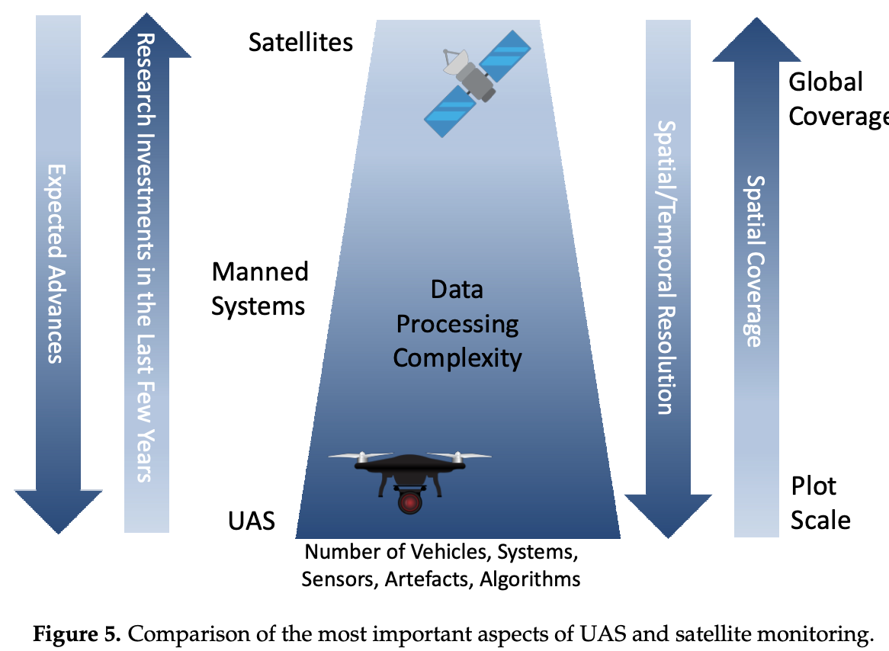
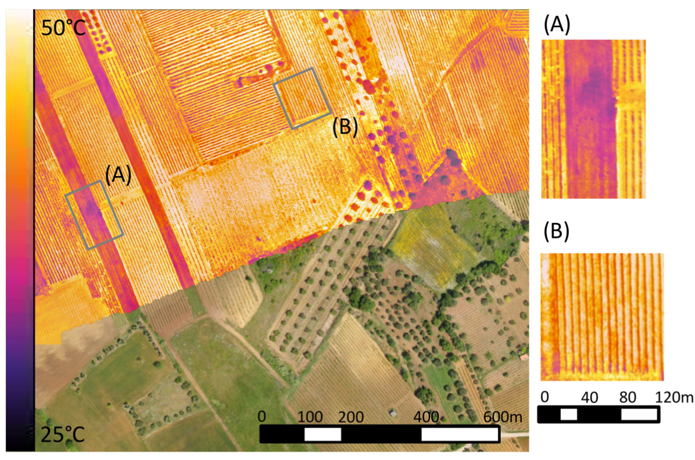
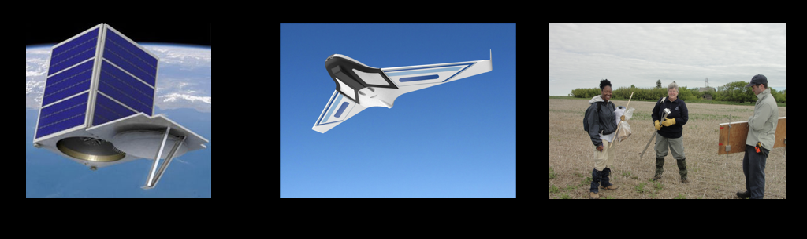
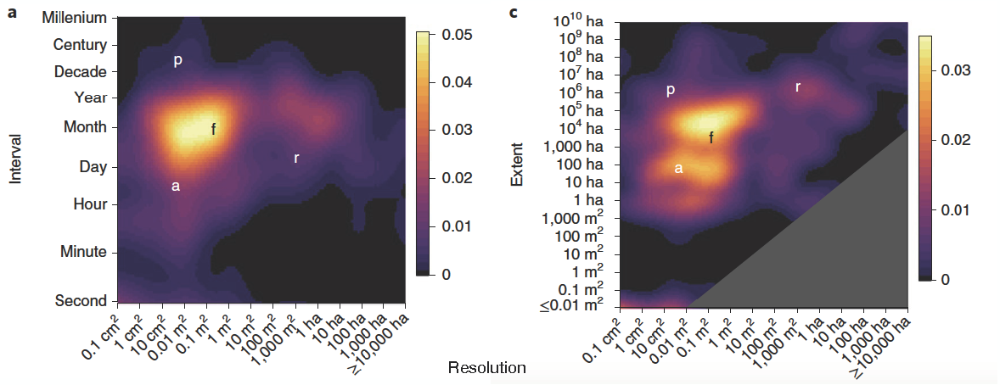
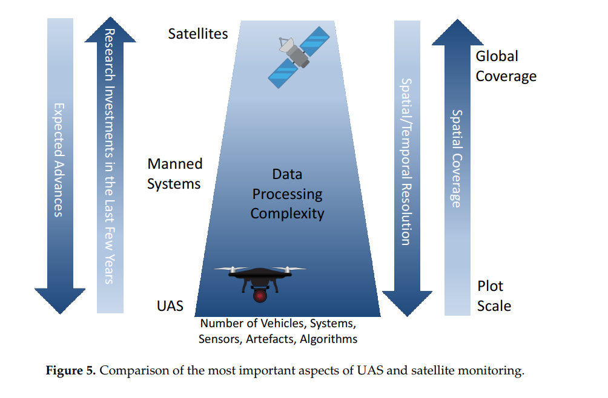
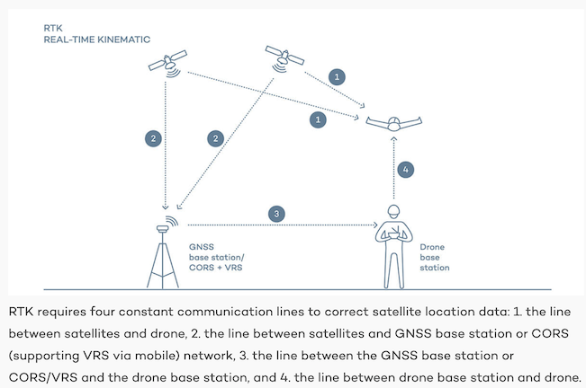
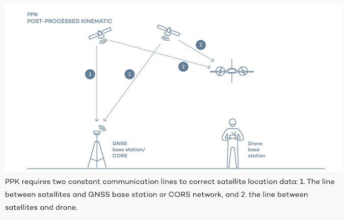
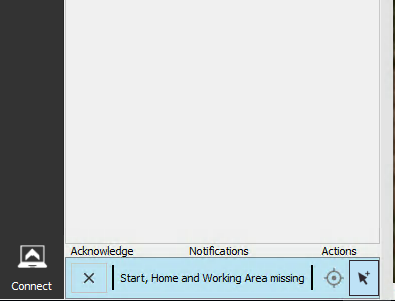

## Introduction
- Today: 
  - RStudio review
  - Resolutions worksheet
  - Manfreda et al article
  - Drones intro
  - eMotion simulation

---
# RStudio review
- Open whittier_comparison.R file
 - located under materials --> code --> R

---
# resolution comparison
- [Satellite costs link](https://www.researchgate.net/publication/326417596_Benchmark_of_Satellites_Image_Services_for_Precision_Agricultural_use)

---
# Manfreda article
- What is ideal extent for UAS?

---
# Manfreda article
- Why are UAS tranformative?



---
# Manfreda article
- Limitations/constraints


---
class: center, middle
# What Can UAS Do That Field Scientists and Cheap Satellites Can't?



---
background-image: url(figures/02/uas_slides/uas_slides.002.png)
background-size: cover

---
background-image: url(figures/02/uas_slides/uas_slides.004.png)
background-size: cover

---
background-image: url(figures/02/uas_slides/uas_slides.005.png)
background-size: cover

---
background-image: url(figures/02/uas_slides/uas_slides.006.png)
background-size: cover

---
background-image: url(figures/02/uas_slides/uas_slides.007.png)
background-size: cover

---
background-image: url(figures/02/uas_slides/uas_slides.008.png)
background-size: cover

---
background-image: url(figures/02/uas_slides/uas_slides.009.png)
background-size: cover

---
background-image: url(figures/02/uas_slides/uas_slides.010.png)
background-size: cover

---
background-image: url(figures/02/uas_slides/uas_slides.011.png)
background-size: cover

---
background-image: url(figures/02/uas_slides/uas_slides.012.png)
background-size: cover

---
background-image: url(figures/02/uas_slides/uas_slides.013.png)
background-size: cover

---
background-image: url(figures/02/uas_slides/uas_slides.014.png)
background-size: cover

---
background-image: url(figures/02/uas_slides/uas_slides.015.png)
background-size: cover

---
background-image: url(figures/02/uas_slides/uas_slides.016.png)
background-size: cover

---
class: center, middle

# UAS Use Cases

---
background-image: url(figures/02/uas_slides/uas_slides.024.png)
background-size: cover

<!-- .footnote[*Ecology + Conservation*] -->
 

---
background-image: url(figures/02/uas_slides/uas_slides.025.png)
background-size: cover

---
background-image: url(figures/02/uas_slides/uas_slides.026.png)
background-size: cover

---
background-image: url(figures/02/uas_slides/uas_slides.031.png)
background-size: cover

---
background-image: url(figures/02/uas_slides/uas_slides.032.png)
background-size: cover

---
background-image: url(figures/02/uas_slides/uas_slides.033.png)
background-size: cover

---
background-image: url(figures/02/uas_slides/uas_slides.034.png)
background-size: cover

---
# Drones as Scaling Tools

```{r, echo = FALSE, message = FALSE, fig.height=6, fig.width=6, fig.align='center'}
library(png)
library(grid)
library(gridExtra)
img1 <-  rasterGrob(as.raster(readPNG("figures/02/gaveau_etal_2b.png")),
                    interpolate = FALSE)
grid.arrange(img1, ncol = 1)
```

.center[Gaveau et al (2014), Figure 2b]

---


.center[Gaveau et al (2014), Figure 3]

---

background-image: url(http://upload.wikimedia.org/wikipedia/commons/c/c9/FEMA_-_45355_-_Firefighting_helicopter_hovering_over_a_lake_in_Colorado.jpg)
background-size: cover

# Key Characteristics of Drones
- Cannot cover large areas like satellites and crewed aircraft
- Unmatched spatial and temporal resolution
- Variable perspective

---

background-image: url(figures/02/uas_slides/uas_slides.021.png)
background-size: cover


---
background-image: url(figures/02/uas_slides/uas_slides.035.png)
background-size: cover

---
background-image: url(figures/02/uas_slides/uas_slides.036.png)
background-size: cover

---
background-image: url(figures/02/uas_slides/uas_slides.037.png)
background-size: cover

---
background-image: url(figures/02/uas_slides/uas_slides.039.png)
background-size: cover

---
background-image: url(figures/02/uas_slides/uas_slides.040.png)
background-size: cover

---
background-image: url(figures/02/uas_slides/uas_slides.041.png)
background-size: cover

---
background-image: url(figures/02/uas_slides/uas_slides.042.png)
background-size: cover

---
background-image: url(figures/02/uas_slides/uas_slides.043.png)
background-size: cover

---
background-image: url(figures/02/uas_slides/uas_slides.044.png)
background-size: cover

---
background-image: url(figures/02/uas_slides/uas_slides.045.png)
background-size: cover

---
background-image: url(figures/02/uas_slides/uas_slides.046.png)
background-size: cover

---
background-image: url(figures/02/uas_slides/uas_slides.047.png)
background-size: cover

---
background-image: url(figures/02/uas_slides/uas_slides.048.png)
background-size: cover

---
background-image: url(figures/02/uas_slides/uas_slides.049.png)
background-size: cover

---
background-image: url(figures/02/uas_slides/uas_slides.050.png)
background-size: cover

---
background-image: url(figures/02/uas_slides/uas_slides.051.png)
background-size: cover

---
background-image: url(figures/02/uas_slides/uas_slides.052.png)
background-size: cover

---
background-image: url(figures/02/uas_slides/uas_slides.053.png)
background-size: cover

---
background-image: url(figures/02/uas_slides/uas_slides.054.png)
background-size: cover

---

# The Scales of Ecological Observations



.center[Estes et al (2018), Figure 2]

---
# The Scales of Ecological Observations


.center[Manfreda et al (2018), Figure 5]

---

# The Scales of Ecological Observations
 - [Padua et al. (2017)](https://doi.org/10.1080/01431161.2017.1297548)


---
# Working With Drones
## Preflight Planning
- Flight properties: Height, overlap
- Control: GCPs, base stations, calibration targets
- Environment: wind, cloud cover, rain

---
## Sensors
+ Choice of sensor: Off-the-shelf versus dedicated sensors

---
background-image: url(figures/02/spectral-char.png)
background-size: 80%
background-position: bottom

### Camera spectral characteristics

---

## Software 

Structure From Motion

<iframe width="600" height="450" src="https://www.youtube.com/embed/i7ierVkXYa8" frameborder="0" allow="autoplay; encrypted-media" allowfullscreen></iframe>

If you want to learn more about the math, go here [here](https://www.youtube.com/watch?v=zdKX7Xo3Cb8)

---

## Software 

Structure From Motion


---

# Sources of Error

## Geometric 
### Orthomosaic from SfM
### Geometric correction (RTK/PPK/GCP)

## Atmospheric effects

---

# Sources of Error

## RTK/PPK links
### [RTK/PPK/GCP video](https://www.youtube.com/watch?v=1A3ZmYwx330)
### [Sensefly link](https://www.sensefly.com/blog/gcps-rtk-ppk-when-what-why/)
### [Wingtra link](https://wingtra.com/ppk-drones-vs-rtk-drones/)

---

# Sources of Error

## RTK scehmatic (Wingtra)


---

# Sources of Error

## PPK scehmatic (Wingtra)


---


### Radiometric calibration

.center[]
.center[Credit: Giuseppe Ciraolo, Università degli Studi di Palermo]

---

## Hard to Correct/Uncorrectable Errors
- Blur
- Hotspots / BRDF

---
background-image: url(figures/02/blurry.png)
background-size: 70%
### Blurry Flight (transects go downwind)


---
background-image: url(figures/02/nonblurry.png)
background-size: 70%
### Less Blurry (transects go upwind)


---
background-image: url(figures/02/IMG_4796.JPG)
background-size: cover
### Blurry

---
background-image: url(figures/02/IMG_4267.JPG)
background-size: cover
### Less Blurry

---
background-image: url(figures/02/orth-artifacts.png)
background-size: cover
### Missing Data

---
background-image: url(figures/02/schaaf_brdf_1.png)
background-size: 70%
### BRDF effects (backscattering vs. forward scattering)
#### [Dr. Crystal Schaaf's Lab](https://www.umb.edu/spectralmass/terra_aqua_modis/modis)

---
background-image: url(figures/02/schaaf_brdf_2.png)
background-size: 70%
### BRDF effects (backscattering vs. forward scattering)


---
background-image: url(figures/02/hotspots.png)
background-size: cover


# Collecting Data

---

class: center, middle

# Flight Simulation
## [Pre-flight checklist link](https://docs.google.com/document/d/1E_k8FtFEPNm1VbdBeYy1wgPX22jcMSnUrJtBy5e8Vmo/edit?usp=sharing)

---

### Plan mission eMotion3
#### Create new mission
##### - Select plane (eBee Plus and eBee RTK) and camera characteristics (Sequioa)
--

##### - if simulating, set start, home, working area on map, select arrow icon (see image below) to place point on map where you want to simulate flight


---
##### - Examine wind (estimated mission wind)

--

##### - Set start point (initial launch point) to be into wind from where you plan to launch


##### - Set home to be where you want to land. 

--

##### - Adjust landing sector so that it provides a funnel into wind (plane should land into wind--a wider pie slice gives more options). Add another one if needed


##### - Create a new mission block, select correct camera, desired pixel resolution (which adjusts height), and orient flight lines to be perpendicular to wind.  First transect points should be the further downwind

--

##### - Calibrate camera

---

##### - Connect to plane (if simulating, have to choose start simulation)

--

##### - After selecting plane, set RTK tab to standalone mode


##### - You are now ready to fly, either for real, or as a simulation. 

---
## Flight Simulation
### This is just a simulation! [(nothing can go wrong...)](https://www.youtube.com/watch?v=2n23oapBEao)
### Try flying with transects (i) into wind, (ii) against wind, (iii) crosswind and turning into wind (ideal)


---

### Post-mission 
#### Transfer photos from camera to computer

--

#### Transfer flight logs from drone to computer

---

### Post-processing flight logs and images
#### Got to post-flight section of eMotion3, create new project: 

--

##### - Select "No" under the "Did you use this computer to fly?" question (unless you did!)

--

##### - Choose a name convention that provides the date of the flight and the location, and click next

--

#### Load in drone flight logs (ending in .bb3, e.g. EP-01-18467_0029.bb3), and click next. Note, you don't need eMotion's flight logs

--

#### Under RTK/PPK, you have two choices: 
##### - Standalone: geotag your images with low accuracy

--

##### - PPK: Process drone's raw GNSS data

##### - For PPK, collect and load in RINEX file from [here](https://www.ngs.noaa.gov/UFCORS/), for our demo area we want MASB (the Sturbridge station), for the date and time of our flight. Note the RINEX request should cover the entire flight interval. Download and unzip the file, and load in the observations (.18o file).  The other fields will populate. Click next. Some calculations will be made. 
---
#### Reminder!!!


---

#### Import the images collected on the flight (easiest is to provide folder location)

##### - Click next a total of three times, after which the images will be converted to compressed .tifs, and .p4d project file will be created. 

##### - The images will be shown over the flight paths

##### - You can click finish


---


## For next class

- Review [DroneDeploy website](https://www.dronedeploy.com/) (guest speaker next class!)
- Review RTK/PPK links 
- Sign-up for Pix4D trial (details on Slack)

