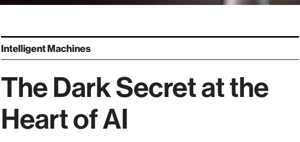
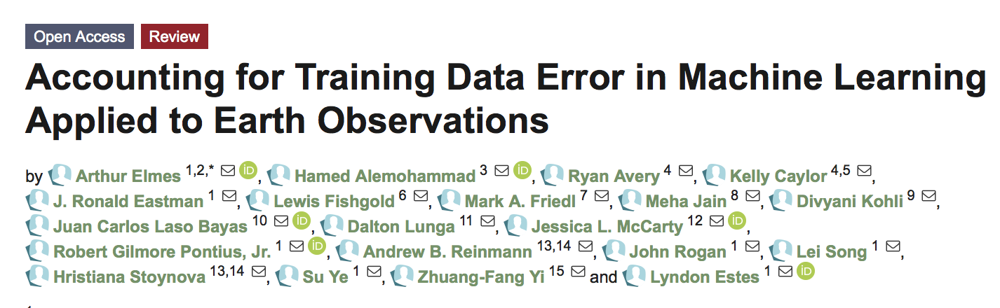

## Today
- Introduce Machine Learning (ML) and Deep Learning (DL) concepts
- Build your own classifier (Earth Engine)

---
class: center, middle
## Current Trends in EO

.center[]

---
- Earth Observations and Machine Learning on the Cloud for Improved Agricultural Decision Making
- Using Remote Sensing / Satellite Data for Human Disease Surveillance
- Estimating crop production at village level and mapping locally attainable yield gap from Sentinel time series using Sen2Agri in a smallholder farming system 
- Cost Effective Measurement of Soil Health Management Practices with Remote Sensing 
- Estimating impact and resilience via convolutional neural network-generated synthetic variables and remotely sensed imagery 
- Plantix - The agricultural app to empower family farms with the help of AI 
- Zoonotic prediction with machine learning 

---

- Getting the big picture right: integrating ground-based surveys and remote sensing for better data and insights
- Crowdsourcing real-time crop surveillance data from small-holder farmers
- e-Agri – low cost sensing and communication systems to augment agricultural disease forecasting
- Nuru an AI system working with CGIAR, FAO and local extension to help smallholder farmers 
- Chameleon: a soil moisture sensor for smallholder farmers 
- A Cost-Effective Way of Collecting Crop Observations using Ultralight Aircraft - From SMS to Social Chat: How mobile messaging can support crop surveillance and audience engagement in Africa 

---
  
## Heavy emphasis on "ground-truth"

- [Plant Village](https://plantvillage.psu.edu/solutions)

---
background-image: url(figures/11/nuru.jpg)
background-size: 60%

---

- [GeoSurvey](https://qed.ai/geosurvey-collect/)
  - [GeoSurvey - cheap spectroscopy](https://qed.ai/scanspectrum/)

---
## Combining Human & Machine Intelligence

.center[]
.center[An increasingly typical data science workflow]

---

## Background
- Algorithms of increasing complexity + predictive power
- Machine learning
  - [Definition](https://en.wikipedia.org/wiki/Machine_learning): 
      - Ability to progressively improve predictions without explicit programming
  - Characteristics:
      - Non-parametric
      - Can predict complex classes
      - Can handle highly dimensioned data
      - More effective than traditional classifiers

---
background-image: url(https://cdn-images-1.medium.com/max/1600/1*xGsYc6aXehD7lyoLEn-mMA.png)
background-size: 50%
background-position: bottom

## Classes of algorithms

Check out this [nice overview](https://www.dropbox.com/s/y7boyxe4ao2fppo/Computer%20Vision%20Machine%20Learning%20Deep%20Learning.pdf?dl=0) by Luisa Young and Lei Song from GEOG391

### Decision trees

- Simple or ensemble (random forest)

---
background-image: url(https://docs.opencv.org/2.4/_images/separating-lines.png)
background-size: 50%
background-position: bottom

### Support Vector Machines
- Optimal plane separating two classes

---
background-image: url(https://cdn-images-1.medium.com/max/2000/1*bhFifratH9DjKqMBTeQG5A.gif)
background-size: 50%
background-position: bottom

### Neural networks
- Mimics structure of animals brains
- Artificial neurons connected by "edges" (synapses)
- Hidden layers determine how inputs mapped to outputs
- One output neuron (node) per class

---
## Machine learning and training data

- Need large amounts of training data
- Typically human interpretation of imagery

---
background-image: url(figures/11/ml_td_needs.png)


---
background-image: url(figures/11/cropland-org.png)
background-size: 50%
background-position: bottom

## Examples
- croplands.org (Xiong et al, 2017)

---
background-image: url(figures/11/croplands-workflow.png)
background-size: 75%

---
background-image: url(figures/11/footprints.png)
background-size: 60%
background-position: center

## Examples
- Microsoft [building footprints](https://www.arcgis.com/home/webmap/viewer.html?useExisting=1&layers=f40326b0dea54330ae39584012807126)

---
## Potential Problems with machine learning


---
## Potential Problems with machine learning


- [Elon Musk interview](https://www.youtube.com/watch?v=H15uuDMqDK0 )

---
## Importance of Training Data



- [Elmes et al. (2020)](https://doi.org/10.3390/rs12061034)


---
## Importance of Training Data
- Harmonize terminology
- Locate TD practices in context with accepted accuracy assessment methods
- Sources of error/uncertainty in TD 
- How to minimize and measure those errors
- How to quantify error impact on maps
- Proposes three tiers of accounting standards

---
background-image: url(https://www.mdpi.com/remotesensing/remotesensing-12-01034/article_deploy/html/images/remotesensing-12-01034-g006.png)
background-size: 70%
background-position: center

---
background-image: url(figures/11/al_slides.002.png)
background-size: 70%
background-position: bottom

# Our solution
[Lyndon's Presentation](https://www.youtube.com/watch?v=pCp7SoNDHfE&list=PL3QzFgBMGnbQRa8uHP0_C_P2Fl5GIBxmn&index=2&t=2224s)

---
## ML in Earth Engine 
- [Noel Gorelick presentation](https://docs.google.com/presentation/d/1BFZVhUVKiANHvSi5ApbmjPqiOEHNBV_NizDVzJJ05tI/htmlpresent)

---
## ML in Earth Engine 
- Steps
 - (1) Collect observations (min: 25-30 per class)
 - (2) Separate observations into training and validation data
 - (3) Build model
 - (4) Train model with training data
 - (5) Apply model to broader area
 - (6) Evaluate model on training/validation


---
## Demo
- Based on [this tutorial](https://geohackweek.github.io/GoogleEarthEngine/05-classify-imagery/)
- We will be using random forests 
 - [video](https://www.youtube.com/watch?v=cIbj0WuK41w)


---
## Demo
- Setup
```{js, eval = FALSE}
// Define a region of interest as a point.  Change the coordinates
// to get a classification of any place where there is imagery.
Map.setOptions('HYBRID');
var lon = -71.8065
var lat = 42.1218
var roi = ee.Geometry.Point(lon, lat);
Map.setCenter(lon, lat, 12)

// Load the Landsat 8 scaled radiance image collection.
var landsatCollection = ee.ImageCollection('LANDSAT/LC08/C01/T1')
    .filterDate('2019-06-20', '2019-08-31').filterBounds(roi);
print(landsatCollection)

// Make a cloud-free composite.
var composite = ee.Algorithms.Landsat.simpleComposite({
  collection: landsatCollection,
  asFloat: true
});
print('composite', composite)
// Visualize the Composite
Map.addLayer(composite, {bands: ['B4', 'B3', 'B2'], max: 0.5, gamma: 2}, 'L8 Image', false);
```

---
## Demo
- (1) Collect training data
 - Use the point marker (in the map) to create a new point layer
 - Add ~30 points over water bodies
 - When finished, click on the gear icon next to the point layer ('geometry')
  - Rename layer to "water_sutton"
  - Import as "Feature Collection"
  - Add a property, "landcover", with value 0
  - Click OK, then Exit

---
## Demo
- (1) Collect training data
 - In the map, below "water_sutton", click "+new layer"
 - Add new layers for urban, forest, and crops
 - Add "landcover" property with vales (1), (2), (3), respectively


---
## Demo
- (1) Collect training data
 - In the map, below "water_sutton", click "+new layer"
 - Add new layers for urban, forest, and crops
 - Add "landcover" property with vales (1), (2), (3), respectively


---
- (1) Collect training data
 - Merge training data sets
 - Sample composite image at training sites
```{js, eval = FALSE}
// Merge the geometry layers into a single FeatureCollection.
var newfc = water_sutton.merge(urban_sutton).merge(forest_sutton).merge(crop_sutton);
print('newfc', newfc)

// Select the bands for training
var bands = ['B2', 'B3', 'B4', 'B5', 'B6', 'B7'];

// Sample the input imagery to get a FeatureCollection of training data.
var data = composite.select(bands).sampleRegions({
  collection: newfc, 
  properties: ['landcover'], 
  scale: 30
});
print('data', data)
```


---
## Demo
- (2) Separate training/validation data

```{js, eval = FALSE}
// add a random column (by default named 'random')
data = data.randomColumn();
// split in a training (80%) and validation (20%)
var training = data.filter(ee.Filter.gt('random',0.2));
var validation = data.filter(ee.Filter.lte('random',0.2));

print('validation', validation);
print('training', training);
```

---
## Demo
- (3/4) Make a random forest classifier and train it

```{js, eval = FALSE}
// Make a Random Forest classifier and train it.
var classifier = ee.Classifier.smileRandomForest({numberOfTrees: 1000, seed: 0}).train({
  features: training, 
  classProperty: 'landcover', 
  inputProperties: bands
});

classifier.setOutputMode("CLASSIFICATION")
```


---
## Demo
- (5) Apply classifier to broader area

```{js, eval = FALSE}
var classified = composite.select(bands).classify(classifier);

// Define a palette for the Land Use classification.
var palette = [
  '0000FF', // water (0)  // blue
  'D3D3D3', // urban (1)  // grey
  '008000', //  forest (2) // green
  '#ffff00' // crop (3) // yellow
];

// Display the classification result and the input image.
//Map.setCenter(-96.0171, 29.6803);
Map.addLayer(classified, {min: 0, max: 3, palette: palette}, 'Land Use Classification');

```

---
## Demo
- (6) Evaluate model on training/validation

```{js, eval = FALSE}
// Get a confusion matrix representing resubstitution accuracy.
print('Training error matrix: ', classifier.confusionMatrix());
print('Training accuracy: ', classifier.confusionMatrix().accuracy());

//// Test on validation data set .

// Classify the test FeatureCollection.
var test = validation.classify(classifier);
print('test', test)

var confusionMatrix = test.errorMatrix('landcover', 'classification');
print('Validation error matrix', confusionMatrix);
print('Validation testing accuraccy', confusionMatrix.accuracy());

```

---
## Demo
- Error matrices
 - Rows represent actual values 
 - Columns represent predicted values


---
## Demo 


---
## Demo
- Test additional classifiers

```{js, eval = FALSE}
// add the code below just after the initial definition for "classifier"

// var classifier = ee.Classifier.libsvm().train({
//   features: training, 
//   classProperty: 'landcover', 
//   inputProperties: bands
// });

// var classifier = ee.Classifier.minimumDistance().train({
//   features: training, 
//   classProperty: 'landcover', 
//   inputProperties: bands
// });

// var classifier = ee.Classifier.smileCart().train({
//   features: training, 
//   classProperty: 'landcover', 
//   inputProperties: bands
// });

// var classifier = ee.Classifier.smileGradientTreeBoost({numberOfTrees: 100}).train({
//   features: training, 
//   classProperty: 'landcover', 
//   inputProperties: bands
// });
```

---
### Neural Networks video
- Neural networks (NN) form the basis for deep learning
- [Video](https://www.youtube.com/watch?v=aircAruvnKk) (20 mins)


---
## For next class
- Work on Assignment 3 (due Thursday 11:59 PM)
- Watch [video on neural network cost function](https://www.youtube.com/watch?v=IHZwWFHWa-w)


