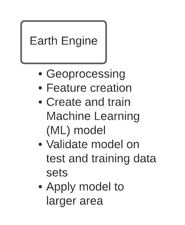

## Today
- Google Colab demo - using TensorFlow
- Final project Discussion

---
## Earth Engine and TensorFlow
- [TensorFlow in Earth Engine](https://developers.google.com/earth-engine/guides/tensorflow#:~:text=Although%20TensorFlow%20models%20are%20developed,exporting%20imagery%20in%20TFRecord%20format.&text=See%20the%20TFRecord%20page%20to,writes%20data%20to%20TFRecord%20files.)
- [Keras](https://keras.io/about/) 
- [Google Colab](https://research.google.com/colaboratory/faq.html#:~:text=Colaboratory%2C%20or%20%E2%80%9CColab%E2%80%9D%20for,learning%2C%20data%20analysis%20and%20education.)

---
## Earth Engine Only Approach (last class)
.center[]

---
## Earth Engine and TensorFlow (today)
.center[]

---
## Google Colab demo
- [link to demo](https://colab.research.google.com/github/google/earthengine-api/blob/master/python/examples/ipynb/TF_demo1_keras.ipynb#scrollTo=ZcjQnHH8zT4q)

---
## Final Project 
- [Project list](https://github.com/agroimpacts/geog287387/blob/class/s2021/docs/projects.md)
- Project proposal due Thursday May 6
- Project includes presentation (recorded video) and report (R Markdown, other scripts)

---
## Project Rubric
- [Rubric link](https://github.com/agroimpacts/geog287387/blob/class/s2021/docs/general-information.md)

---
## Schedule
- Tuesday (May 4). Check-in on project ideas
- Thursday (May 6). Proposals due by 4:15 PM (on Slack)
- Project updates (May 18, 25). Short presentations (2-3 slides). Focus on main obstacles.

---
## Final Project due dates
- Video presentation (Weds June 2)
- Final report (Fri June 4)

---
## Proposal
- Written proposal (1/2 - 1 page)
 - What are the goals of the project? (i.e. what do you want to find out/demonstrate?)
 - What methods/tools will you use?
 - What data sets do you have, and what data sets do you still need to find?
 - Provide a list of concrete steps you can take to achieve this project's goals. These steps should be sequential (i.e. first steps are fundamental to project, later steps are "nice-to-have"). If you are in a group, it may be helpful to assign different tasks to group members.

---
## Project ideas
- [Google sign-up](https://docs.google.com/spreadsheets/d/1h42PUu3rfIO2NpAh4oiVoLo0K0miPSvkUeXnBXHccDY/edit?usp=sharing)

---
## For next class
- Finish project proposals (due on Slack by 4:15 PM May 6)
- Read [Elmes et al. 2020](https://doi.org/10.3390/rs12061034)

