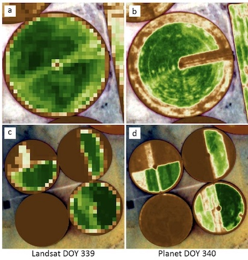

## Introduction
- Today: 
  - Review of McCabe et al. paper
  - Overview of key limitations/innovations in EO
  - Comparison of different sensor networks
  - Housekeeping: computing, R setup

---

## Software check-in
- Have you been able to clone the class repo?


---

## Background

- Limits to Earth Observation


---

## McCabe et al (2017)



---

## McCabe et al (2017)

- What are key limitations to EO mentioned in this paper?
 - physical
 - economic
 - institutional
 - knowledge

---

## McCabe et al (2017)
- How does the use of Planet CubeSats overcome these limitations?
- What limitations remain, and what new limitations are introduced?

---

## Background 
Collapsed limits down to:

- Physical 
- Methodological
- Societal

---

## Physical Limits 1

- Space-time tradeoff
- Initiated by conflict between resolution and extent
- [Youtube video](https://youtu.be/kY7wsSeIkMY?t=1008) by Middlebury RS
 - SNR = signal-to-noise ratio 
 - IFOV = instantaneous field of view

---

## Physical Limits 2

- Temporal: length of record

---

## Physical limits 3

- Surface characteristics: terrain and vegetation
- Atmosphere
- Perspective

---

## Methodological Limits

- Inadequate models: 
    - Need these to solve the inverse problem 
    - Models outpaced by EO data
- Not enough cal/val data
- Competing standards

---

## Societal Limits
- Expertise barrier
- Institutional limitations
    - Data access and collection policies
    - Coordination
- Accessibility to methods
- Collection biases

---
background-image: url(figures/01/current_scales.png)
background-size: 80%
background-position: center

## The Combined Effect of Limits

---

## Innovation Pushing Back Limits 1

- More Eyes in the Sky

```{r, echo = FALSE, fig.height=4, fig.width=8, fig.align='center', fig.cap="Left: max. resolution versus year of launch (Belward & Skøien, 2015), Right: number of launches (Radtke et al, 2017) "}
library(png)
library(grid)
library(gridExtra)
img1 <-  rasterGrob(as.raster(readPNG("figures/01/b&s_fig8.png")),
                    interpolate = FALSE)
img2 <-  rasterGrob(as.raster(readPNG("figures/01/radtke_fig1.png")), 
                    interpolate = FALSE)
grid.arrange(img1, img2, ncol = 2)
```

---

## Limits Addressed

- Physical:
    - Space-time tradeoff mitigated: 
        - Resolution versus extent
        - Atmospheric interference
    - Terrain effects (more radar)
    - Perspective (more radar and lidar)
- Societal:
    - Accessibility (cheaper)

---

## How Our Methods Fit In

- PlanetScope, SmallSats

---
background-image: url(figures/01/geowiki.png)
background-size: 60%
background-position: bottom


## Innovation Pushing Back Limits 2

- Upping the N

---

## Limits Addressed

- Physical:
    - Perspective
- Methodological:
    - Inadequate calibration/validation data
    - Better models
- Societal:
    - Accesibility
  
---

## How Our Methods Fit In

- Crowdsourcing platform
- Arable ground sensors

---
background-image: url(figures/01/gaveau_etal2014.png)
background-size: 60%
background-position: center

## Innovation Pushing Back Limits 3

- Peering into the gaps (due to time, cloud cover)


---

## Limits Addressed

- Physical
    - Space-time tradeoff
    - Perspective
- Methodological
    - Inadequate cal/val
- Societal
    - Cost/accessibility

---

## How Our Methods Fit In

- UAS
- Arable ground sensors

---
background-image: url(https://ngee-arctic.ornl.gov/sites/default/files/9.jpeg)
background-size: 40%
background-position: bottom

## Innovations Pushing Back Limits 4

- Advances in sensors/communications


---

## Limits Addressed

- Physical:
    - Space-time tradeoff
    - Perspective
- Methodological
    - Better models
    - Inadequate cal/val
- Societal
    - Cost/accessibility

---
background-image: url(figures/whittier10082018.png)
background-size: 50%
background-position: center


## How Our Methods Fit In

- Sequoia
- Miniaturization of CubeSat sensors

---

## Innovations Pushing Back Limits 5

- Data and model-data fusion


---
background-image: url(http://2.bp.blogspot.com/-JpPn3jLt5Nw/VVDSnQ3WNEI/AAAAAAAAAR0/wmhUJp7SQ1c/s1600/output_SAPgfu.gif)
background-size: 50%
background-position: center

## SCYM
- Scalable Yield Mapping (Lobell et al, 2015)

---

## Limits Addressed

- Physical:
    - Space-time tradeoff
    - Duration
- Methodological
    - Better models

---

## How Our Methods Fit In

- Arable Marks + Ebee + Planet + DSSAT crop model & R package

---
background-image: url(http://2rct3i2488gxf9jvb1lqhek9-wpengine.netdna-ssl.com/wp-content/uploads/2017/05/isprs-potsdam-predicitions-4.gif)
background-size: 50%
background-position: bottom

## Innovations Pushing Back Limits 6
- Computer vision, machine, and deep learning

---

## Limits Addressed

- Methodological:
    - Inadequate models

---
background-image: url(figures/01/ll_debatsetal_slide.png)
background-size: 50%
background-position: bottom

## How Our Methods Fit In

- Debats et al (2016) (adapted by Song and Young, 2018)

---
background-image: url(figures/01/activelearning.png)
background-size: 50%
background-position: bottom

## How Our Methods Fit In

- Active learning (Debats et al, 2017; Elmes et al, 2020)
- RadiantEarth machine learning data sets

---

## Innovations Pushing Back Limits 7

- Cloud-based data and analytical platforms


---

## Limits Addressed

- Methodological:
    - Inadequate models
- Societal:
    - Accessibility

---

## How Our Methods Fit In

- Compare Sentinel-1 and Sentinel-2 imagery on Google Earth Engine
- Process Planet
- Host and view UAS imagery

---

## Whittier Farms image comparison

- Open "whittier_comparison.R" in materials --> code --> R 
- This likely won't work yet, but you can follow along


---

## Multispectral sensor comparison

- In groups, open the "Multispectral sensor comparison sheet"
- Your group is assigned a sensor. Try to fill out the sheet!
- Your answer may be "it depends", this is OK! Try to explain what your answer depends on


---

## Multispectral sensor comparison

- How well would your group's sensor be used for the following applications?
 - Precision irrigation for vineyards  
 - Mapping forest fire burn areas
 - Mapping smallholder agriculture productivity (small, irregular shaped fields) at a  (state/district) scale
 - Mapping national crop productivity over multiple years


---

## For next class

- Read Manfreda et al. [(2018)](https://doi.org/10.3390/rs10040641) 
- Watch full video on [remote sensing resolutions](https://www.youtube.com/watch?v=kY7wsSeIkMY)
- Install RStudio packages (details on Slack)
- Download/install eMotion and Pix4D software (details on Slack)


