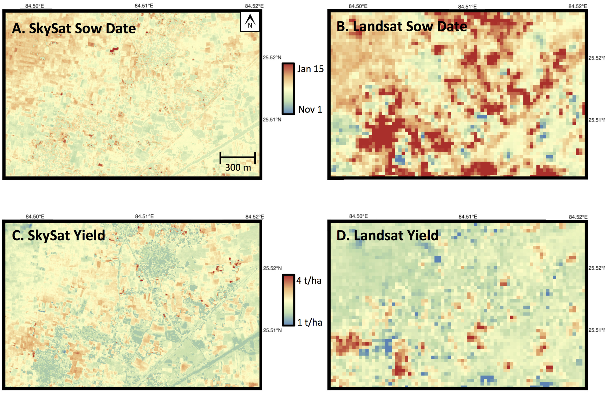
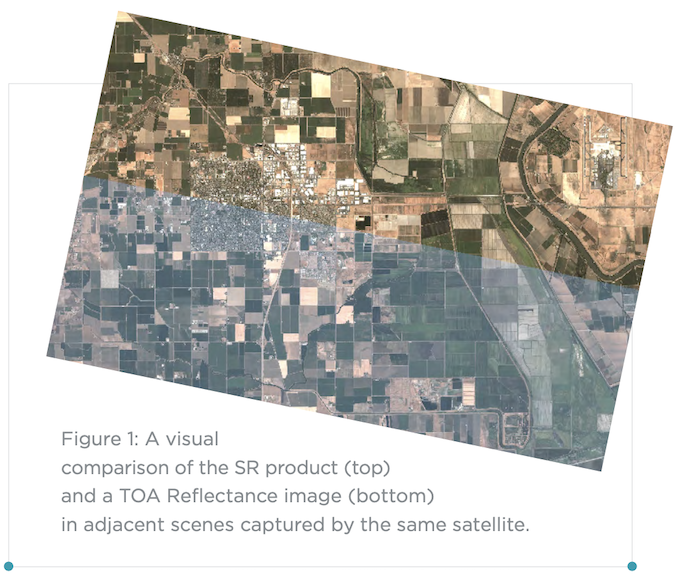
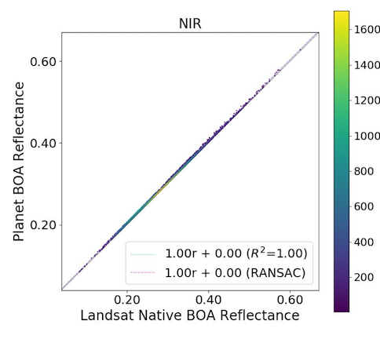
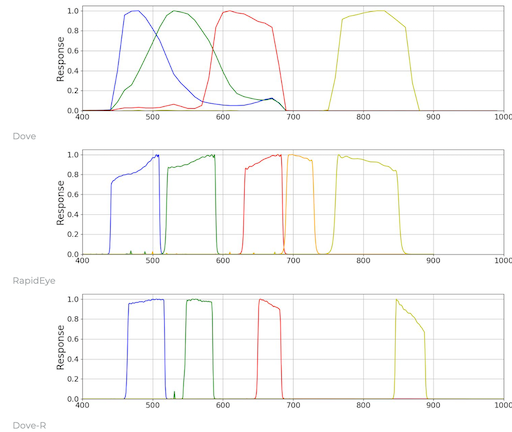
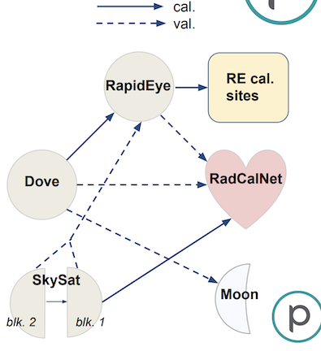

class: center, middle
# Small Sats
---
##Planet Unit

### Overview, working with Planet Explorer (Mar 11)
### Understanding Planet data (Mar 16) <---
### Working with [NICFI basemaps](https://www.planet.com/nicfi/) (Mar 18)
### Meha Jain Colloquium (Mar 18, noon)
### Planet API (Mar 18/25)

---
## Meha Jain colloquium 

---
## STEM Virtual Fair

---

## Jain et al. (2016)

---

## Jain et al. (2016)
### Three data sets used to calibrate prediction models
### Relatively low R² (common in agriculture)
### Trade-offs between SkySat and Landsat

---

## Surface Reflectance

---
## Surface Reflectance
&nbsp;&nbsp;- Aerosol optical depth, water vapor from `MOD09CMA`

&nbsp;&nbsp;- Ozone from `MOD09CMG`

&nbsp;&nbsp;- Time difference ~1 hour

&nbsp;&nbsp;- Major uncertainties from MODIS values over clouds, ice, desert

&nbsp;&nbsp;- Sometimes no MODIS nearby--default 6S model

&nbsp;&nbsp;- Haze, cirrus not corrected

&nbsp;&nbsp;- Single, global aerosol model

&nbsp;&nbsp;- Scattering not dealt with

&nbsp;&nbsp;- Lambertian surface assumed

---
## Surface Reflectance
### Also tested by applying Planet SR model to Landsat Top-of-atmosphere reflectance, and comparing results to Landsat-derived SR

---
## Surface Reflectance
### Different sensors have different Relative Spectral Response

---
## Planet sensors
### Three generations of Dove satellites
#### PS2 or Dove
#### PS2.SD or Dove-R
#### PSB.SD or SuperDove

---
## Planet sensors
### Planet also has two acquired constellations
#### SkySat (50 cm)
#### Rapideye (5 m)

---
## Planet sensors
### [Sensor descriptions](https://developers.planet.com/docs/apis/data/sensors/)
### [Product spec](https://assets.planet.com/docs/Planet_Combined_Imagery_Product_Specs_letter_screen.pdf)

---
## Planet sensors
### [Sensor comparison](https://www.planet.com/products/planet-imagery/)
### [Calibration](https://calval.cr.usgs.gov/apps/sites/default/files/jacie/OnOrbitRadiometricCalibrationandValidationofPlanetsConstellations.pdf)

---
## Planet image types
- [Planet Ortho-tiles](https://www.planet.com/products/satellite-imagery/planetscope-analytic-ortho-tile/)
- includes surface reflectance "_SR" image type

---
## Planet data types
- [Planet Usable Data Mask 2](https://developers.planet.com/docs/data/udm-2/)
- includes measure of clearness, other bands

---
## Planet Explorer
- https://www.planet.com/explorer

---
## Planet Orders
- https://www.planet.com/account/#/orders
- We will learn how to do these programatically!

---
## Today's coding
### Compare time-series from different Planet sensors
### Use UDM mask and visual interpretation to filter images

---
## For next class

- Assignment 1 (due Weds 3/17)
- Meha Jain colloquium (Thursday at noon)
- Read [Jain et al (2017)](https://doi.org/10.3390/rs8100860) and [Planet Surface Reflectance White Paper v2](https://assets.planet.com/marketing/PDF/Planet_Surface_Reflectance_Technical_White_Paper.pdf)
- Set up Python and Python libraries (details to follow)